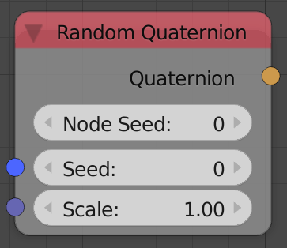

## Description

This node generates a random quaternion.

## Inputs

- **Seed** - Seed for the random generator, where different seed
    generates different random quaternion.
- **Scale** - Scale of the quaternion elements.

## Outputs

- **Quaternion** - A random quaternion.

## Advanced Node Settings

- N/A

## Note

The node has an **extra seed** (*Node Seed*) that can be used to
differentiate between nodes with the same seed, e.g., when using
multiple *Random quaternion* nodes in a loop while using the index as a
seed, you can change the extra seed to get different results from the
other nodes.

Animation Nodes automatically changes the *Node Seed* when you duplicate
or add a new *quaternion vector* node.

## Examples of Usage


