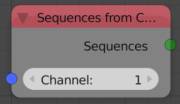

## Description

This node returns all the sequences in the input *Channel*.

## Inputs

- **Channel** - The index of the channel to return its strips.
- **Scene** - A scene.

## Outputs

- **Sequences** - A list of sequences which are in the input channel.

## Advanced Node Settings

- N/A

## Examples of Usage


