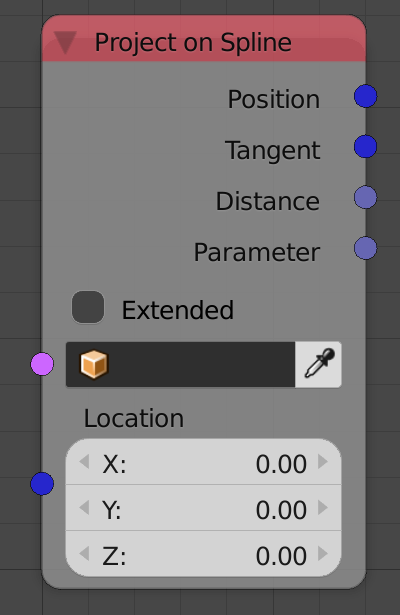
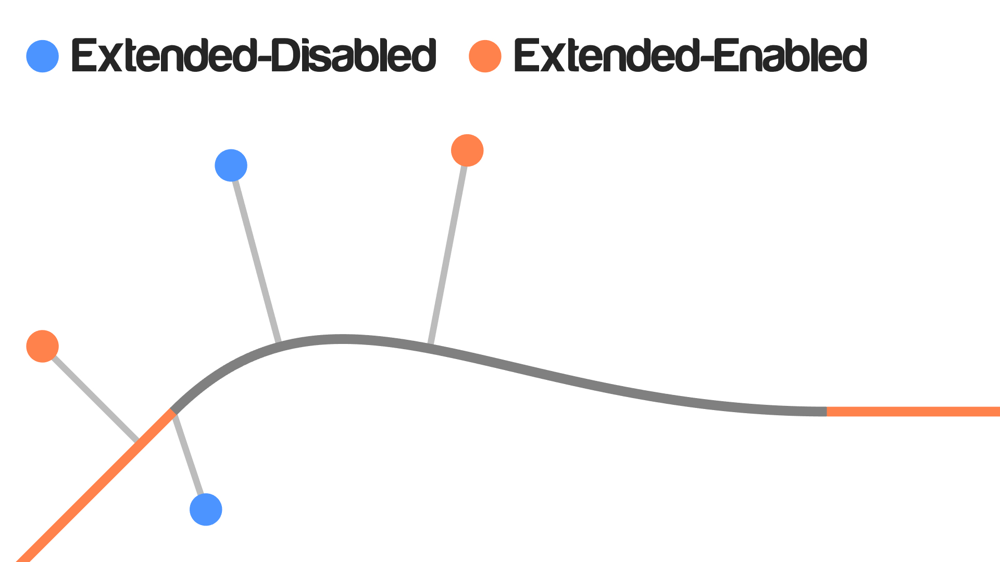

## Description

This node will project the input point to the input spline and return
some information about the projection. The projection of a point on a
spline is the closest point to the input point and the vector going from
the point to its projection is perpendicular to the tangent at that
point.

## Options

  - **Extended** - This option of enabled will virtually extend the
    spline from its terminals and project points on that virtual line as
    well.The vitual line is just the tangent line to both terminals.

As you may see in this illustration: If extended is enabled, points that
are close to the spline will be projected perfectly as well as points
that are away---Which are projected on a vitual line crated by the node.
If extended is disabled, points that are close to the spline will be
projected perfectly but points that are away will always be projected to
one of the terminals of the spline.

## Inputs

  - **Spline** - A spline.
  - **Location** - The location of the point to be projected.

## Outputs

  - **Position** - The position of the point---on the curve---that is
    closest to the input point.
  - **Tangent** - A vector that respresents the tangent line to the
    output position point.
  - **Distance** - The distance between the input point and the position
    point.
  - **Parameter** - The location of the output position point in the
    normalized distance of the spline. (Is not calculated if the
    Extended option is enabled)

## Advanced Node Settings

  - N/A

## Examples of Usage


