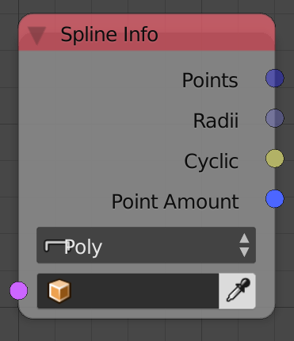

## Description

This node returns some information about the input spline as the
location of its points and handles.

## Options

- **Poly** - This option will only return the locations of the points
    and not their handles.
- **Bezier** - This option will return both the locations of the
    points as well as their handles.

## Inputs

- **Spline** - A spline.

## Outputs

- **Points** - A vector list that contain the locations of the points
    of the input spline.
- **Left Handles** - A vector list that contain the locations of the
    left handles of the input spline.
- **Right Handles** - A vector list that contain the locations of the
    right handles of the input spline.
- **Radii** - A float list that contains the radii of the points of
    the input spline.
- **Cyclic** - A boolean that is true if the spline is closed, that
    is, every handle is connected to two other handles.
- **Point Amount** - The amount of points in the input spline.

## Advanced Node Settings

- N/A

## Examples of Usage


