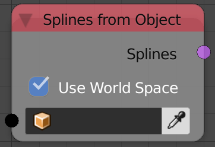

## Description

This node returns the spline(s) of the input curve.

## Inputs

  - **Object** - A curve to return its splines.
  - **Use World Space** - If True, the splines will be in world space.

## Outputs

  - **Splines** - A list of splines that has all the splines in the
    input curve.

## Advanced Node Settings

  - **Import Type** - This option is set to **all** by default which
    return all the splines in the input curve. The other option
    **Single** will add an extra input **Index** which will be the index
    of the output spline and of course the output will be a single
    spline and not a list of splines.

## Examples of Usage


