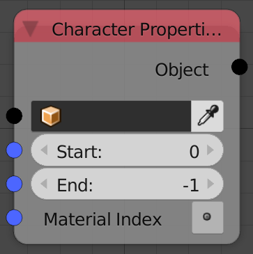

## Description

This node controls the property of the input text object in a specific
character interval.

## Inputs

- **Object** - A text object to edit.
- **Start** - The index of the character when the interval starts.
- **End** - The index of the character when the interval ends.
- **Material Index** - The index of the material starting from 0.
- **Bold** - Enable or disable bold property.
- **Italic** - Enable or disable italic property.
- **Underline** - Enable or disable underline property.
- **Small Caps** - Enable or disable small caps property.

## Outputs

- **Object** - The input object.

## Advanced Node Settings

- **Allow negative index** - This option will allow you to invert the
    interval by entering negative values for the start and end indicies.

## Examples of Usage


