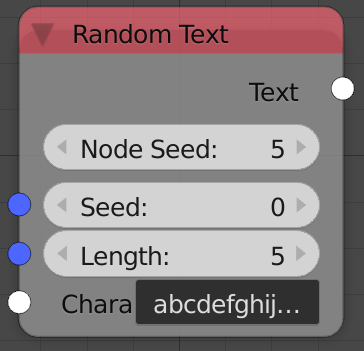

## Description

This node generates a random string based on an input characters.

## Inputs

  - **Seed** - Seed for the random generator, Where different seed
    generate different random strings.
  - **Length** - The number of characters in the output string.
  - **Characters** - A string that contain all the possible characters.

## Outputs

  - **Text** - A random string based on the input characters.

## Advanced Node Settings

  - N/A

## Note

The node has an **extra seed** (*Node Seed*) that can be used to
differentiate between nodes with the same seed, e.g., When using
multiple *Random String* nodes in a loop while using the index as a
seed, you can change the extra seed to get different results from the
other nodes.

Animation Nodes automatically changes the *Node Seed* when you duplicate
or add a new *Random String* node.

## Examples of Usage


