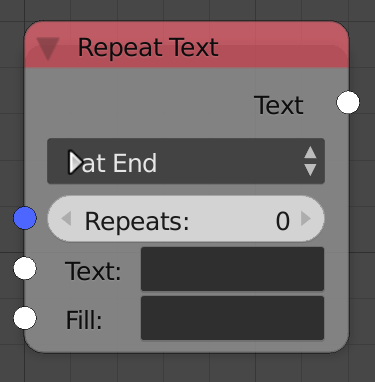

## Description

This node is used to repeat an input text and add it before or after
another input text.

## Options

  - **At End** - Adds the repeated text after the input text.
  - **At Start** - Adds the repeated text before the input text.

## Inputs

  - **Repeats** - Number of repetitions.
  - **Text** - The initial text, the repeated text will be added after
    or before it. Leave it empty if all you need is the repetitions.
  - **Fill** - A text to repeat.

## Outputs

  - **Text** - The output string.

## Advanced Node Settings

  - N/A

## Examples of Usage


