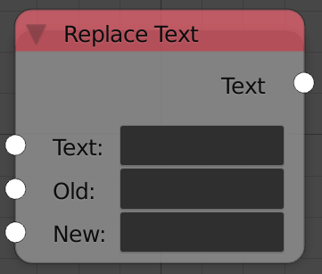

## Description

This node replaces a part of the input string by another string.

## Inputs

  - **Text** - The input string.
  - **Old** - The characters to replace.
  - **New** - The new characters.

## Outputs

  - **Text** - The output string.

## Advanced Node Settings

  - N/A

## Examples of Usage


