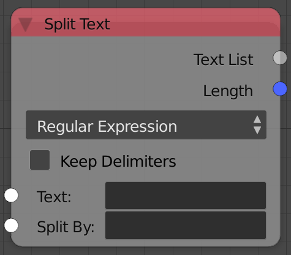

## Description

This node splits input string into multiple strings based on the chosen
algorithm.

## Options

  - **Separator** - This option allows splitting string by a specific
    character. So if the input text is "Animation,Nodes" the output list
    will contain : -Animation and -Nodes.
  - **N Characters** - This option allows splitting string each n number
    of characters. So if the input text is "Animation Nodes" and N = 2
    the output list will contain: -An,-im,-at,-io,-n,,-No,-de,-s.
  - **Regular Expression** - This node allows you to use "regex"
    operations in python enabling more control. So if the input string
    is "Animation Nodes" and I want to split by white spaces, I can use
    the "/s" operations which will return -Animation and -Nodes. A list
    of operations can be found
    [here](https://docs.python.org/3/library/re.html).
  - **Lines** This option allow splitting by new lines, in other words,
    every line will be an element of the list.
  - **Words** - This option allow splitting by words, in other words,
    every word will be an element of the list.
  - **Characters** - This option allow splitting by character, in other
    words, every character will be an element of the list.

## Inputs

  - **Text** - Input text to split.

## Outputs

  - **Text list** - A list of strings that contains string parts.
  - **Length** - The number of strings in the list.

## Advanced Node Settings

  - N/A

## Examples of Usage


