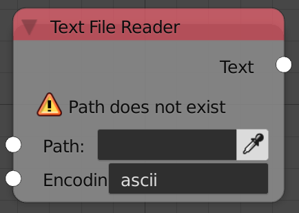

## Description

This node reads a file from your disk.

## Inputs

- **Path** - The path of the file.
- **Encoding** - The encoding method. A list of avilable encoding can
    be found
    [here](https://docs.python.org/3/library/codecs.html#standard-encodings).

## Outputs

- **Text** - The output text.

## Advanced Node Settings

- N/A

## Examples of Usage


