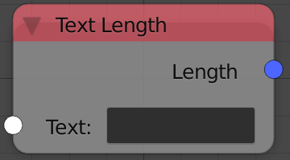

## Description

This node will return the number of characters in the input text.

## Inputs

- **Text** - The input string.

## Outputs

- **Length** - The number of characters in the input text.

## Advanced Node Settings

- N/A

## Examples of Usage


