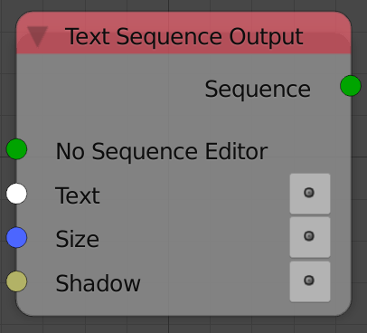

## Description

This node can control a text sequence strip.

## Inputs

- **Strip** - A text strip to edit.
- **Text** - The value of the text strip.
- **Size** - The size of the text.
- **Shadow** - Enable or disable text shadows.
- **X Align** - Text aligment method in X.A list of values can be
    found in the advanced node setting panel.
- **Y Align** - Text aligment method in Y.A list of values can be
    found in the advanced node setting panel.
- **X Location** - The location of the strip in X.
- **Y Location** - The location of the strip in Y.
- **Wrap Width** - Enable or disable wrap width.

## Outputs

- **Sequence** - The input sequence.

## Advanced Node Settings

- N/A

## Examples of Usage


