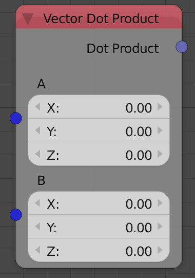

## Description

This node calculates the dot product of the two input vectors.

## Inputs

- **Vector A** - The first vector.
- **Vector B** - The second vector.

## Outputs

- **Dot Product** - The dot product of the two input vectors.

## Advanced Node Settings

- N/A

## Examples of Usage

Example needed.

