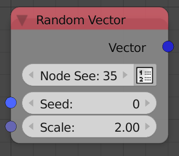

## Description

This node generates a random vector or a list of random vectors.

## Options

- **Node Seed** - Aside from the *Seed input*, this extra seed
    parameter enables you to get different random vectors if the *Seed
    input* in not free, that is, it is dependent on some property that
    you can't freely controle, for instance, when using multiple *Random
    Vector* nodes in a loop while using the index as a seed, you can
    change the node seed to get different vectors for each node.
    Animation Nodes automatically changes the *Node Seed* when you
    duplicate or add a new *Random Vector* node.
- **Create List** - It is the button you see beside the *Node Seed*,
    if it is enabled, the output will be a list of random vectors.

## Inputs

- **Seed** - Seed for the random generator, where different seeds
    generates different random vector.
- **Scale** - If **Normalized Vector** is enabled, the scale will
    represents the magnitude of the output vectors, which means it will
    also respresents the radius of the sphere on which the vectors are
    located. If **Normalized Vector** is disabled, the scale will
    represents the maximum of the absolute of the values of all three
    components of the output vectors, which also means it represents
    half of the side length of the cube that bounds the output vectors.
- **Count** - The number of random vectors to generate. (Only
    available if *Create List* is enabled)

## Outputs

- **Vector(s)** - A random vector(s).

## Advanced Node Settings

- **Normalized Vector** - If enabled, the random vectors will be
    uniformly distributed on the surface of a sphere. See second example
    below and **Scale** Input above.

## Examples of Usage

**Normalized Vector** disabled:



**Normalized Vector** enabled:



Connecting close random vectors together:



The follwoing is what is know as a random walk, at each iteration, you
move in a random direction by adding a random vector to your initial
location, and then update your initial direction to that new position
using the reassign function in loops:


