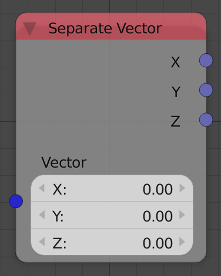

## Description

This node takes a 3D vector and returns its components.

## Inputs

- **Vector** - A 3D vector to decompose.

## Outputs

- **X** - The X component of the input vector.
- **Y** - The Y component of the input vector.
- **Z** - The Z component of the input vector.

## Advanced Node Settings

N/A

## Examples of Usage


