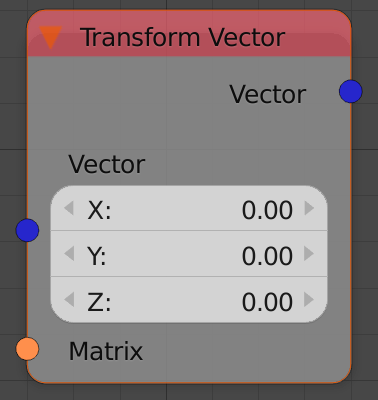

## Description

This node transforms the input vector(s) based on an input
Transformation Matrix.

## Inputs

- **Vector(s)** - The vector(s) to transform.
- **Matrix** - A transformation matrix.

## Outputs

- **Vector** - The vector after transformation.

## Advanced Node Settings

- N/A

## Examples of Usage


