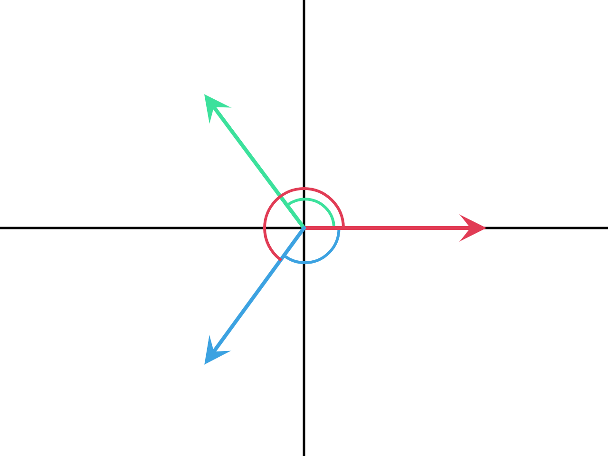

## Description

This node takes two vectors and computes two things:

1.  The shortest angle between the two vectors in radian.
2.  The directed angle between the two vectors in a form of rotation
    quaternion.

## Inputs

- **Vector A** - The first vector.
- **Vector B** - The second vector.

## Outputs

- **Angle** - The shortest angle between the two vectors in radian.
- **Rotation Difference** - A quaternion that represents the directed
    angle between the two vectors.

## Demonstration

### Angle

The Angle output returns the **shortest** angle between the input
vectors. This means it can not compute the angle in full `[0, 2pi]`
(`[0°, 360°]`) range but rather in `[0, pi]` (`[0°, 180°]`) range, this
can be demonstrated in the following illustration:

The standard angle between the red and green vectors is `120°` (Green
angle) while the standard angle between the red and blue vectors is
`240°` (Red Angle). However, the *Angle* output will return `120°` in
both cases, why? because there is a shorter angle in the second case
which measures `120°` (Blue angle). This output doesn't tell us about
the axis of rotation as well. So we see that the angle output doesn't
provide full information about the angle.

### Rotation Difference

This output returns the directed angle between the input vectors in a
form of a quaternion. A directed angle is a signed shortest angle at
which the first vector has to be rotated to coincide with the second
vector. To understand this, let us look at the previouse example again:

The directed angle between the red and green vectors is equal to `+120°`
because to rotate the red vector to coincide with the green vector along
the shortest path, we rotate in the anticlockwise direction. On the
other hand, the directed angle between the red and blue vectors is equal
to `-120°` because to rotate the red vector to coincide with the blue
vector along the shortest path, we rotate in the clockwise direction, an
equivalence angle to `-120°` is `-120°+360° = 240°` which is the angle
we originally computed. It should be noted that if we switched the order
of the vectors, we will get negative the original directed angle;
because the rotation direction changes from anticlockwise to
clockwise---or the converse. So we see that the Rotation Difference
output gives full information about the angles, including the axis of
rotation and the direction of the rotation.
