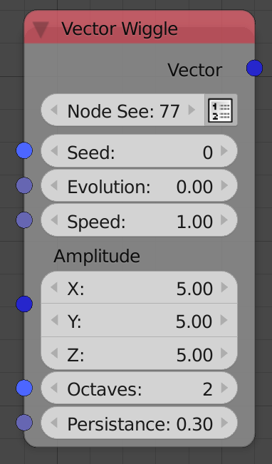

## Description

This node generates a random vector by generating a 1D noise in all of
its components. See `Number Wiggle <../number/number_wiggle>` node for
more info.

## Options

  - **Node Seed** - Aside from the *Seed input*, this extra seed
    parameter enables you to get different random vectors if the *Seed
    input* in not free, that is, it is dependent on some property that
    you can't freely controle, for instance, when using multiple *Random
    Vector* nodes in a loop while using the index as a seed, you can
    change the node seed to get different vectors for each node.
    Animation Nodes automatically changes the *Node Seed* when you
    duplicate or add a new *Random Vector* node.
  - **Create List** - It is the button you see beside the *Node Seed*,
    if it is enabled, the output will be a list of random vectors.

## Inputs

  - **Seed** - Seed for the random generator, where different seed
    generate different vectors.
  - **Evolution** - A float at which the noise is evaluated.
  - **Speed** - It is the frequency of the noise or the rate of change
    of the values.
  - **Amplitude** - A vector that represents the element wise maximum of
    the absolute of the componenets of the output vector.
  - **Octaves** - It is the number of perlin noises that constructs the
    noise function, where the noise function is the superposition of
    n number of perlin noise with
    different frequencies where n is the
    Octaves input.
  - **Persistance** - The magnitude of the added higher frequency
    octaves, the magnitude of each octave is directly propertional to
    its frequency.

## Outputs

  - **Vector** - The output vector of the noise functions at the input
    **Evolution**.

## Advanced Node Settings

  - N/A

## Examples of Usage






