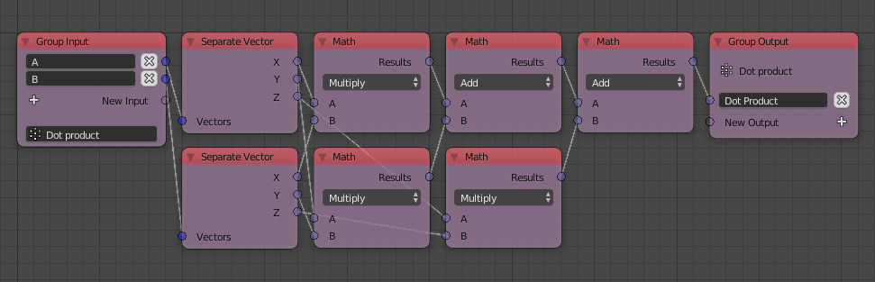
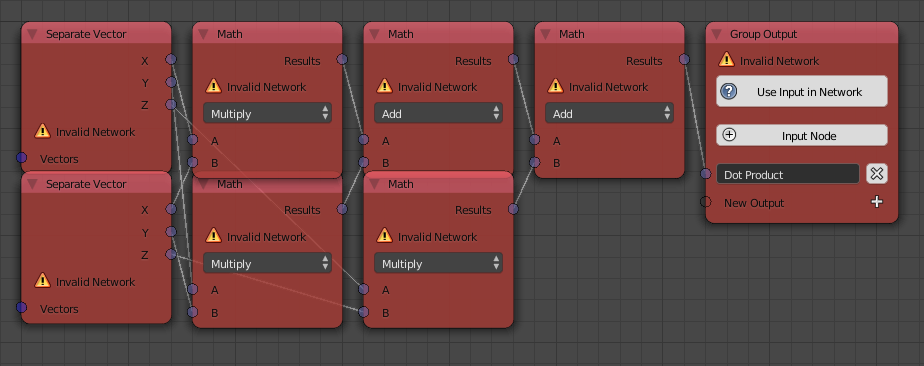

A group is the simplest type of subprograms, it takes some inputs and
return some outputs or perform a certain task defined by the nodes
encapsulated in it. A group is defined by a *Group Input* and a *Group
Output* node, however, the latter can be skipped as in *example 1*.
Unlike other subprograms, a group has to have at least one input.

## Advanced Node Settings

The inputs of a group can have default values. Default values can only
be defined for basic data types like numbers, vectors and booleans. One
can define the default values in the advanced node settings of the
*Group Input* node.

## Example 1

One can make a group that positions the input object randomly and shade
it smooth.

Notice that the group has two inputs *Object* and *Seed*, a new input
can be added by creating a link from the transparent socket to the
required node socket or by pressing the plus icon. This group has no
outputs and is thus called an *Operational Group* because it returns
nothing.

Had one defined the group, one can call/invoke it using the *Invoke
Subprogram* node.

Groups saves one the trouble of not having to copy the whole node tree
for each object resulting in a more efficient and organized node tree.

## Example 2

One can make a group that computes the dot product of two vector lists.
The group takes two inputs *A* and *B* and returns an output *Dot
Product*. A new output can be added by creating a link from the
transparent socket to the required node socket or by pressing the plus
icon. The *Group Output* node itself can be created by pressing the plus
button *Output Node*.

The group can be similarly invoked as in *example 1*.

## Network Error

A network error is raised in three situations:

1.  The group encapsulates an invoke node calling itself. Recursion is
    not supported.
2.  The *Group Input* node was removed but its *Group Output* node is
    still present. A group can't be solely defined by a *Group Output*
    node. The error can be fixed by either:
      - Adding a new *Object Input* node, connecting it to the group
        nodes and pressing *Use Input In Network*.
    
      - Adding a new *Object Input* node by pressing the plus button in
        the *Group Output* node.
        
        
3.  *Object Instancer* node exist in its structure. The *Object
    Instancer* node is a *subprogram-forbidden* node, meaning it can't
    be used inside any subprogram.
