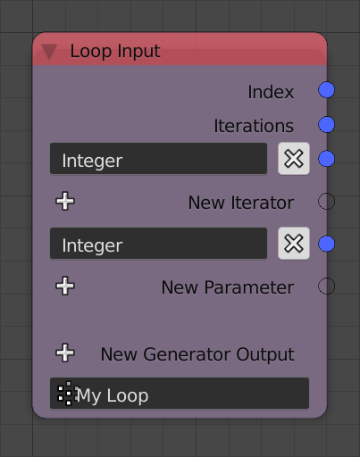
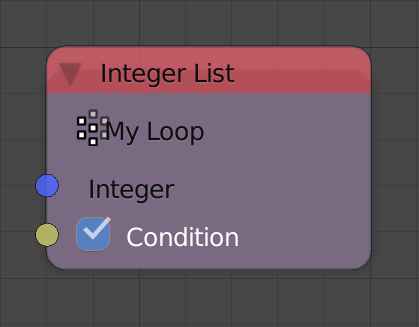
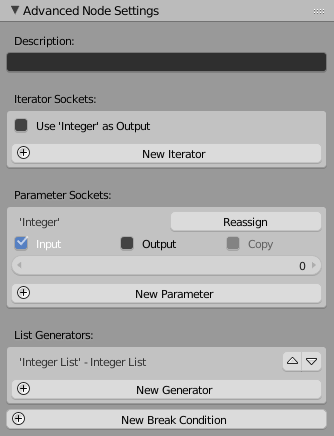
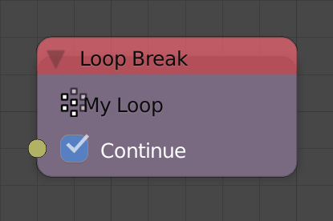
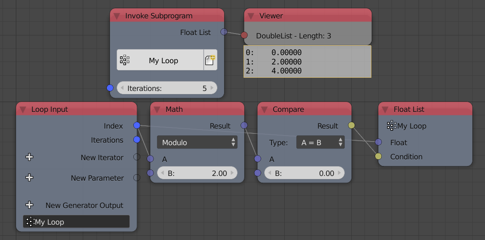
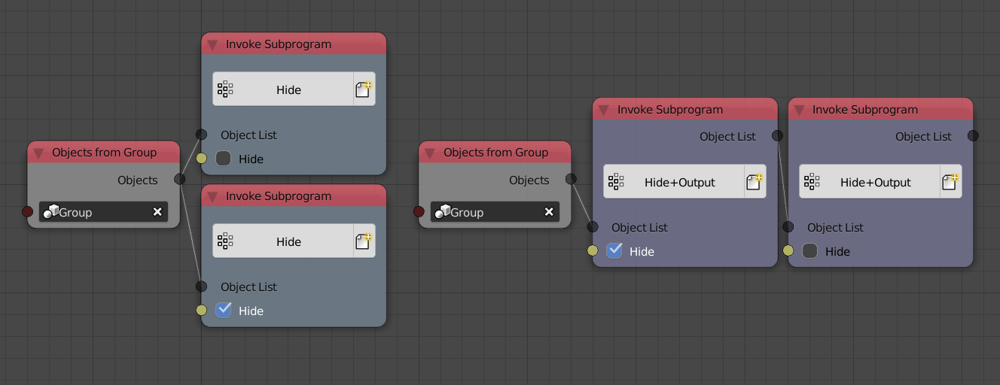
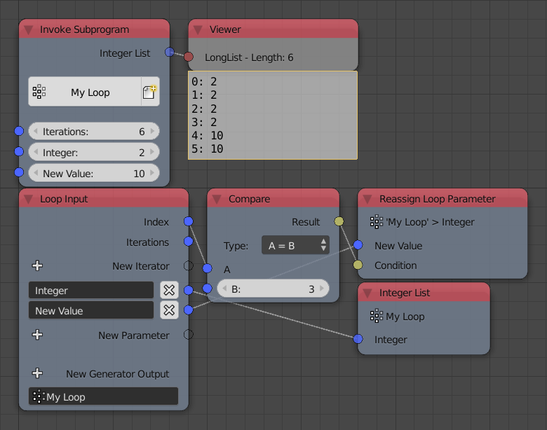
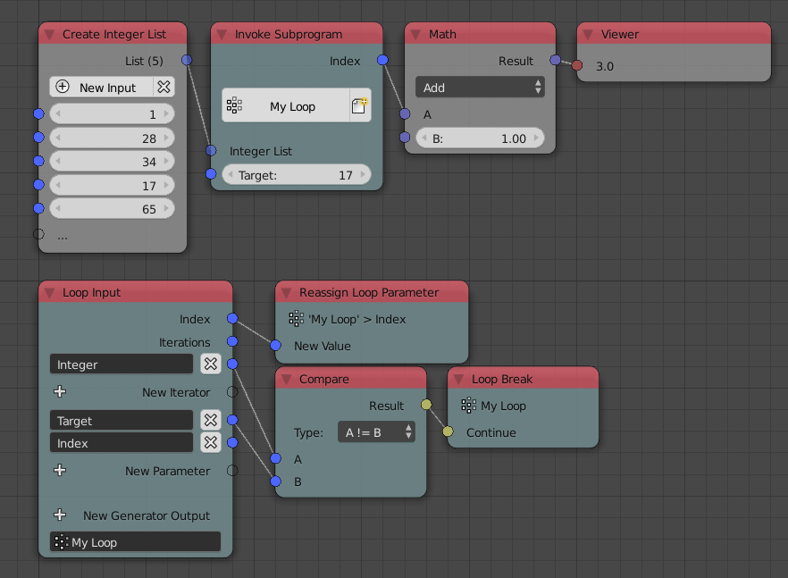
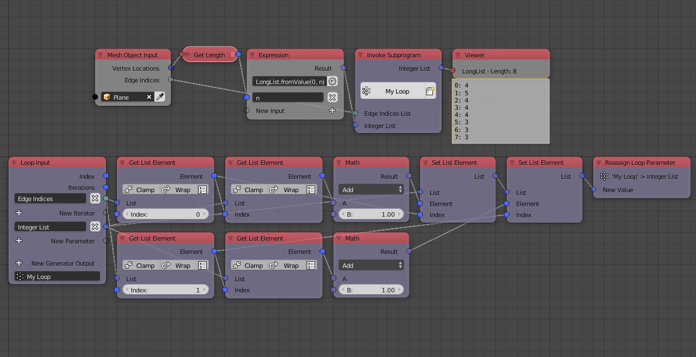

The loop subprogram allows iteration in Animation Nodes. Iteration is
the act of executing a group of the nodes multiple times, each time is
often called an *Iteration*. The *Number Of Iterations* (*Iterations*
for short) is the number of times the loop will execute. Each iteration
has an integer associated with it called an *Index*, this index is 0 for
the first iteration, 1 for the second, 2 for the third and so on to the
last iteration, which has an index n-1 where n is the number of
iterations.

## Parameters And Iterators

A loop can have *Parameters*, values that are fed to the loop and are
constant for all iterations unless explicitly changed. Values that
change from an iteration to another are defined by what is known as an
*Iterator*. An iterator is a list that feeds the loop its nth element at
the nth iteration, so at the first iteration, the iterator feeds the
loop its first element, at the second iteration, the iterator feeds the
loop its second element, and so on. If no iterator is present, the
number of iterations can be set manually using the *Iterations* input
that will be present when the subprogram is invoked, if an iterator is
present, the number of iterations is set automatically and will be equal
to the length of the iterator, that is, the number of elements in the
iterator. Multiple iterators can be used, in which case, the number of
iterations becomes equal to the length of the smallest iterator.
Iterators and Parameters can be added by the plus buttons *New Iterator*
and *New Parameter* respectively.

Loop are typically used to automate tasks or repeat them, for instance,
if one wants to shade 10 objects smooth, one might add 10 *Shade Object
Smooth* nodes and specify one object for each, but that would be tedious
and inefficient, what if there were 100 objects? Will one add 100 nodes?
Using a loop would be a wiser approach, one simply creates a list
containing those objects and use that list as an iterator in a loop that
contains a single *Shade Object Smooth* node where its input object is
the output of the iterator. At the first iteration, the output of the
iterator will be the first object, thus the first object gets shaded
smooth, at the second iteration, the output of the iterator will be the
second object, thus the second object gets shaded smooth, and so on.
Often, when one wants to describe such loop, one says *"We loop over the
objects and shade them smooth"*, the term *loop over something* means
using that something as an iterator.

## Generators

A generator is a list that is initially empty and allows one to
add/append values(s) to it at each iteration. A generator has two
inputs, the value(s) to be appended and a condition (Hidden by default)
which is a boolean that is True if one wants the value(s) to be appended
and False otherwise. For instance, if one have a list of integers and
one wants to only keep the even integers, one would loop over the
integers, check if they are even and append them if they are, this is
done by using the output of the check as the condition. A new generator
can be added by using the plus button *New Generator Output*. The name
and type of the generator can be set from its advanced node settings.

## Advanced Node Settings

  - **Description** - A description for the function of the loop. This
    description only appears in the **Invoke Subprogram** node when
    choosing the required subprogram, however, it is a good practice to
    write a description for each subprogram so that other users can
    understand its function.

### Iterator Sockets

The *New Iterator* button can be used to add a new iterator, this is
equivalent to the button in the node. If iterators are presents, an
option *Use {Iterator} As Output* for each of them will be displayed, if
enabled for an iterator, the iterator will be available as an output
when the loop is invoked. The output will be the same list you input.
This is useful to avoid unnecessary data copying by using the output
instead of creating another branch from the source iterator which would
enforce data copying. Moreover, this also ensures that the loop executes
first as a consequence of the series connection. See examples below.

### Parameter Sockets

The *New Parameter* button can be used to add a new parameter, this is
equivalent to the button in the node. A list of parameters is displayed
with their options. For each parameter, the following options are
present:

  - **Input** - If enabled, the parameter will be available/exposed as
    an input when the loop is invoked, if disabled, it won't be
    available as an input and its value will be equal to its default
    value. Certain applications of loops use parameters as temporary
    placeholders or as outputs, thus sometimes, they are expected to
    have a certain initial values, so to make sure the user doesn't
    alter its expected value, the parameter can be hidden using this
    option. In this case, the parameter is called a dummy parameter. See
    examples below.
  - **Output** - If enabled, the parameter will be available as an
    output when the loop is invoked, if disabled, it won't be available
    as an output. The significance of this option will be apparent when
    we discuss reassignment operators. See examples below.
  - **Copy** - If enabled, the parameter at each iteration will be a
    different copy of its source, if disabled, Animation Nodes will
    handle the copying automatically, so even if it is disabled,
    parameters might be copied anyway if Animation Nodes decides to.
    This option is only available for structures that can be copied, so
    it won't be available for simple data types like integers and
    floats. This option is helpful in certain advanced cases, see
    examples below.
  - **Default** - The default value of the parameter, this option is
    only available for simple data types, so data types like BVH and KD
    Trees won't have this option.

#### Reassignment Operators

Parameters are constant for all iterations, however, one can change
their value at a certain iteration using what is known as a reassignment
operator, this operator can be added using the *Reassign* button. The
operator has two inputs, the new value of the parameter and a condition,
if this condition is True, the operator changes the parameter value to
the new value, if the condition is False, the operator is rendered
ineffective and the parameter retains its value. See examples below.

#### List Generators

A list of generators is displayed. The arrows can be used to change the
order of generators as outputs. It should be noted that iterators—if
used as outputs—will always be displayed first according to their input
order. Moreover, parameters—if used as outputs—will be displayed at the
end according to their input order.

#### Break Condition

A break condition forces the loop to terminate at a certain iteration.
The break condition has a single boolean input *Continue*, if it is
True, the loop is continued as normal, if it is False, the loop is
terminated and all iterations after the current one won't be executed. A
break condition can be added by the *New Break Condition* button in the
advanced node settings. See examples below.

## Execution Mechanism

Loops have a certain execution mechanism that can be described by a
number of defined **ordered** steps, the execution mechanism for the nth
iteration is as follows:

1.  The *Loop Input* node returns the index of the current iteration,
    the number of iterations, the parameters—if available, and the
    outputs of the iterators—if available. The values of the parameters
    are equal to their default value if they are not exposed as inputs.
    The outputs of the iterators are their nth elements. If an iterator
    has no nth element, the loop is terminated. Moreover, if the index
    of the current iteration is equal to the number of iterations, the
    loop is terminated.

2.  The body of the loop, that is, all nodes—excluding generators,
    reassignment operators and break conditions—are executed based on
    the values provided by the *Loop Input* node.

3.    - For each break condition:
        
          - If its *continue* input is `False`, the loop is terminated.

4.    - For each generator:
        
          - If its *condition* input is `True`, the value is appended to
            the list it points to.

5.    - For every reassignment operator:
        
          - If its *condition* input is `True`, the value of the
            parameter it points to is changed to the input value.

The fact that *Break Conditions* execute before *Generators* and
*Reassignment Operators* is of essence, because if the loop broke at a
certain iteration, the value that would have been appended at that
iteration by the generator will not be appended, and the parameter that
would have been reassigned at that iteration will not be reassigned.
**However**, note that the body of the loop executes before the *Break
Conditions*, subsequently, any action performed by the body at that
iteration will take place. For instance, if a loop is used to position
some objects—using the *Object Transforms Output* node—and return their
positions—using a generator—, if that loop broke at the fifth iteration,
the fifth object will be positioned, however, its location will not be
appended.

## Examples

### Example 1

In this example, an integer generator is used to append the index of
each iteration. The number of iterations is defined manually using the
*iterations* input since there are no iterators present.

Notice that the first iteration has and index of 0 and the last
iteration have an index n-1 where n is the number of iterations.

### Example 2

In this example, a float generator is used to append the the index
divided by n-1 where n is the number of iterations.

Notice that since the largest/last index is equal to n-1, then the
output will be an arithmetic sequence that starts with zero and ends
with 1.

### Example 3

In this example, a generator is used to append multiple values at each
iteration. The values are defined by a list filled with the index.

### Example 4

In this example, a generator is used to append the index if it an even
number. This is done by using the condition of the generator.

Notice that modulo two of some integer is zero if it is an even number.
So, the condition is True only if the number is even.

### Example 5

In this example, we loop over an integer list and use a generator to
only append the even integers as in the foregoing example.

Notice that since an iterator is present, the number of iterations is
now defined by the length of the list, there is no iterations input.

### Example 6

In this example, we loop over two integer list and use a generator to
append the product of both integers.

Notice that the second list have 5 elements while the first only have 4,
thus the loop ignores the fifth element of the second list and only
executes 4 times. Subsequently, the output list contains only 4
elements.

### Example 7

In this example, we loop over an integer list and use a generator to
append the integer multiplied by some parameter.

Notice that the value of the parameter is constant for all iterations.

### Example 8

In this illustrative example, we have two node trees that supposedly
does the same thing, that is, hide the objects in a blender group and
then show/unhide them. The only difference is, in the node tree on the
right, we used the iterator as an output and used that output as the
iterator of the second loop, while on the left node tree, we used the
object list directly as the iterator for both loops.

Those two node trees are actually not the same, the left node tree
shouldn't be used for two reasons:

1.  There is no defined order for the loops to execute. Should Animation
    Nodes execute the upper or the lower loop first? There is no way to
    know, so Animation Nodes executes them in arbitrary order. This
    causes unexpected results because if the show loop was executed
    first, the object will end up hidden because the hide loop will
    execute second.
2.  Even though the object list is not edited, Animation Nodes copy it
    thinking you wanted two different copies.

The right node tree fixes both problems by:

1.  Defining an order for the loops to execute by making the second
    depend on the output of the first, thus instructing Animation Nodes
    to execute the dependencies first.
2.  The object list is not copied because it is used sequentially, that
    is, no branching occur.

In conclusion, the right setup should be used at all times.

### Example 9

In this illustrative example, we use a generator to append the value of
an integer parameter.

Since parameters are constant for all iterations, the the output of the
generator will be a list filled with the value of the parameter.
However, it is possible to change the value of a parameter at a certain
iteration by a reassignment operator. In the following example, we
reassign/change the value of the parameter to some new value at the
fourth iteration, that is, when the index is equal to 3:

Notice that the value appended at the fourth iteration is the old value,
when you reassign a parameter, its value changes for all iterations
after the current one, while the current iteration still has the old
value.

### Example 10

In this example, we find the greatest integer in an integer list. This
is done by adding an integer parameter whose value is the first integer,
we then loop over the integers, if the integer at the current iteration
is larger than the parameter, then we reassign the value of the
parameter to be the integer at the current iteration, at the end of the
loop, the value of the parameter will be the largest integer in the
list. Then we output that parameter by enabling *Output* in its advanced
node settings.

Since we reassign whenever the integer is larger than the integer stored
in the parameter, we end up with the largest integer, why? Take your
time to think about it.

### Example 11

In this example, we find the index of the first occurrence of a certain
integer in an integer list. We start by adding a dummy integer parameter
whose initial/default value is equal to negative one, we then loop over
the integers, reassigning the parameter to the index of the iteration,
we also check if the current integer is the target integer we are
looking for and if yes, we break the loop. Finally, we output the dummy
parameter. At the end of the loop, the parameter will have the required
index minus one, so by adding one we get the index we are looking for.

At the time of the break happened, the current iteration index is the
index we are looking for, but the breaking happen before the
reassignment—or any other operation in the node—, so the current index
never gets written to the parameter, but we know that the index that was
going to get written is, in fact, the previous index plus one, that's
why we added one at the end.

Notice that we could have taken another approach by adding to an
initially zero dummy parameter as follows, but that would be less
efficient due to the extra plus instruction:

### Example 12

In this example, we compute the number of neighboring vertices of each
vertex in a mesh. We first initialize an integer list filled with zeros
where its length is the number of vertices, this is done by using the
`fromValue(value, length)` method of the `LongList` data structure. We
then loop over the edge indices list of the mesh with the zeros list as
a parameter. For each index in the current edge indices (there are two),
we get the element of the zeros list at the index and set its value to
its value plus one using the *Set List Element* node, effectively
incrementing its value by one. Finally, we reassign the value of the
zeros list to the output of the *Set List Element* node and output it as
a parameter.

What happens here? The number of neighboring vertices of a vertex is the
number of edges connected to it, so to compute the number of neighboring
vertices, one simply computes the number of edges connected to that
vertex. To do so, we could count the number of times the vertex is
mentioned in the edge indices list, and by that I mean the number of
times its index appeared in the edge indices list. So we loop over the
edges, and increment the number of times each vertex was mentioned by
one, the number of times each vertex was mentioned is zero at the start
of the loop, hence the list of zeros. Take your time to think about it.

But what if we are only interested in one vertex? In this case, we can
loop over the edges, if the index of the vertex we are interested in is
equal to either of the two indices in the edge, we should increment an
initially zero parameter by one and output that parameter. When the loop
finishes, the parameter will represents the number of times the vertex
appeared in the edge list.

The way we incremented the amount above is unusual, we added a boolean
to an integer\! This is called an implicit conversion, a boolean is
converted to `1` if it is `True` and `0` if it is `False`, so by adding
the condition directly, we are effectively adding one if the index was
found and zero(that is, not incrementing) if the index was not found.
