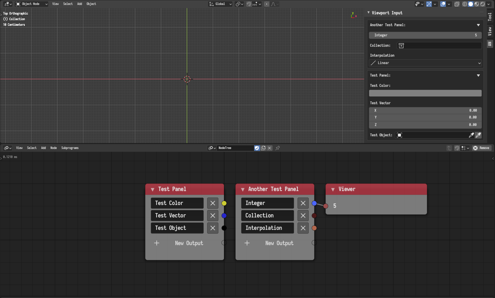

The node allows the user to create an interface in the 3D view-port AN menu
where values can be retrieved and used in the node tree. Each node creates a
collapsible box named after the label of the node, the box contain all the
interface elements added in node. The added node outputs store the values that
the user inputs.

## Advance Node Settings

- **Order Weight** - Nodes with lower weights will have their view-port panels
  placed at the top, while nodes with higher weights will have their view-port
  panels placed at the bottom.
