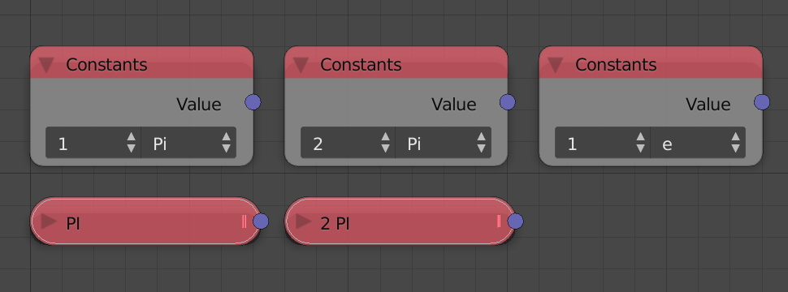

All number nodes that can be vectorized are now vectorized.

## Float Range

Float Range node can now generate floats inside the closed interval
`[start, stop]`. This can be done by choosing the **Start/Stop** option.
The node now is 400x faster than before.

## Random Number

Random Number node can now generate a list of random floats. This can be
done by checking the **Create List** button beside the node seed. The
node is now 400x faster than before.

## Map Range

Map Range node has a new UI for easier and faster workflow. And it is
vectorized, so it can now remap a list of floats.

## Float Math

Math node is now 200x faster. It is vectorized such that you can operate
on two lists element wise, operate on a single list for single input
operations and operate on a list and a value where the value is added,
multiplied, etc to all the value of the list.



The math node also have a new UI feature: A small menu called **Quick
Settings** will appear whenever the node is duplicated. This menu
includes four buttons which convert the type of the math node to
addition, multiplication, subtraction or division. This allow faster
conversion if needed. If you don't want to convert, then pressing the
check mark will hide the menu telling AN that this is the type you want.
Moreover, a button is present in the advanced node settings that hide
the menu for all nodes in the current node tree.



Float can now be automatically converted to Integer without an extra
node.

## Constants

There is a new Number Constants node which provides easy access to a few
constants.

