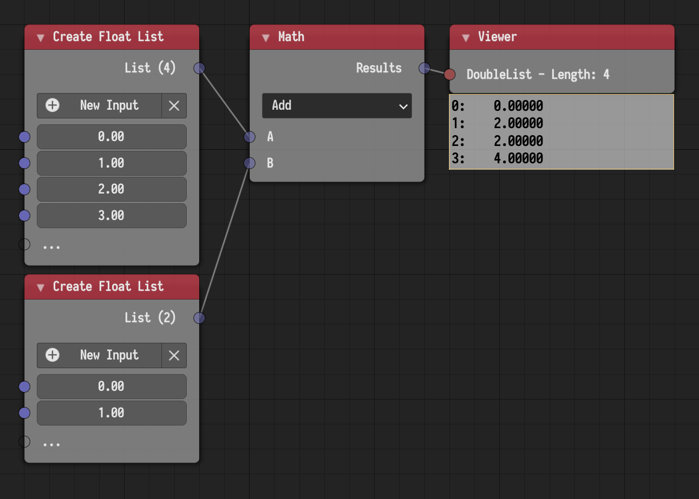

## Key Features

### Virtual Lists

Virtual lists are special kind of lists where the user can get the element at
any index, even if the index is out of bound or the list is empty. Virtual
lists are used internally by Animation Nodes, so users will not typically
interact with them. Many nodes utilize virtual lists to interpret input lists
of different lengths. For instance, Math nodes can now operate on lists of
different lengths, in which case, the shorter list is repeated to match the
length of the longer list. This is shown in the following example.

The usefulness of virtual lists and their repetitive behavior will become
apparent when using generator and evaluator nodes. This is shown in the
following example.



### Changes in Detail

{}

