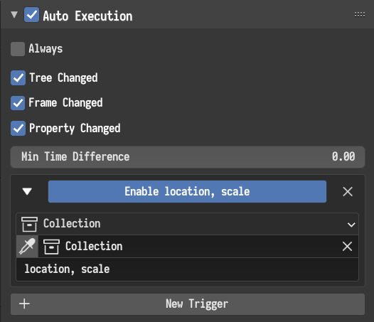
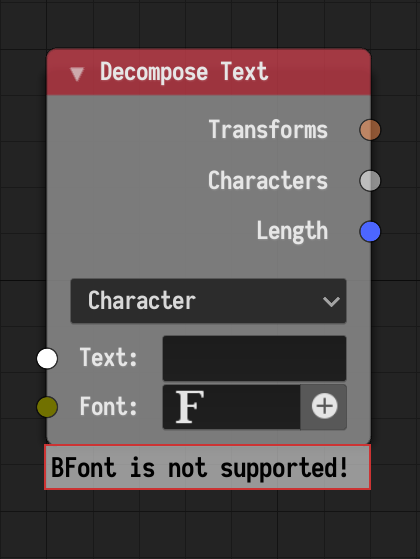

## Viewport Input

This node was added. The node allows the user to create an interface in the 3D
view-port AN menu where values can be retrieved and used in the node tree. Each
node creates a collapsible box named after the label of the node, the box
contain all the interface elements added in node. The added node outputs store
the values that the user inputs.

## Triggers

Triggers have been redesigned. A new option to use a collection as the trigger
property was added. In this case, each object in the collection is monitored.
Additionally, it is now possible to monitor multiple properties by writing
comma-separated paths. For instance, to execute the node tree whenever the
location or scale of each object in the master collection change, we can add
the following trigger.

## Error Messages

Error messages are now reported in a special HUD under the node instead of
in-line display.

## Subprogram Search

It is now possible to search for subprograms in the search menu, where an
*Invoke* node will be inserted.
