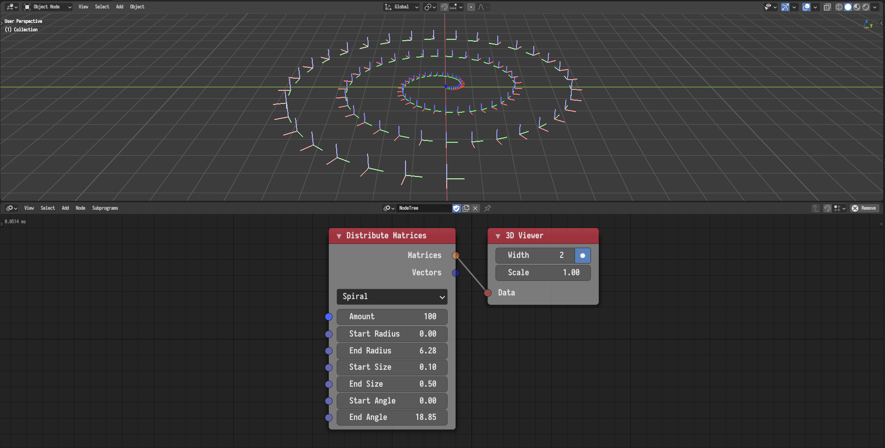

## Offset Matrix

The offset transformation can now be defined using an action and can be
evaluated either at a certain frame or a range of frames defined by a falloff.
The following example illustrates the evaluation of an F-Curves based action at
a linear range of frames.



## Distribute Matrices

A new mode for distributing matrices on a spiral was added.

## Axis Rotation Matrix

The *Axis Rotation Matrix* node was added. The node compose a rotation matrix
of a rotation around a certain axis.

## Compose Matrix

A new *Compose Matrix* node was added. The node allows the user to construct a
matrix or a list of matrices from locations, rotations, and scales. This node
replaces the *Translation Matrix*, *Scale Matrix*, and *Rotation Matrix* nodes.

## Translation Matrix

This node was removed. Replaced by the *Compose Matrix* node.

## Scale Matrix

This node was removed. Replaced by the *Compose Matrix* node.

## Rotation Matrix

This node was removed. Replaced by the *Compose Matrix* node.
