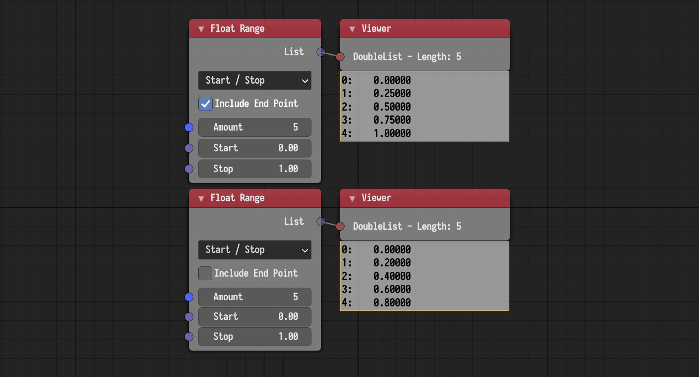

## Float Range

A new *Include End Point* option was added. If enabled, the range will be
inclusive, that is, it will include the end point. Otherwise, the range will be
exclusive.

## Sort Numbers

This node was added. It sorts a list of numbers and return the sorting indices.
Key-based sorting can be achieved by evaluating the input list at the output
indices. For instance, to sort a list of vectors based on their x value, the
following setup can be used.

