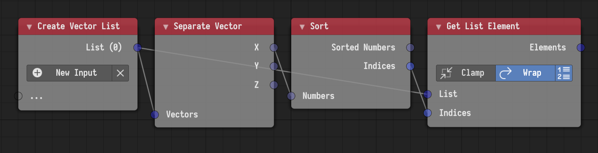

## Sort

This node was added. It sorts a list of numbers and return the sorting indices.
Key-based sorting can be achieved by evaluating the input list at the output
indices. For instance, to sort a list of vectors based on their x value, the
following setup can be used.

