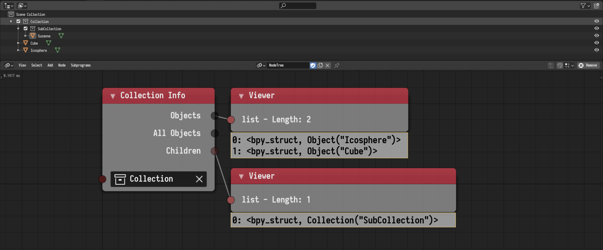

## Collection Info

This node was added. It return the objects and children in the input
collection.

## Object Group Operation

This node was updated to deal with collections and it was renamed to
*Collection Operations* node.

## Objects From Group

This node was removed. Replaced by the *Collection Info* node.

## Set Layer Visibility

This node was removed.

## Object Transforms Input

Evaluating transforms at certain frames is no longer possible. The new action
system can be used for that.

## Shape Keys From Object

The reference key is no longer included in the output keys list.

## Object Color Output

A new *Object Color Output* node added. This node allows to set the viewport
color of the object which can also be utilize for object material.

## Copy Object Data

A new *Deep Copy* option was added to the *Copy Object Data* node. If enabled,
the object data data-block will be copied before being set.

## Object Instancer

The *Object Instancer* node now remove instanced objects even if they have
users. Additionally, a new option to create Grease Pencil objects was added.
