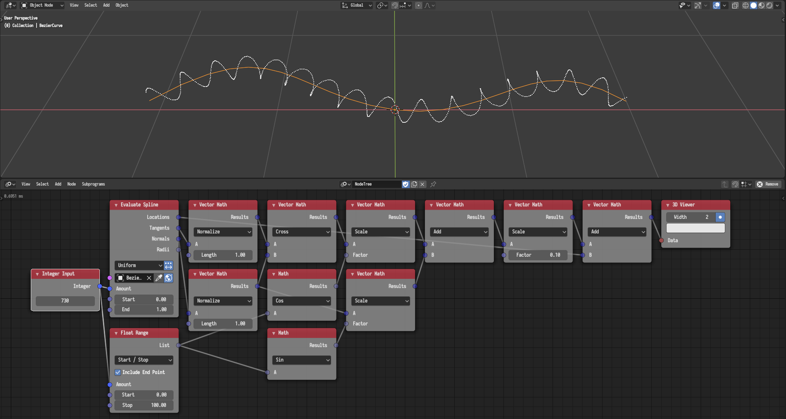
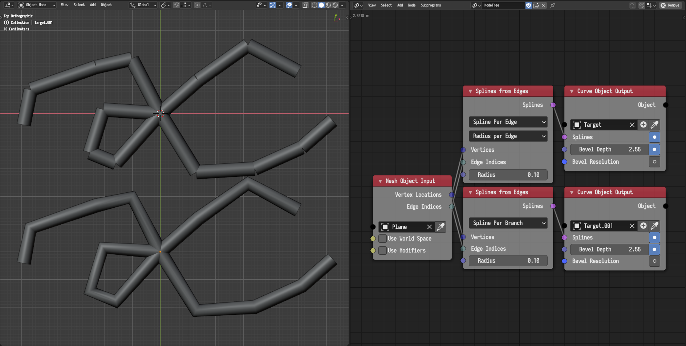
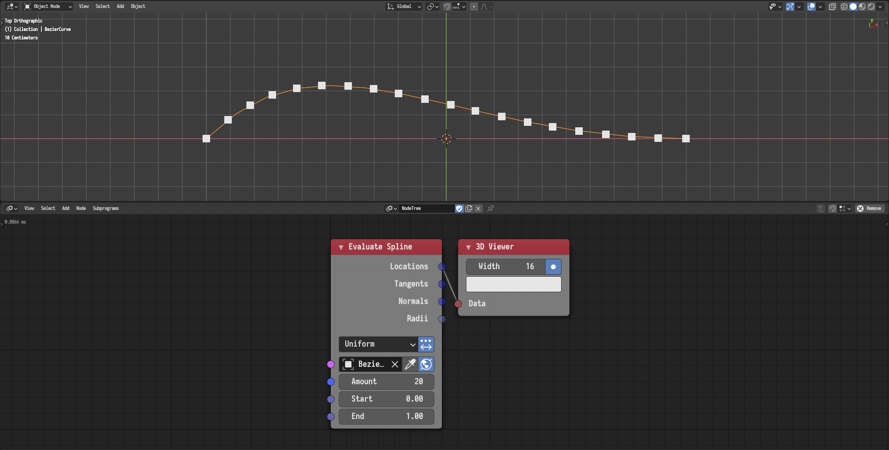

## Spline Normals

Spline nodes now return spline normals when possible. Normals, while arbitrary,
are guaranteed to be sufficiently continues with low deviations for visually
pleasing results.

## Spline Tilt

Splines nodes can now deals with spline tilt.



## Tilt Spline

A new *Tilit Spline* node was added. The node alters the tilt of the spline and
can so in an accumulative manner.



## Splines From Edges

A new *Spline Per Branch* option was added. It minimizes discontinuity by
forming splines from *branches* instead of edges. A comparison between the old
approach and the new option is shown in the following example.

## Evaluate Spline

A new *Evaluate Range* option was added.

## Get Spline Samples

This node was removed. Replaced by the *Evaluate Range* option of the *Evaluate
Spline* node.
