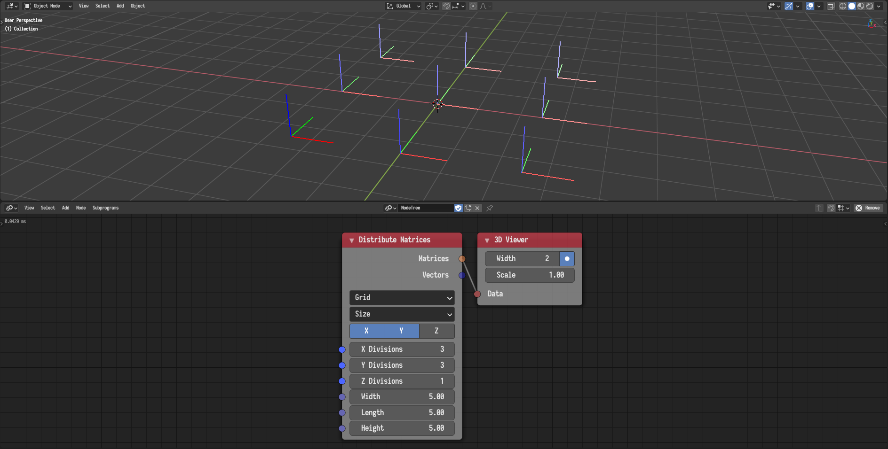
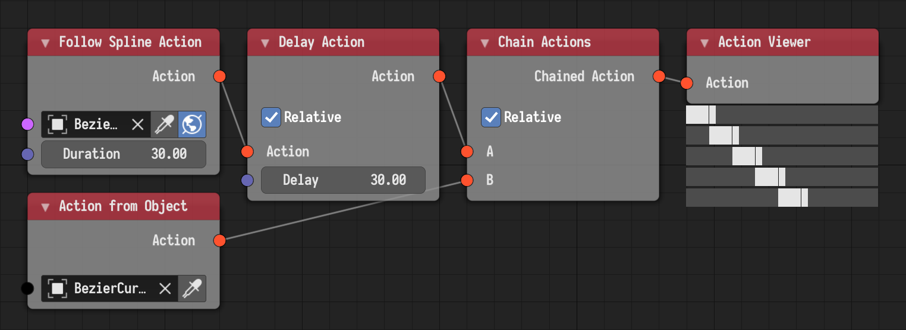

## 3D Viewer

Matrices are now displayed as colored positive axis. Additionally, the
saturation of the colors decrease as the index of the matrix increase.

The node now allows viewing 2D vectors.

## Viewer

The view node now shown angles in degrees as opposed to radians.

## Action Viewer

This node was added to visualize actions. It is particularly useful to
visualize how actions stack and chain against each other. The following example
illustrates the use of the viewer to visualize a chained delayed action.

