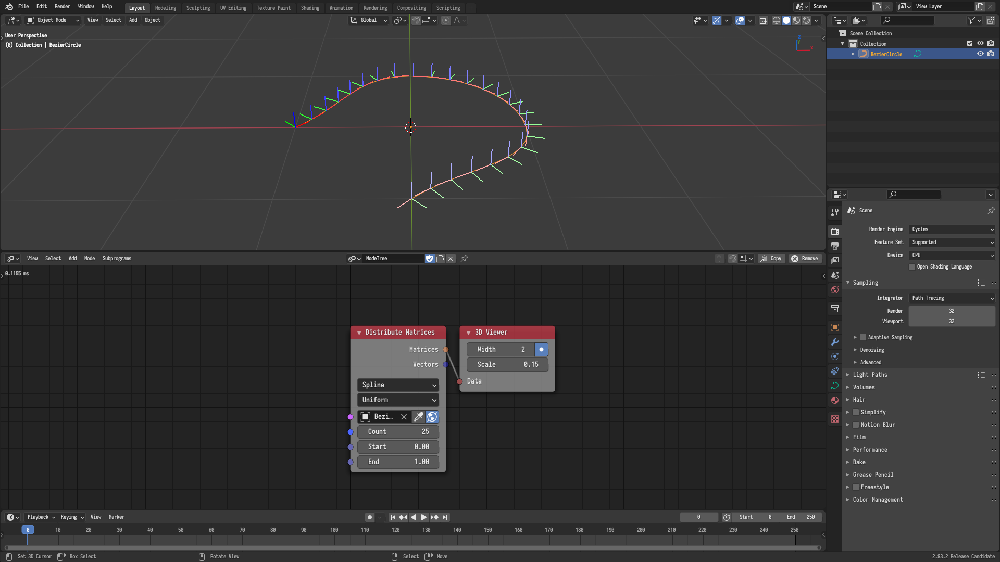
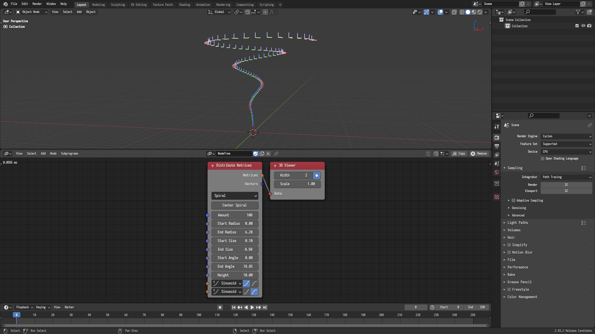

## Distribute Matrices

A new *Spline* mode was added to the *Distribute Matrices* node. This option
lets you distribute matrices along a spline. The matrices are oriented such that
its local axis align with the tangent and normal to the spline.

A height input and interpolation inputs controlling the rate of change of the
radius and the height were added to the *Spiral* mode of the node.

A center and an axis options were added to the *Linear* mode to center the
distributed matrices and align them on the chosen axis.

A plane axis option was added to the *Circle* mode to define the plane at which
the circle will lie.

A new *Hexagonal Grid* mode was added.

It is now possible to search for the node using the name of its modes. For
instance, searching for *Spiral* will add a node with its mode set to spiral.

## Transform Matrix

The *Transform Matrix* node was vectorized.

## Extract Matrix Basis

The *Extract Matrix Basis* node was added.

## Mix Matrices

The *Mix Matrices* node was vectorized.
