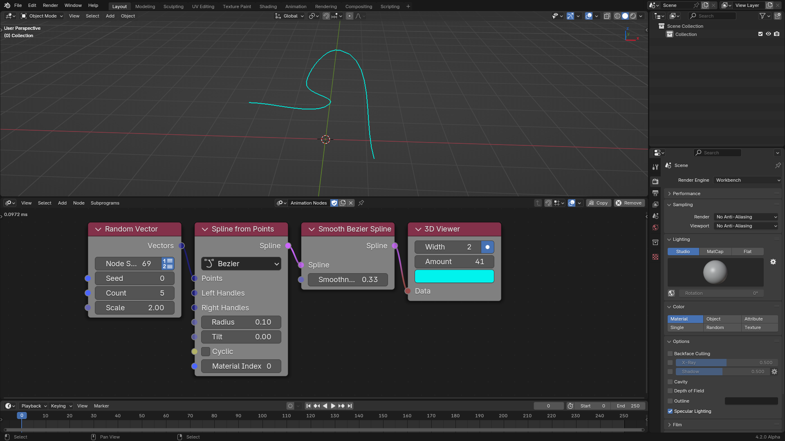
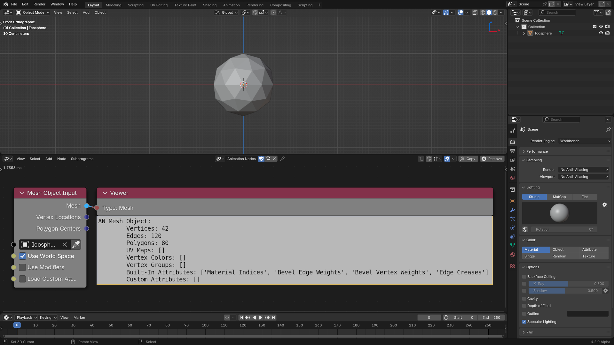

## Evaluate FCurves Transforms

A new *Evaluate FCurves Transforms* node was added to evaluate location,
rotation, and scale fcurves at an arbitrary frame.



## Auto Execution

A new *Scene Changed* option was added to the Auto Execute panel. This option
makes Animation Nodes execute if anything changes in the scene, which is much
more efficient that the existing *Always* which superfluously executes in most
cases. This is now the default.

## 3D Viewer

The *3D Viewer* node now allows viewing splines.

## MIDI

The *Evaluate MIDI Track* node now supports controlling the *Decay* time as
well as its interpolation and the *Sustain* level. So it now supports the full
ADSR envelope. The node now also have a new *Velocity Sensitivity* input, which
attenuates the MIDI note values by their velocity if 1, does nothing if 0.

## Attributes

The *Insert Custom Attribute* node now allows overwriting existing attributes.

Input and output mesh nodes now support built-in attributes.

## Object Instancer

The *Add To Main Container* advanced option was replaced with a *Container
Type* option, which specifies where the new instanced objects will be added.
They can be added to the *Main Collection* as before, to the *Scene Collection*
of the scenes provides by the user through the *Scenes* input, or to the
*Collections* provided by the user through the *Collections* input.

## Lamp Data

A new *Lamp Input* and *Lamp Output* nodes were introduced to get and set lamp
data like Color and Energy.

## Vectorization

The *Get Spline Length* and *Float To Text* nodes were vectorized.

## Optimizations

Animation Nodes no longer setup unused subprograms, so it should be much faster
for files with many node trees with subprogram assets.
