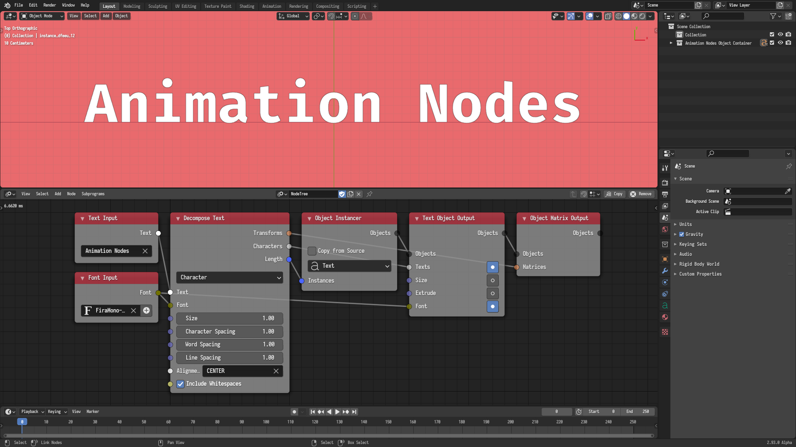
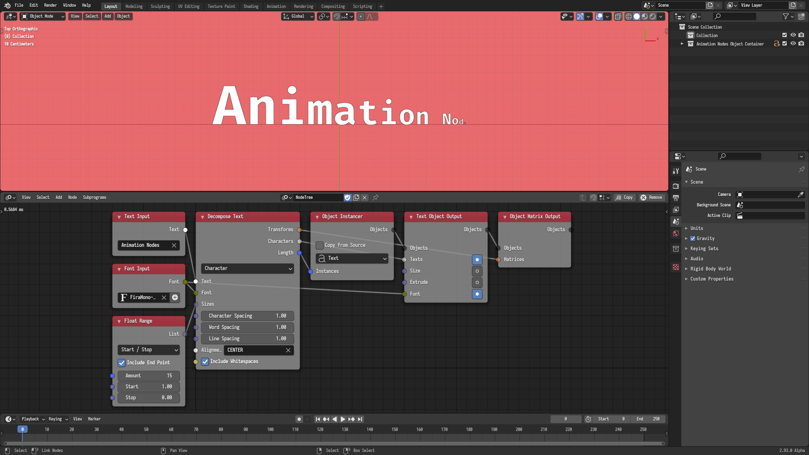
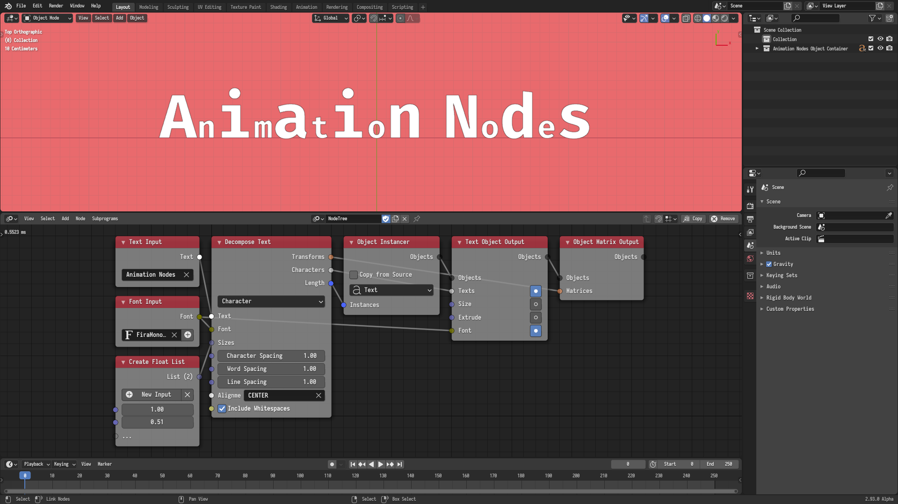
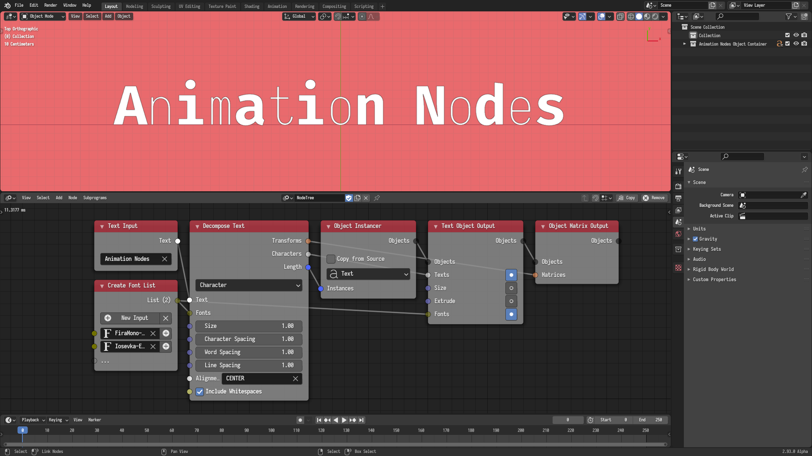

## Introduction

The *Decompose Text* node is perhaps the most useful node for text animation in
Animation Nodes. The node takes a text as input and decomposes it into
characters or words, returning some information about those characters or words
such as their transforms, texts, and count. Those information can then be be
manipulated and animated using the many facilities provided by Animation Nodes.

For instance, given the text `cat` in characters mode, the node will return the
following:

- Transforms: A list of transformation matrices representing the location,
  rotation, and scale of each character as a text object.
- Characters: A list of texts containing `c`, `a`, and `t`.
- Length: The number of characters, which is 3 in this case.

In this tutorial, a number of examples are provided to demonstrate the
capabilities of this node.

## Basic Setup

The most basic use of this node is as follows. A number of text objects are
instantiated, their texts are set using the output texts of the node, their
fonts are set using the input font, and their transforms are set using the
output transforms of the node. Since each font have its own typographic
properties, the font has to be provided to the node and set to the output
objects, failure to do so would result in erroneous spacing. The built-in
`BFont` font can not be used due to technical limitations, but it is also a
sign from the universe that you shouldn't use that font in your work.

## Parameters

The node parameters are straightforward. The reader is encouraged to adjust the
parameters of the basic setup to get a basic idea of what they control.

- Size: The size of each character or word.
- Character Spacing: The length of the space after each character. Note that in
  Word Decomposition mode, it is assumed that the text object will have its
  Letter Spacing option equal to this parameter. Failure to equate those two
  values would result in erroneous spacing.
- Word Spacing: The length of the space after each word.
- Line Spacing: The length of the space between each line.
- Alignment: The alignment of the text in each line. Possible values are
  `CENTER`, `LEFT`, and `RIGHT`.
- Include White Spaces: If enabled, white spaces will be considered a character
  and output in Character Decomposition.

Most of those parameters are vectorized and virtual, meaning you can specify
those parameters per character, word, or line by providing lists.

The following examples demonstrate vectorized parameters.

## Basic Animation

The most basic text animation to create with this node is as follows. An Offset
Matrix node is used to offset the scale of the characters based on an inverted
Delay Falloff with a back interpolation.



This animation can be extended to include rotation and location offsets as
follows.



The animation can be extended further to incorporate a leaving animation as
follows. The input time of the delay falloff is ping ponged to decrease again
after a certain amount of time. A compare and switch tree is used to change the
rotation and location offsets depending on whether the animation is in its
first or second part.



## Random Appearance Disappearance

In this example, the offsets of the Delay Falloff node are controlled by
shuffled linearly distributed values. This results in each character appearing
at a random point in time. The animation is ping ponged to add a disappearance
animation. The seed of the shuffle node is the result of the floor division of
the time by the ping pong period, this means that it will be zero in the first
part of the animation and one in the second part.



## Bubbly

It is possible to animate the node parameters directly. In this example, the
size of characters is controlled in a manner similar to the one described in
the previous example. This is different from the previous example in that the
size parameter affects the positions of the characters, while offsetting the
scale in the output matrix will only affect the scale.



## Bouncy

In this example, we also animate the parameters directly by setting the
character spacing to the values of a delay falloff with a bouncy interpolation.
The falloff values are multiply by a factor that determine the distance they
will travel and a value of one is eventually added because the default base
value of character spacing is one.



## Wavy

In this example, the character sizes are controlled by the values of a remapped
cosine wave with an animated phase.



## Action

In this example, an empty is animated along a path and an action is constructed
from its animation data. The matrices are offset based on that action using a
delay falloff as an offset.


