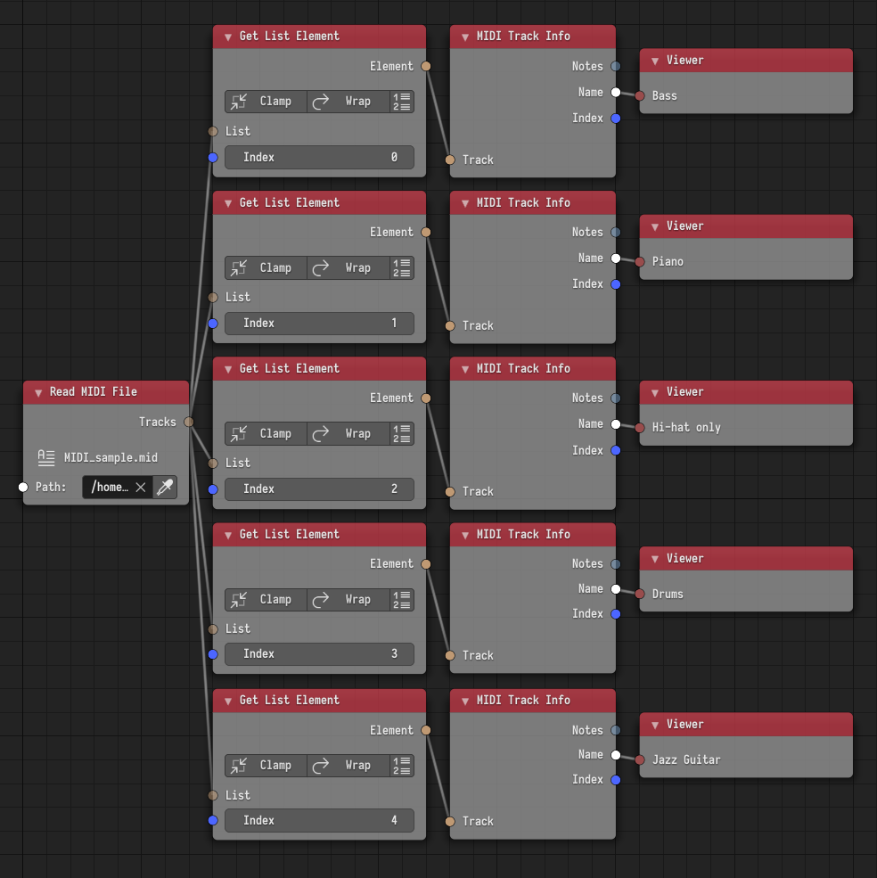
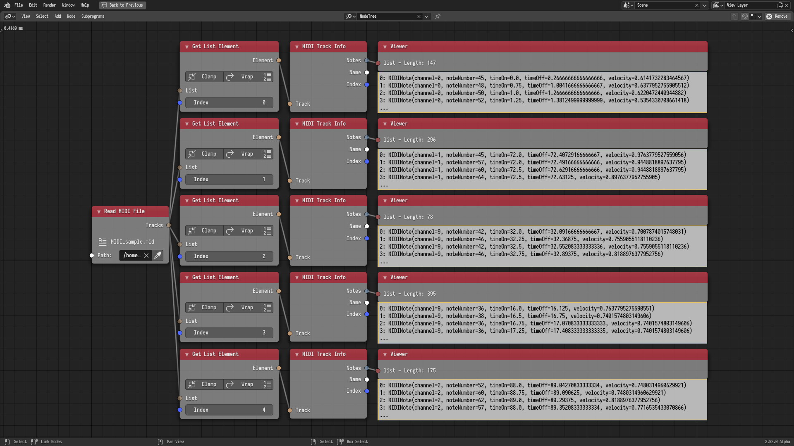

## Introduction

MIDI files are files that store musical events such as the key presses on a
piano or the drum hits on a drum. MIDI files can be used in Animation Nodes as
a mean of music visualization. While MIDI files actually store events,
Animation Nodes represents MIDI files in a data oriented manner. This
representation is described in the following section.

MIDI files are composed of one or more *MIDI Tracks*. A MIDI track contains a
list of *MIDI Notes*, the name of the track, and the index of the track in the
file. A MIDI note is represented by:

- Channel. The channel defines the channel that this note is playing on. It
  ranges between 0 and 15. Typically, each channel represents a certain
  instrument. So notes on channel 0 could represent piano notes, while notes on
  channel 9 could represent drum hits. A track can contain notes of a unified
  channel or notes of different channels.
- Note Number. The note number defines the octave and frequency of the note.
  It ranges between 0 and 127. You can think of it as a number identifying the
  piano key that was pressed. 0 being the leftmost key and 127 being the
  rightmost key.
- Time On. The time on defines the time in seconds when the note started
  playing. You can think of this as the time when the pianist pressed the piano
  key.
- Time Off. The time off defines the time in seconds when the note ended
  playing. You can think of this as the time when the pianist released the
  piano key.
- Velocity. The velocity defines the strength of the note. It ranges between 0
  and 1. The meaning of strength here is dependent on the instrument. For
  instance, for the piano, the velocity could be the force at which the pianist
  pressed the key.

Now that we are familiar with the structure of MIDI files. Lets look at how
they can be utilized in Animation Nodes. But first, download the following
[MIDI file][MIDIfile] for testing purposes.

[MIDIfile]: https://en.wikipedia.org/wiki/File:MIDI_sample.mid

## Read File

The *MIDI File Reader* node can be used to read a MIDI file from disk. The node
returns a list of all MIDI tracks in the file. The node caches its output for
faster subsequent reads, the cache can be cleared from the advanced node
settings of the node.

If we read our test file and check the amount of tracks available, we will find
that it have 5 tracks.

## Explore Tracks

The *Get List Element* node can be used to get the 5 tracks from the track
list. It is advised that the user disabled *Make Copy* in the advanced node
settings of the Get List Element node for better performance. The *MIDI Track
Info* node returns the notes, track name, and track index of the track.

If we look at the names of all the tracks we got, we will find that they have
the following names in order:

- Bass.
- Piano.
- Hit-hat only.
- Drums.
- Jazz Guitar.

So we are already have a good idea what each of those tracks contain.

## Explore Notes

The *MIDI Note Info* node returns the channel, note number, time on, time off,
and velocity of the note.

If we look at a sample of the notes available in each of the tracks, we realize
that notes in each track all have the same channel, so those notes must be
playing the same instrument, which is consistent with the names of the tracks.
The first track contains notes in channel 0, the second track contains notes in
channel 1, the third and fourth tracks contain notes in channel 9, and the
fifth track contains notes in channel 2.

## Evaluate Track

Track evaluation is the first method of utilizing MIDI in Animation Nodes.
Tracks can be evaluated using the *Evaluate MIDI Track* node. Evaluating a
track in this context means evaluating the [ADSR][ADSR] envelope of the note
currently playing with a maximum sustain level. This means that the output of
the evaluation will be zero at the start of the note and will gradually
increase to reach 1 in a time period called the *Attack Time* and after the
note ends, the output will gradually decrease from 1 to reach zero in a time
period called the *Release Time*. Both periods can have custom interpolations
to define how fast the values decrease or increase. There are two modes of
evaluation. You can either evaluate a single note number or all 128 note
numbers at the same time.

In the following example, the 10 octave piano keys are sorted along the x axis,
the first MIDI track is evaluated at channel 0, and the evaluation is used to
derive the rotation of the piano keys.

{}

The following videos contain sounds, but they are muted by default. Use your
browser tools to enable the sound.

{}



[ADSR]: https://en.wikipedia.org/wiki/Envelope_(music)

## Raw Note Information

Utilization of raw note information is the second method of utilizing MIDI in
Animation Nodes. The following example demonstrates such use. A number of
planes are distributed, their Y location is the time on of the notes of a
certain track, their X location is the note numbers, their length is the length
of the note (The Time Off minus the Time On). The mesh is generated, written to
an object, and cached. The generated object is translated along the Y axis in
the negative direction by the value of the time in seconds. Effectively, the
planes pass the X axis at their start time, because that's when the Time On
minus the time in seconds equals to zero. The result of the first and second
tracks are shown below.





## Exercise

The reader is advised to create a scene utilizing all 5 tracks.
