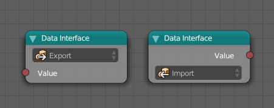
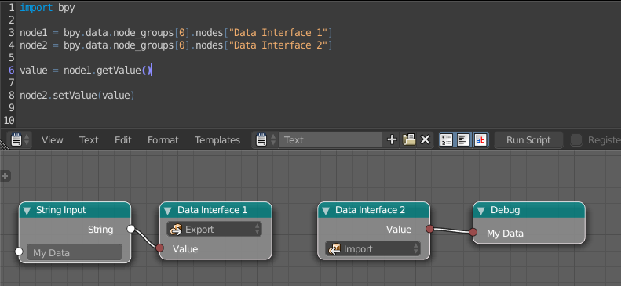

==============
Data Interface
==============

This is a passive node that stores data so that other scripts can access
(and change) it. The main idea is that another script references this node and
calls the ``getValue`` or ``setValue`` function.

Here is an example on how to access the data:

.. code-block:: python
    :linenos:

    import bpy

    tree = bpy.data.node_groups[INDEX_OR_NAME]
    if tree.bl_idname == "an_AnimationNodeTree":

        node = tree.nodes[INDEX_OR_NAME]
        if node.bl_idname = "an_DataInterfaceNode":

            node.setValue(VALUE)
            // or
            value = node.getValue()

Note: After restarting Blender the stored data will not be available anymore.
