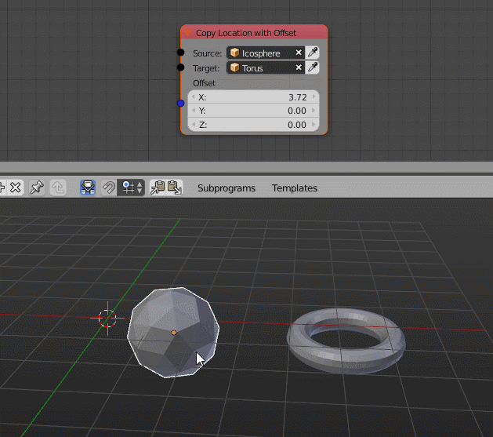

Part 1 - Introduction and First Node
====================================

Welcome to this introduction into node development in Animation Nodes 2.0 or higher. In this guide you will learn how to get started with writing your own nodes (and I suggest you learn this before you try to modify existing nodes!). It will consist of multiple parts. Each part will go a bit more into detail so that you will be able to write more complex nodes in the end. The following tutorials expect you to have a basic knowledge in Python.

To develop your own nodes you have to setup your development environment first. There are basicly two possible setups:

1. Complete Setup:
    This mainly means that you are working in the real git repository of Animation Nodes. You will have to make sure that you can compile the code etc. More information on how to do that can be found here: :ref:`setup-environment`
2. Lightweight Setup:
    The easiest way to start developing your own stuff. Basicly you just install the addon normally and work directly in Blenders addon folder. I definitly suggest to use this method at first because you can forget about compiling and all that stuff that can cause trouble. So if you have AN already installed you don't need to do anything.

Once you setup everything, you'll have to choose where to put your new node in the existing code base. Usually all nodes are in a subdirectory of the ``animation_nodes/nodes/`` folder. However, they can be anywhere in the Animation Nodes package. You can even decide to to create your own folder for your nodes. In that case don't forget to also create a new empty ``__init__.py`` file in that new folder. It tells Python that this folder is part of Animation Nodes.

For this tutorial I suppose that the new file will be in a folder like ``animation_nodes/nodes/category/``. If you put it somewhere else you have to adjust the relative imports accordingly.

Now you are ready to create the actual file. Since Animation Nodes 2.0 there are two different types of source code files:

1. Python files: ``.py``
    These are just normal python files. If you choosed the lightweight setup you have to use this type. Most nodes should be of this type, there are only a very few nodes which aren't. I suggest to choose this type always at this stage. It will be easy to change it later if necessary.
2. `Cython`_ files: ``.pyx``
    Cython is another programming language that builds on top of Python. The main benefit is that it can be compiled into machine code which can make it much faster than normal python code. For most nodes this is absolute overkill, the performance benefit will only be visible be computational expensive operations. Also you can only work with Cython files when you setup the complete working environment.

The First Node
**************

The first simple node we want to create will be able to copy the location of one object to another object with an offset.

First create a file for this node following the rules above. Then copy this little template code into the file:

.. code-block:: python
    :linenos:

    import bpy
    from ... base_types import AnimationNode

    class TemplateNode(bpy.types.Node, AnimationNode):
        bl_idname = "an_TemplateNode"
        bl_label = "Template"

        def create(self):
            pass

        def execute(self):
            pass

This template is what I personally use for all new nodes, it is very easy to build up on it.

Now we have to choose a name for our new node. The most important thing here is the ``bl_idname`` because this is the identifier for your node, when you change it later on, all files that used this node will be broken. Also it should have a prefix like ``an_`` so that it there will be no problems with other addons. So make sure that you give it a good name that tells as exact as possible what the node does. The class name and the ``bl_label`` property can be changed later without problems if necessary. Here is the updated "header" for our specific example:

.. code-block:: python
    :linenos:

    class CopyLocationWithOffsetNode(bpy.types.Node, AnimationNode):
        bl_idname = "an_CopyLocationWithOffsetNode"
        bl_label = "Copy Location with Offset"

The next step is to create the sockets we need. Therefor there is the ``create(self)`` function. In our example node we need three inputs. One source object, one target object and the offset vector. So let's create those:

.. code-block:: python
    :linenos:

    def create(self):
        #               Type      Name   Identifier
        self.newInput("Object", "Source", "source")
        self.newInput("Object", "Target", "target")
        self.newInput("Vector", "Offset", "offset")

When creating a socket, we have to specify at least three parameters:

1. Type:
    This will determine which socket will be created, every socket has a different color. There are a lot of socket types. Here are a few common one: ``Object``, ``Vector``, ``Float``, ``Integer``, ``Object List``, ...
2. Name:
    This name will be displayed in the Node Editor in Blender.
3. Identifier:
    The identifier is not very important for us yet. However you it shouldn't change if not absolutely necessary, but changing it is not as bad as changing the ``bl_idname``. It is common to use this identifier as variable name in the code later.

Last but not least we have to put some code into the ``execute`` function. As soon as the node has input sockets this function has to have parameters. In this case we need three parameters, the names should correspond to the socket identifiers. Also the order has to be the same. In the function body we can do whatever we want with these objects. One thing we have to take care of is an object can be ``None``. This has to be checked before anything else happens because if there is an error in the node, the whole node tree suddenly stops working.

.. code-block:: python
    :linenos:

    def execute(self, source, target, offset):
        if source is None or target is None:
            return

        target.location = source.location + offset

This node is already fully functional now. Below is all the code for this node again. To test it you have to restart Blender. If you you used the Complete Setup described at the top you also have to run ``python setup.py`` in order to recompile the code and copy it over to Blenders addon directory. Otherwise restarting Blender is enouph.

.. code-block:: python
    :linenos:

    import bpy
    from ... base_types import AnimationNode

    class CopyLocationWithOffsetNode(bpy.types.Node, AnimationNode):
        bl_idname = "an_CopyLocationWithOffsetNode"
        bl_label = "Copy Location with Offset"

        def create(self):
            self.newInput("Object", "Source", "source")
            self.newInput("Object", "Target", "target")
            self.newInput("Vector", "Offset", "offset")

        def execute(self, source, target, offset):
            if source is None or target is None:
                return

            target.location = source.location + offset

We will continue to work on this node in the next part.

.. _Cython: http://www.cython.org/
