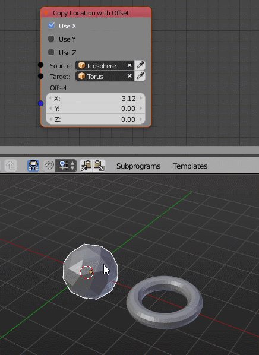

Part 3 - Properties
===================

In this chapter we want to give the nodes some properties so that the user of our node can decide which axises he wants to copy from one object to the other. We start with the result of the first part, because we don't really need output sockets in order to understand this. So here is the original code:

.. code-block:: python
    :linenos:

    import bpy
    from ... base_types.node import AnimationNode

    class CopyLocationWithOffsetNode(bpy.types.Node, AnimationNode):
        bl_idname = "an_CopyLocationWithOffsetNode"
        bl_label = "Copy Location with Offset"

        def create(self):
            self.newInput("Object", "Source", "source")
            self.newInput("Object", "Target", "target")
            self.newInput("Vector", "Offset", "offset")

        def execute(self, source, target, offset):
            if source is None or target is None:
                return

            target.location = source.location + offset

In order to create properties we first have to import the property types Blender provides: ``from bpy.props import *``.

.. note::
    In general it is a bad idea to do "import star" in Python. However this is the only case where I think this is acceptable because it makes coding much easier and every Blender developer knows what happens (it imports these `properties`_).

Now we want to create three properties, one for each axis. They should have the type *bool* because we want to turn specific axises on or off.

.. code-block:: python
    :linenos:

    import bpy
    from bpy.props import *
    from ... events import propertyChanged
    from ... base_types.node import AnimationNode

    class CopyLocationWithOffsetNode(bpy.types.Node, AnimationNode):
        bl_idname = "an_CopyLocationWithOffsetNode"
        bl_label = "Copy Location with Offset"

        useX = BoolProperty(name = "Use X", default = False, update = propertyChanged)
        useY = BoolProperty(name = "Use Y", default = False, update = propertyChanged)
        useZ = BoolProperty(name = "Use Z", default = False, update = propertyChanged)

As you can see I also imported the ``propertyChanged`` event handler. This is absolutely necessary but results in a better user experience. This way when the user changes these properties and *Property Changed* ist activated in the *Auto Execution* panel an update is triggered. Otherwise Animation Nodes cannot know that these properties changed.

As always the next step is to implement this functionality in the ``execute`` method.

.. code-block:: python
    :linenos:

    def execute(self, source, target, offset):
        if source is None or target is None:
            return

        if self.useX: target.location.x = source.location.x + offset.x
        if self.useY: target.location.y = source.location.y + offset.y
        if self.useZ: target.location.z = source.location.z + offset.z

This node is fully function again but there is still one problem. The user can't see the properties so far. To change that we have to implement another function called ``draw(self, layout)`` that will specify which properties will be drawn in the node itself.

.. code-block:: python
    :linenos:

    def draw(self, layout):
        layout.prop(self, "useX")
        layout.prop(self, "useY")
        layout.prop(self, "useZ")

Now the new feature is complete, here is the full code again:

.. code-block:: python
    :linenos:

    import bpy
    from bpy.props import *
    from ... events import propertyChanged
    from ... base_types.node import AnimationNode

    class CopyLocationWithOffsetNode(bpy.types.Node, AnimationNode):
        bl_idname = "an_CopyLocationWithOffsetNode"
        bl_label = "Copy Location with Offset"

        useX = BoolProperty(name = "Use X", default = False, update = propertyChanged)
        useY = BoolProperty(name = "Use Y", default = False, update = propertyChanged)
        useZ = BoolProperty(name = "Use Z", default = False, update = propertyChanged)

        def create(self):
            self.newInput("Object", "Source", "source")
            self.newInput("Object", "Target", "target")
            self.newInput("Vector", "Offset", "offset")

        def draw(self, layout):
            layout.prop(self, "useX")
            layout.prop(self, "useY")
            layout.prop(self, "useZ")

        def execute(self, source, target, offset):
            if source is None or target is None:
                return

            if self.useX: target.location.x = source.location.x + offset.x
            if self.useY: target.location.y = source.location.y + offset.y
            if self.useZ: target.location.z = source.location.z + offset.z

.. _properties: https://docs.blender.org/api/blender_python_api_current/bpy.props.html
