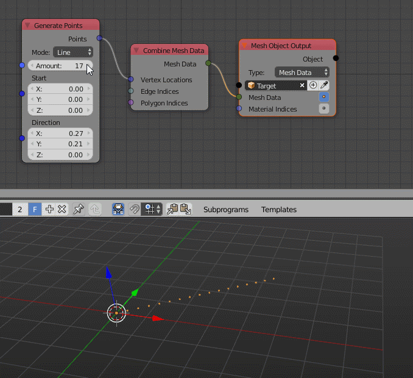

Part 4 - Dynamic Socket Sets
============================

The development method you've seen so far works great and should always be used when possible, because it keeps the code clean. However it has one big disadvantage, it only works when the amount of sockets stays the same all the time. This is because the ``execute`` function has a fixed number of parameters.

Many a bit more advanced nodes support multiple modes though. E.g. the *Math* nodes support a lot of different operations and some of these require different sockets. In order to show how nodes with multiple operations work, we'll forget about the node we developed in the last parts and focus on a new one.

We now want to develop a node called *Generate Points* (maybe you should try to find a more specific name...) that has two modes:

1. Line:
    Takes two vectors (start and direction) and an integer (amount) as input and calculates a vector list with points on the line.
2. Circle:
    Takes a float (radius) and an integer (amount) as input and calculates a vector list with points on the circle.

Obviously the old approach doesn't work here anymore because both modes have different amounts of inputs. But before you'll learn about another approach on how node execution works in AN, we'll focus on how to create a node with dynamic sockets in the first place.

For our example we will use an ``EnumProperty`` to allow the user to switch between both modes. Furthermore we have to tell Animation Nodes that it has to recreate the sockets when the mode changes. There are many nodes in AN already which have to do this as well. The general structure of the code looks like so:

.. code-block:: python
    :linenos:

    import bpy
    from bpy.props import *
    from ... base_types.node import AnimationNode

    # first define the modes the node can have
    # item tuple: (identifier, display name, description, icon, value)
    # the value should be different for each item and should not change later
    modeItems = [
        ("LINE", "Line", "Distribute points on line", "", 0),
        ("CIRCLE", "Circle", "Distribute points on circle", "", 1)
    ]

    class GeneratePointsNode(bpy.types.Node, AnimationNode):
        bl_idname = "an_GeneratePointsNode"
        bl_label = "Generate Points"

        # AnimationNode.refresh will cause AN to remove all sockets
        # and to call the create method again.
        mode = EnumProperty(name = "Mode", default = "LINE",
            items = modeItems, update = AnimationNode.refresh)

        def create(self):
            self.newInput("Integer", "Amount", "amount")
            if self.mode == "LINE":
                self.newInput("Vector", "Start", "start")
                self.newInput("Vector", "Direction", "direction")
            elif self.mode == "CIRCLE":
                self.newInput("Float", "Radius", "radius")
            self.newOutput("Vector List", "Points", "points")

        def draw(self, layout):
            layout.prop(self, "mode")

So now that you know how to make nodes with changing sockets, it is now time to show how to write the execution code in that case. The solution is to define a new function called ``getExecutionFunctionName(self)``. It returns a string that contains the name with the function that should be called at that moment. Basicly it looks like this:

.. code-block:: python
    :linenos:

    def getExecutionFunctionName(self):
        if self.mode == "LINE":
            return "execute_Line"
        elif self.mode == "CIRCLE":
            return "execute_Circle"

    def execute_Line(self, amount, start, radius):
        # do something

    def execute_Circle(self, amount, radius):
        # do something different

With that new knowledge it is easy to fill in the missing code in the correct functions to get the final node. I'll just skip forward to the end now because how to calculate points on lines and circles is not part of this tutorial. However here is the code:

.. code-block:: python
    :linenos:

    import bpy
    from bpy.props import *
    from math import sin, cos, pi
    from ... data_structures import Vector3DList
    from ... base_types.node import AnimationNode

    modeItems = [
        ("LINE", "Line", "Distribute points on line", "", 0),
        ("CIRCLE", "Circle", "Distribute points on circle", "", 1)
    ]

    class GeneratePointsNode(bpy.types.Node, AnimationNode):
        bl_idname = "an_GeneratePointsNode"
        bl_label = "Generate Points"

        mode = EnumProperty(name = "Mode", default = "LINE",
            items = modeItems, update = AnimationNode.refresh)

        def create(self):
            self.newInput("Integer", "Amount", "amount")
            if self.mode == "LINE":
                self.newInput("Vector", "Start", "start")
                self.newInput("Vector", "Direction", "direction")
            elif self.mode == "CIRCLE":
                self.newInput("Float", "Radius", "radius")
            self.newOutput("Vector List", "Points", "points")

        def draw(self, layout):
            layout.prop(self, "mode")

        def getExecutionFunctionName(self):
            if self.mode == "LINE":
                return "execute_Line"
            elif self.mode == "CIRCLE":
                return "execute_Circle"

        def execute_Line(self, amount, start, direction):
            points = Vector3DList()
            for i in range(amount):
                points.append(start + i * direction)
            return points

        def execute_Circle(self, amount, radius):
            points = Vector3DList()
            if amount <= 0: return points
            factor = 2 * pi / amount
            for i in range(amount):
                points.append((cos(i * factor) * radius, sin(i * factor) * radius, 0))
            return points

