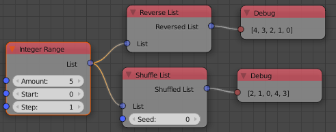

Creating a new Socket Type
**************************

Note: This step-by-step guide only works in after the v1.6 release.

1.  Create a **new file** for the new socket type. Normally this should be inside the
    *sockets* folder but it can be anywhere. The file name should be the data type
    in lower case with underscores.

2.  Insert the **template** below. This is the bare minimum of what is needed in
    for each socket. Here is an overview over the class properties of sockets:

        - ``bl_idname``
                This an identifier for the socket type, changing it
                breaks all files in which this socket is used.
        - ``bl_label``
                This label is used nowhere but we need to specify it
                for Blender.
        - ``dataType``
                A more readable identifier for the socket. It is used in
                the socket searches and in many other places within AN.
        - ``allowedInputTypes``
                If this socket is connected to a socket whose type
                is not in that list the link will be removed (or a converter
                node will be inserted when a rule for that has been specified).
        - ``drawColor``
                Color of the socket in the node editor in RGBA format.
        - ``storable``
                Is *True* when data type can be stored between executions
                without the danger of crashing Blender. Examples where
                this has to be *False* are *Object*, *Scene*, *Sequence*, ...
        - ``comparable``
                Is *True* when the data type can be hashed with pythons *hash*
                function.

    .. code-block:: python
        :linenos:

        import bpy
        from .. base_types.socket import AnimationNodeSocket

        class DATATYPESocket(bpy.types.NodeSocket, AnimationNodeSocket):
            bl_idname = "an_DATATYPESocketSocket"
            bl_label = "DATATYPE Socket"
            dataType = "DATATYPE"
            allowedInputTypes = ["DATATYPE"]
            drawColor = (0.5, 0.5, 0.5, 1)
            storable = False
            comparable = False

            @classmethod
            def getDefaultValue(cls):
                return None

3.  Replace ``DATATYPE`` with the name of the new data type you want to create a
    socket for. Choose a color and set the storable and comparable properties.

4.  Specify a default value for the data type. Now you already have a fully
    functional socket that can be used in AN.

Displaying Properties in the Socket
===================================

Many data types like *Integer*, *Float*, *Vector*, ... give you some properties
in the socket. Others like *Matrix*, *BVHTree*, ... don't. You need to follow
a few simple steps to make properties in your own node.

1.  Import the properties and the ``propertyChanged`` event handler.
    (btw: `bpy.props` is the only module where star-imports are allowed in AN)

    .. code-block:: python
        :linenos:

        from bpy.props import *
        from .. events import propertyChanged

2.  Define the property directly below the class properties and use the ``propertyChanged``
    event handler as update method.
    An overview over all possible property types is
    `here <https://www.blender.org/api/blender_python_api_2_77_release/bpy.props.html>`_.

3.  Implement the ``drawProperty(self, layout, text)`` function (example below).

4.  So far the property is displayed in the node but the default value is still
    used everywhere. To use the correct value you have to implement the ``getValue(self)``
    function. The value returned by this function always has to have the correct data type.

5.  Sometimes (in fact more often than you might think) AN needs to copy the value
    from one socket to another. To support that you have to implement the
    ``getProperty(self)`` and ``setProperty(self, data)`` function (example below).

Here is a simplified float socket that can serve as example:

    .. code-block:: python
        :linenos:

        import bpy
        from bpy.props import *
        from .. events import propertyChanged
        from .. base_types.socket import AnimationNodeSocket

        class FloatSocket(bpy.types.NodeSocket, AnimationNodeSocket):
            bl_idname = "an_FloatSocket"
            bl_label = "Float Socket"
            dataType = "Float"
            allowedInputTypes = ["Float"]
            drawColor = (0.2, 0.2, 0.2, 1)
            storable = True
            comparable = True

            value = FloatProperty(default = 0.0, update = propertyChanged)

            def drawProperty(self, layout, text):
                layout.prop(self, "value", text = text)

            def getValue(self):
                return self.value

            def setProperty(self, data):
                self.value = data

            def getProperty(self):
                return self.value

            @classmethod
            def getDefaultValue(cls):
                return 0.0

The getCopyExpression Function
==============================

AN automatically finds the areas where data has to be copied. Copies are necessary
in cases like this one because otherwise both nodes act on the same list object
what leads to unexpected results:

Not all data types can be copied but the types that can should implement the
``getCopyExpression(self)`` classmethod. This function returns a string which
will be further processed by the caller. Therefore this string has to contain the
word ``value``.

Here are a few examples for different data types:

.. code-block:: python
    :linenos:

    # Vector
    @classmethod
    def getCopyExpression(cls):
        return "value.copy()"

    # Vector List
    @classmethod
    def getCopyExpression(cls):
        return "[element.copy() for element in value]"

    # Float List
    @classmethod
    def getCopyExpression(cls):
        return "value[:]"
