Release Notes for Version 1.5
=============================

Custom Frequency Ranges
***********************

It is possible to bake a custom amount of frequency ranges in the *Sound Bake* node.
Previously there were 10 hardcoded ranges.

.. image:: images_v1_5/custom_frequency_ranges.png

Conditional Debug Nodes
***********************

The *Debug* and *Debug Drawer* node have a *Conditional* input now (which is hidden
by default). This allows more precise and easier debugging in loops and other
cases where a node is executed multiple times with different inputs.

.. image:: images_v1_5/conditional_debug_nodes.gif

Get Selected Objects Node
*************************

This node can easily be used together with the new conditional debug nodes.
It's important to know that this node will only work while during creation of
the node tree. When you start the render it is disabled, because your render
should not depend on the selection.

Basic Shape Key Implementation
******************************

The two new socket types *Shape Key* and *Shape Key List* are part of AN now.
Also the *Object Instancer* node handles objects with shape keys much better in v1.5.

.. image:: images_v1_5/shape_key_nodes.png

Basic Font Implementation
*************************

There are two new socket types for fonts (*Font* and *Font List*). Furthermore
you have the ability to set the font of a text object using the *Text Object Output* node now.

.. image:: images_v1_5/fonts.png

Extended Math Nodes
*******************

New *Snap* and *Absolute* operation that can be used in the *Vector, Euler and Quaternion Math* node.
This enables you to snap values to specific increments.

Note: *Snap* operation is also added to *Float Math* node, while removing the *Round* operation from the list.
(To round, you can use *Snap* by setting Step Size to 1, 0.1, 0.01 etc. Or use the independent *Round* node)

.. image:: images_v1_5/math_operations.png

Quaternion Math Node
********************

Previously you were not really able to work with quaternions in a more complex way.

.. image:: images_v1_5/quaternion_math_node.png

Parse Number Node
*****************

This node can convert a text into a number which is handy when you want to parse
a text block or something similiar that contains numbers.

.. image:: images_v1_5/parse_number_node.png

Extended Rotation Matrix Node
*****************************

The *Rotation Matrix* node allows to create a rotation matrix for all 3 axis
at once now (previously you had to create three individual matrices and combine
them or misuse the *Compose Matrix* node which is slower).

.. image:: images_v1_5/rotation_matrix_node.png

Shear Matrix Node
*****************

The *Shear Matrix* node calculates a matrix that can be used to shear meshes.
You can't use this matrix on objects because it cannot be decomposed into
location, rotation and scale. Instead it can be used with the
*Transform Vector List* node.

.. image:: images_v1_5/shear_matrix.png

Rotation to Direction Node
**************************

This is the reverse of the *Direction to Rotation*.

.. image:: images_v1_5/rotation_to_direction_node.png

BVH Tree
********

Next to the KD-Tree which can be used to find close points, you have access
to Blenders BVH-Tree module now. A BVH Tree is a data structure that allows quick
ray cast operations on many polygons. Make sure to use Blender 2.77 when you use
these nodes because there is a bug in the previous version. The *Raycast* and
*Find Nearest Surface Point* nodes have additional *Min/Max Distance* inputs
and a *Polygon Index* socket output which you can unhide in the node panel in the right.

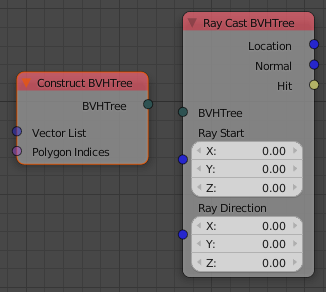

Sequence Info Node
******************

Access many different properties of a given sequence (the image doesn't show all).

.. image:: images_v1_5/sequence_info_node.png

Access Hair Data
****************

The *Particle Info* node gives you access to some more particle properties like
hair points now (the image only shows a subset of the possible outputs).

.. image:: images_v1_5/particle_info_node.png

Get Random List Elements Node
*****************************

The same node can be archieved with a combination of some existing nodes, but
having a specialised node for that makes everything easier.

.. image:: images_v1_5/get_random_list_elements.png

Dynamic Node Labels
*******************

Dynamic node labels allows you to have cleaner node trees because some nodes can
show useful information in their label, which allows you to collapse them without
disadvantages.

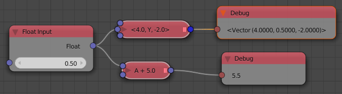

Shift List Node
***************

.. image:: images_v1_5/shift_list_node.png

Data Interface Node
*******************

This node allows other addons to exchange data with AN. More information is
available here: http://animation-nodes-manual.readthedocs.org/en/latest/dev_guide/data_interface.html

ID Key System
*************

The *ID Key* system got a major overhaul again. It is much more stable now, which
means it doesn't accidently remove some sockets.
In general the *ID Key System* allows you to store data for individual objects
in custom properties. The best known usecase for that is to store initial
transformations of multiple objects so that you can still access them when the
objects were moved by AN.

Improved Support for Multiple Scenes
************************************

The *Object Instancer* takes *Scene List* as input instead of only one scene now.
This allows you to put the the instances into multiple scenes without having to
make multiple Instancers.

Each node tree has a *global Scene* that is used in all *Scene* and *Scene List*
sockets by default. The global scene can by changed in the *Animation Node Tree*
panel. It is never *None*.

.. image:: images_v1_5/scene_sockets.png

List Operations
***************

There are two new nodes that deal with lists now. The *Set List Element* and
*Remove List Element* nodes.

The *Remove List Element* node has three modes:

- Remove only the first occurrence of an element (limited to certain types)
- Remove all occurrences of an element (limited to certain types)
- Remove the element at a specific index (works with all list types)

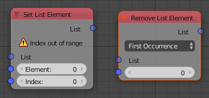

Condition Socket for Reassign Parameter Node
********************************************

This allows to model functions for eg finding the minimum and maximum using a Loop.
The *Condition* socket is hidden by default.

.. image:: images_v1_5/condition_in_reassign_parameter_node.png

Object Group Operations
***********************

This new node allows you to dynamically link and unlink objects from an object group.

.. image:: images_v1_5/object_group_operations.png

List Math Nodes
***************

The *Number List Math* node has a new operation now that can be used to quickly
calculate the average of multiple numbers.

The new *Vector List Math* supports adding multiple vectors together as well as
calculating the average.

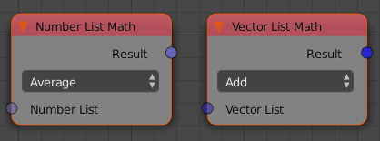

Overview and Statistics
***********************

The *Overview* panel allows you to turn *Auto Execution* on and off for multiple
node trees at once. Beside that you can jump to a specific tree by clicking on
its name now.

Clicking on the *Statistics* button opens the new *Statistics View* that can
give some interesting insights into how large your node tree is.
The two numbers in the *Nodes* column is the total node count as well as the
functional nodes (Reroute and Frame nodes are excluded).

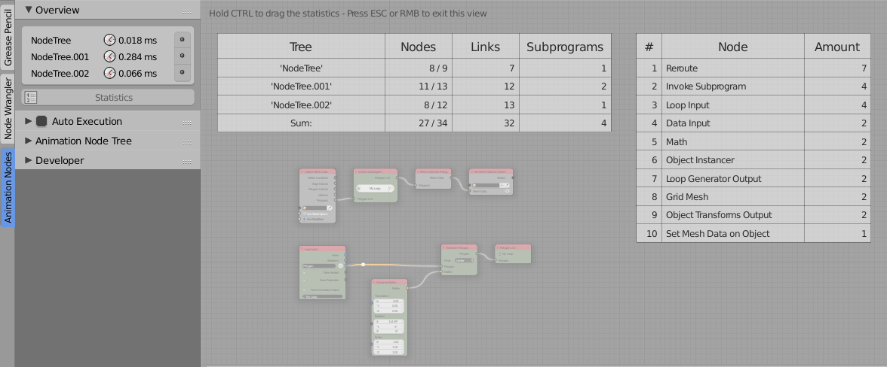

Set Vertex Color Node
*********************

The *Set Vertex Color* node didn't change much in its appearance but it is 15x
faster now. What makes this node so special is that it is the only non-hacky way
to modify colors of individual objects that use the same material. (A hacky way
would be to missuse the pass_index property.)
Also it has very little overhead when the same color is already set.
The ultimate solution to this problem is to get access to Custom Properties
of individual objects in Cycles materials.

.. image:: images_v1_5/set_vertex_color.png

Sort List Node
**************

Sorting lists was only possible using Expression or Script nodes so far. Using
the new *Sort List* node this is not needed anymore. The node automatically adapts
to the list type that it is connected to. There are two sort types that work with
all list types:

    - **Custom**: You'll get a little text box in which you can insert an expression
        that will be used to get the sorting-key of the individual objects.
    - **Key List**: In this mode you can provide the node with an extra list that
        has the same length as the list you want to sort. The second list contains
        the sorting-keys for the individual objects. Most of the times you will
        need to make a simple loop with a generator output to create this key list.
        Supported key list types are *Float* and *String*.

Beside these two generic sorting modes, there are some simple sorting templates
for specific list types (currently only for object lists). We can add more of
these templates over time when needed. The node uses a stable sorting algorithm.

Warning: Moving and sorting objects based on their position is not always a good
idea, because it leads to flickering..

.. image:: images_v1_5/sort_list.png

Geometry Nodes
**************

A small set of geometry nodes has been added to make certain operations easier.

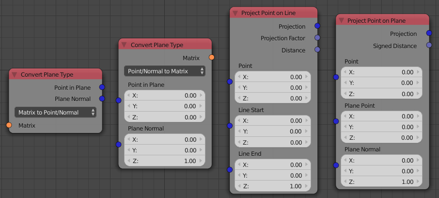

Object Output Nodes
*******************

The object output nodes have been unified into more similiar nodes.

The *Set Splines on Object* node does not exist anymore. It is part of the
*Curve Object Output* node now.

Previously we had three nodes to replace the mesh of an object:
*Set Mesh Data on Object*, *Set BMesh on Object* and *Set Vertices on Object*.
These are all part of the *Mesh Object Output* node now. Additionally we
can set material indices of polygons with this new node.

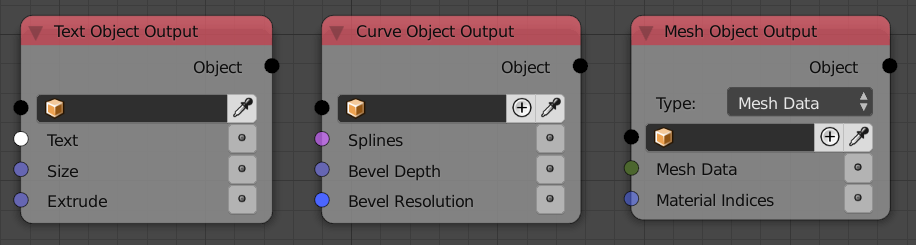

Change Text Case Node
*********************

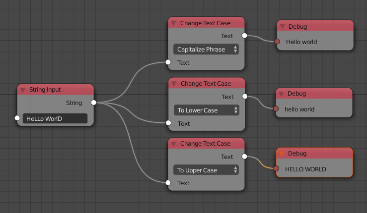

Smaller Changes
***************

The *Get List Element* node has a *Clamp* checkbox now, that allows you to
clamp the index to the length of the list.

The *Create List* node displays the amount of elements in the output list.

The *Object Mesh Data* node outputs the name of the mesh now (the socket is hidden by default).

The *Random Text* node has a *Node Seed* property now.

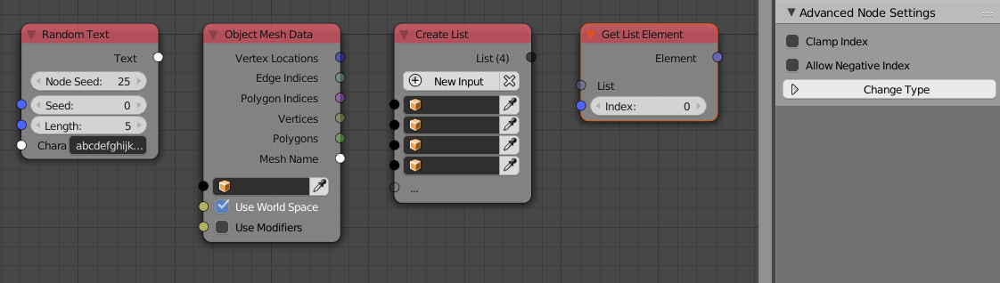

The *Number*, *Vector*, *Euler* and *Quaternion Wiggle* nodes have a *Speed* socket
again and a better default speed than before.

.. image:: images_v1_5/wiggle_nodes.png

The *Auto Execution* panel changes when preview rendering is enabled now. This
is to make it more appearent that the *Always* option is turned of in that case.

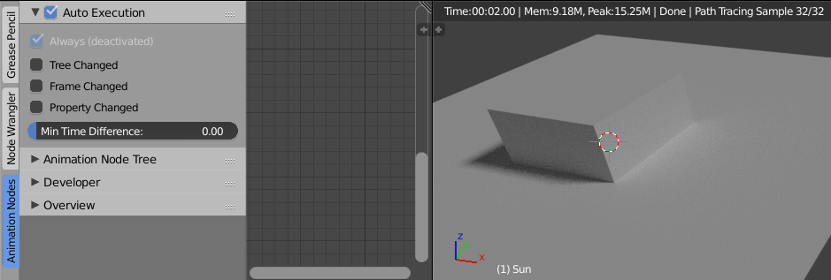

The *List* category got submenus for the *Create* and *Combine List* nodes in order
to force the user to make a type decision right at the beginning. It is possible
to change that type later, but it might not be obvious. (The recommended way
to insert specific *Create/Combine List* nodes is to use the search.)

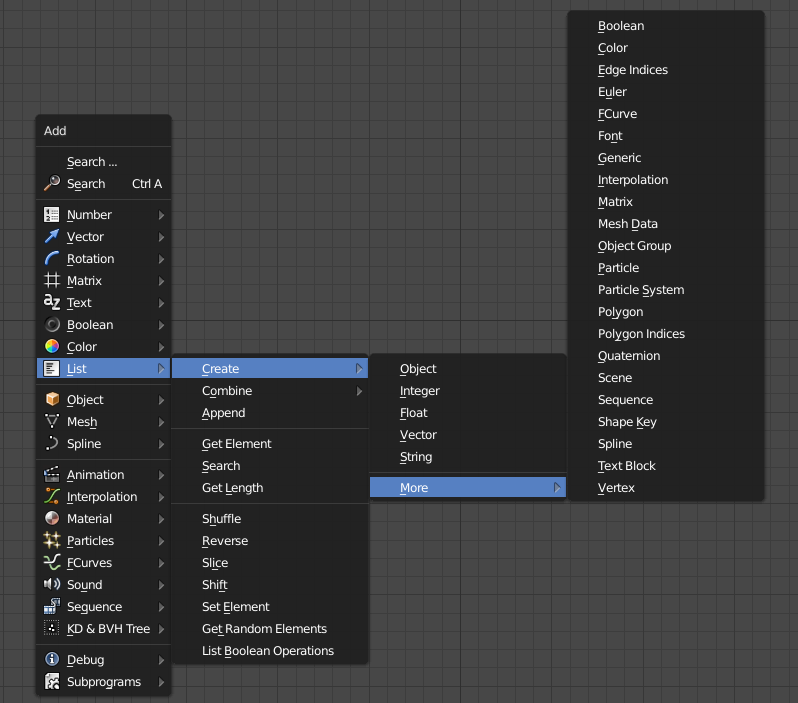

The *Transform Polygon* can be used with a custom pivot point now.

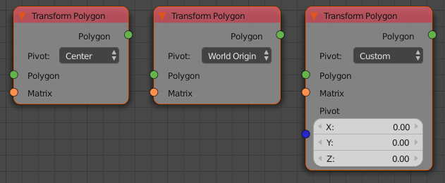

There is a *Boolean List* socket now.

When a user tries to connect a link to a *Script* node he now gets an info popup
that explains that he should use the *Invoke Subprogram* node to execute the script.

AN uses a new better algorithm to sort the nodes before the execution now. This
results in a small speedup when working with many nodes and large networks.

The *Object Instancer* node supports creation of empty objects now.

.. image:: images_v1_5/instancer_empty_creation.png

The *Frame* and *Reroute* nodes are now in the menu like in the other node systems.

The *Direction to Rotation* node also outputs a rotation matrix and a quaternion now.
