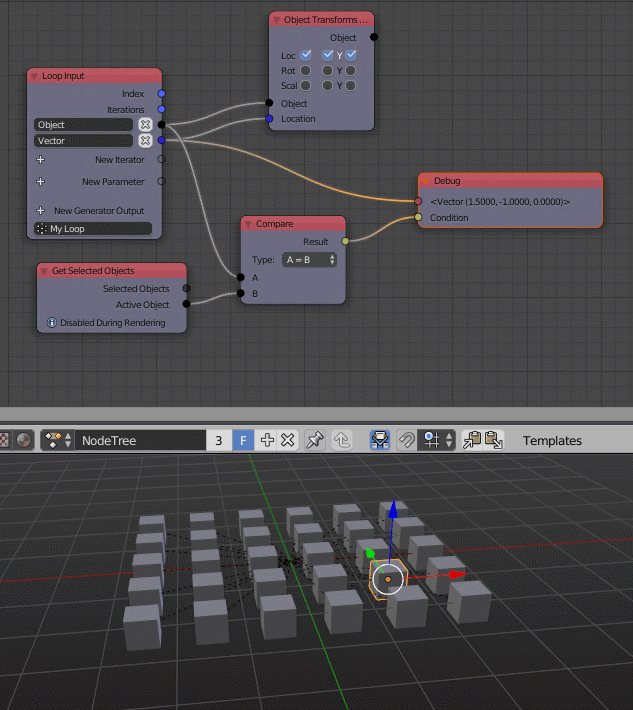
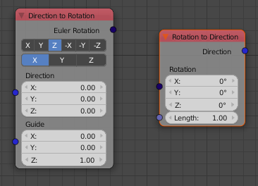
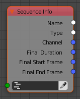
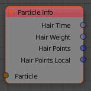

Release Notes for Version 1.5
=============================

Custom Frequency Ranges
***********************

It is possible to bake a custom amount of frequency ranges in the *Sound Bake* node.
Previously there were 10 hardcoded ranges.

.. image:: images_v1_5/custom_frequency_ranges.png

Conditional Debug Nodes
***********************

The *Debug* and *Debug Drawer* node have a *Conditional* input now (which is hidden
by default). This allows more precise and easier debugging in loops and other
cases where a node is executed multiple times with different inputs.

Basic Shape Key Implementation
******************************

The two new socket types *Shape Key* and *Shape Key List* are part of AN now.
Also the *Object Instancer* node handles objects with shape keys much better in v1.5.

.. image:: images_v1_5/shape_key_nodes.png

Get Selected Objects Node
*************************

This node can easily be used together with the new conditional debug nodes.
It's important to know that this node will only work while during creation of
the node tree. When you start the render it is disabled, because your render
should not depend on the selection.

Extended Math Nodes
*******************

New *Snap* operation that can be used in the *Float, Vector, Euler and Quaternion Math* node.
This enables you to snap values to specific increments.

.. image:: images_v1_5/math_operations.png

New *Vector Angle* node that can calculate the angle between two vectors as well
as the rotation difference.

Quaternion Math Node
********************

Previously you were not really able to work with quaternions in a more complex way.

.. image:: images_v1_5/quaternion_math_node.png

Parse Number Node
*****************

This node can convert a text into a number which is handy when you want to parse
a text block or something similiar that contains numbers.

.. image:: images_v1_5/parse_number_node.png

Extended Rotation Matrix Node
*****************************

The *Rotation Matrix* node allows to create a rotation matrix for all 3 axis
at once now (previously you had to create three individual matrices and combine
them or misuse the *Compose Matrix* node which is slower).

.. image:: images_v1_5/rotation_matrix_node.png

Rotation to Direction Node
**************************

This is the reverse of the *Direction to Rotation*.

BVH Tree
********

Next to the KD-Tree which can be used to find close points, you have access
to Blenders BVH-Tree module now. A BVH Tree is a data structure that allows quick
ray cast operations on many polygons.

Sequence Info Node
******************

Access many different properties of a given sequence (the image doesn't show all).

Access Hair Data
****************

The *Particle Info* node gives you access to some more particle properties like
hair points now (the image only shows a subset of the possible outputs).

Smaller Changes
***************

The *Get List Element* node has a *Clamp* checkbox now, that allows you to
clamp the index to the length of the list.
