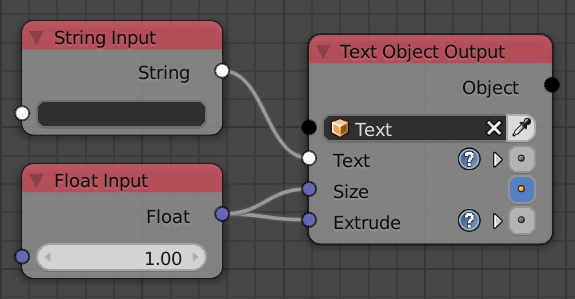

Release Notes for Version 1.6
=============================

Convert to Integer List Node
****************************

.. image:: images_v1_6/convert_to_integer_node.png

Slice List Node
***************

The *Slice List* node has two options now. You can either input an start and end
index or the start index and the length the output list. You can choose between
both options in the advanced node settings.

.. image:: images_v1_6/slice_list_node.png

Popup to Rename Objects
***********************

The button to assign the active object to an object or spline socket got a
new functionality. When you hold down Ctrl and click it you get a little popup
that allows you to rename the object in place. This is very handy when you
want to clean up your scene but don't want to seach all the objects in the
outliner or the 3d viewport.

.. image:: images_v1_6/object_renaming.gif

Change Matrix Pivot Node
************************

WIP

Fill List Node
**************

This node can create a new list with a specific length that contains the same
element at each index. Furthermore it can extend an existing list to the left
or right.

Screenshot missing!

Splines from Object Node
************************

This node has two options now. You can either load all splines on a curve object
or only one with an index. Previously you would import all splines first and
pick one of them with the Get List Element node afterwards. Unfortunally
this adds unnecessary overhead because you imported the other splines although
you don't need them.

Screenshot missing!

More Dynamic Labels
*******************

Dynamic labels are becoming more and more important in AN in order to create
cleaner looking node trees. They allow you to collapse nodes without loosing
any information on what they are doing.

Here is a list of nodes that have dynamic labels now:
    - ...
    - ...

Screenshot missing!

Developer Tools
***************

Monitored Execution
-------------------

Updating older files to work in the newest version has always been an issue
in AN. With this new addition we finally have a toolset that allows you to find
and correct the problematic nodes easily. If there is a problem during the node
tree execution you can enable this option and execute again. The error should
still occure but the *Problems* panel clearly shows which node has the error.
Now you just have to replace that node with a newer version and the error is gone.

Node Profiling
--------------

As soon as you start creating more complex node trees you will notice that AN
can become slow. Very often it is possible to optimize the node setup for better
performance. A golden rule of optimization is to only optimize the stuff that
is slow but until now it was hard to determine which nodes are the slowest
because we only had the total execution time. When this new feature is enabled
AN will record the execution times of each individual node and will draw the
results into the node editor. This makes it easy to find the performance bottlenecks.

Function Profiling
------------------

This feature is more important to people who develop AN, but it can also be
useful for others to find out which functions make your node tree slow.
Unfortunally it isn't very easy to understand the profiling output if you
don't know anything about programming.

Screenshot missing!

Minor Changes
*************

The *Compose Matrix* node is roughly 40% faster now.

The *Splines from Object* node is 30% faster for bezier splines.

This *Floating Advanced Panel* that you can open with the U key is fixed now.

The width and location of the selected node in the Node Panel aren't visible
anymore when *Debug* is disabled in the user preferences of AN.

AN always creates a python script based on your node tree. This script
needs to be recreated each time the node tree changes. In setups with only a
few nodes you never notice that because it is fast but as soon as you have more
than a few hundred nodes the time spend for the code creation can become noticable.
With this release the code generation process is 2-3x faster for large node trees.

You can sort the generator outputs of a loop now. To do it you need to select the
corresponding Loop Input node and go into the advanced settings.

Help the user to remember to enable the socket when it is linked:

I moved the settings for the Debug Drawer node into the advanced settings
(in the right sidebar of the node editor, or press U while the node is selected).
The reason for that is that I rarely need to change these settings and they took
too much space.

Screenshot missing!
