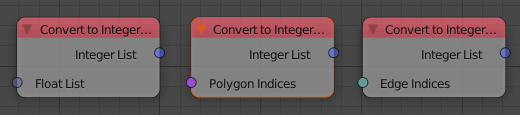
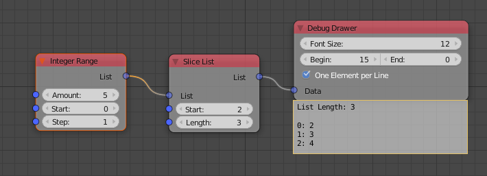

Release Notes for Version 1.6
=============================

Convert to Integer List Node
****************************

Slice List Node
***************

The *Slice List* node has two options now. You can either input an start and end
index or the start index and the length the output list. You can choose between
both options in the advanced node settings.

Popup to Rename Objects
***********************

The button to assign the active object to an object or spline socket got a
new functionality. When you hold down Ctrl and click it you get a little popup
that allows you to rename the object in place. This is very handy when you
want to clean up your scene but don't want to seach all the objects in the
outliner or the 3d viewport.

.. image:: images_v1_6/object_renaming.gif

Change Matrix Pivot Node
************************

WIP

Fill List Node
**************

This node can create a new list with a specific length that contains the same
element at each index. Furthermore it can extend an existing list to the left
or right.

Screenshot missing!

Splines from Object Node
************************

This node has two options now. You can either load all splines on a curve object
or only one with an index. Previously you would import all splines first and
pick one of them with the Get List Element node afterwards. Unfortunally
this adds unnecessary overhead because you imported the other splines although
you don't need them.

Screenshot missing!

More Dynamic Labels
*******************

Dynamic labels are becoming more and more important in AN in order to create
cleaner looking node trees. They allow you to collapse nodes without loosing
any information on what they are doing. Here are some examples:

    .. image:: images_v1_6/dynamic_labels.png

Network Navigation
******************

The functionality of the TAB key has been improved. It has context sensitive
behaviour now. Before this release it was only possible to jump from an
*Invoke Subprogram* node to the corresponding subprogram. Now function depends
more on the active node. Just try it out. It should become pretty clear what happens
when certain nodes are selected. More information can be found `here <https://github.com/JacquesLucke/animation_nodes/issues/480>`_.

Developer Tools
***************

Execution Code Types
--------------------

AN can generate different execution codes based on the same node tree now.
This is used for some features which make the execution slower but should have
zero overhead when they are disabled. Currently there are four different
execution code types:

    - Default:
        This should be turned on most of the time. It just creates the execution
        code like before without any extra features enabled.
    - Monitor Execution:
        This creates a ``try-except`` block around the execution code of every
        node. This is helpfull when a node raises an exception but you cannot
        tell which one. It should only be turned on when there are problems.
    - Measure Execution Times:
        Measure the total and average time each node takes to execute and display
        the results in the node editor. I personally use this a lot when I try
        to improve the performance of certain nodes but it also helps to find
        the performance bottlenecks of whole node trees.
    - Bake:
        This is mainly used by the new bake function and should not be activated
        manually (although it is no problem to activate it).

    .. image:: images_v1_6/measure_execution_times.png

Function Profiling
------------------

This feature is more important to people who develop AN, but it can also be
useful for others to find out which functions make your node tree slow.
Unfortunally it isn't very easy to understand the profiling output if you
don't know anything about programming.

    .. image:: images_v1_6/profile.png

Minor Changes
*************

The *Compose Matrix* node is roughly 40% faster now.

The *Splines from Object* node is 30% faster for bezier splines.

This *Floating Advanced Panel* that you can open with the U key is fixed now.

The width and location of the selected node in the Node Panel aren't visible
anymore when *Debug* is disabled in the user preferences of AN.

AN always creates a python script based on your node tree. This script
needs to be recreated each time the node tree changes. In setups with only a
few nodes you never notice that because it is fast but as soon as you have more
than a few hundred nodes the time spend for the code creation can become noticable.
With this release the code generation process is 2-3x faster for large node trees.

You can sort the generator outputs of a loop now. To do it you need to select the
corresponding Loop Input node and go into the advanced settings.

    .. image:: images_v1_6/sort_generators.png

Help the user to remember to enable the socket when it is linked:

    .. image:: images_v1_6/is_used_helper.png

I moved the settings for the Debug Drawer node into the advanced settings
(in the right sidebar of the node editor, or press U while the node is selected).
The reason for that is that I rarely need to change these settings and they took
too much space.

    .. image:: images_v1_6/debug_drawer.png

Broken Nodes
------------

I'm not 100% if this is a full list but you'll definitly have to replace these
nodes when updating older files to this release:

    - Splines from Object
    - Object Matrix Output
