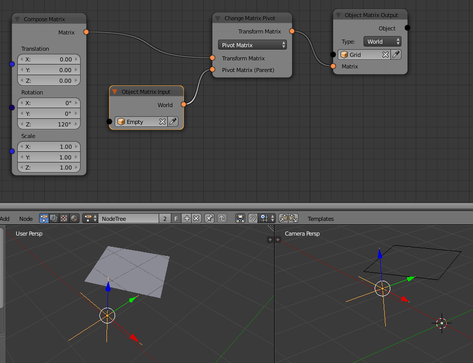
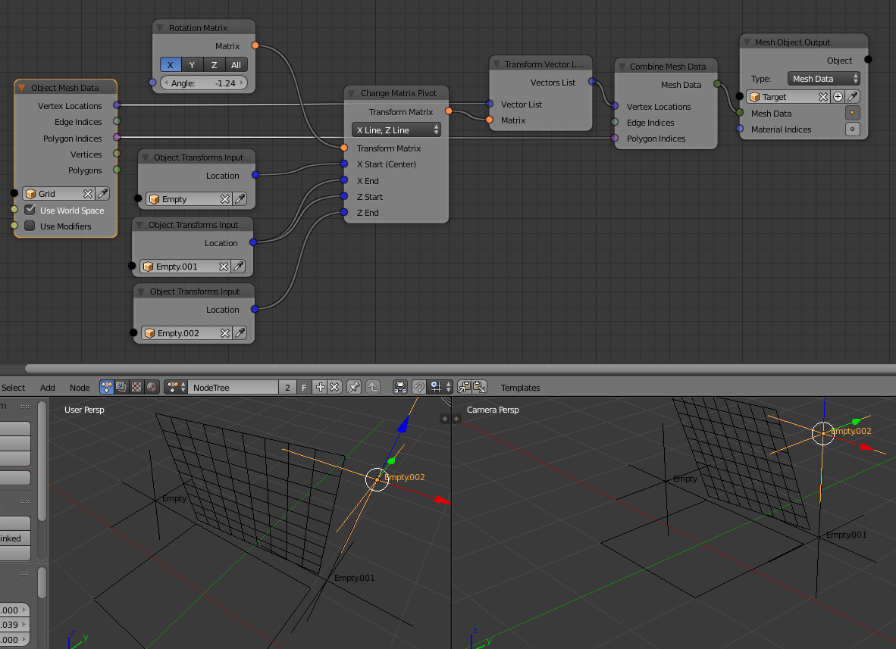

Release Notes for Version 1.6
=============================

Convert to Integer List Node
****************************

.. image:: images_v1_6/convert_to_integer_node.png

Popup to Rename Objects
***********************

The button to assign the active object to an object or spline socket got a
new functionality. When you hold down Ctrl and click it you get a little popup
that allows you to rename the object in place. This is very handy when you
want to clean up your scene but don't want to seach all the objects in the
outliner or the 3d viewport.

.. image:: images_v1_6/object_renaming.gif

Change Matrix Pivot Node
************************

.. image:: images_v1_6/change_pivot_matrix_use.png

This node is mainly a companion or complement to the transform nodes.
It helps setting a custom "pivot point" for the transformation operations,
a process similar to parenting.
Basically it replaces the need for some matrix construction setups that
can prove to be confusing sometimes and not very "artist friendly"

Basic usage exmples:

- transform (rotation) of object goes around Empty
- Rotetion aroud axis, where X and Z are defined by points

It does define the reference pivot in several ways, from simple location
to matrix or combinations of vectors and directions.

A classic and very used case, would be "flipping" a polygon around an edge,
where defining Z as normal and a side (0-1) as center and X direction.
(this can be defined otherwise with matrices etc. but can prove quite complex setup)

.. image:: images_v1_6/change_pivot_matrix_flip_poly.png

Note: when using along with polygon transform, to be in control of the results,
use the World option in polygon transform

Repeat and Fill List Nodes
**************************

    .. image:: images_v1_6/repeat_and_fill_list.png

Splines from Object Node
************************

This node has two options now. You can either load all splines on a curve object
or only one with an index. Previously you would import all splines first and
pick one of them with the Get List Element node afterwards. Unfortunally
this adds unnecessary overhead because you imported the other splines although
you don't need them.

    .. image:: images_v1_6/splines_from_object.png

More Dynamic Labels
*******************

Dynamic labels are becoming more and more important in AN in order to create
cleaner looking node trees. They allow you to collapse nodes without loosing
any information on what they are doing. Here are some examples:

    .. image:: images_v1_6/dynamic_labels.png

Slice List
**********

The slice list node has been extended to support all the different slice that
Python supports. The *Start*, *Stop* and *Step* sockets be enabled and disabled
as needed.

    .. image:: images_v1_6/slice_list_node.png

Network Navigation
******************

The functionality of the TAB key has been improved. It has context sensitive
behaviour now. Before this release it was only possible to jump from an
*Invoke Subprogram* node to the corresponding subprogram. Now function depends
more on the active node. Just try it out. It should become pretty clear what happens
when certain nodes are selected. More information can be found in this `GitHub Issue <https://github.com/JacquesLucke/animation_nodes/issues/480>`_.

Execution Triggers
******************

Until now *Auto Execution* of node trees was limited to certain predefined events
like *Always*, *Frame Changed*, etc. Most people don't like to have *Always* enabled
all the time because slows down the scene and heats up the cpu. This is a problem
because sometimes the result of the node tree only depends on the location of an
object. So it would make sense to only execute the tree when the location changes.
This is exactly what these new *Execution Triggers* allow you to do.

    .. image:: images_v1_6/execution_trigger.png

You just need to create the trigger, select an object and write/paste the data
path to the property. For convenience some nodes have a button in the advanced settings that quickly
creates the *Trigger* for this specific node.

    .. image:: images_v1_6/auto_create_trigger.png

Structs
*******

Structs are a new socket type. It can store multiple values in one socket.
Having such a type has multiple benefits:

    - It's easier to manage many records.
    - Can replace Generic Lists in some cases (generic lists are bad because
      they don't which data type they contain)
    - Allows us to have a new set of nodes in the future. E.g. for automatically
      reading and parsing .csv files.

    .. image:: images_v1_6/structs.png

It's also worth mentioning that struct nodes make sure that data types stay correct.

    .. image:: images_v1_6/structs_error.png

Select Area
***********

I always found it annoying to use Blenders text editor together with AN, mainly
because it required so many click to setup it up. For this release I developed
a new operator that makes it much faster to setup the text editor. The operator
itself is very generic, it allows you to create/select an area in the Blender
interface, the caller than decides what to do with this area.
It is already used in multiple places: *Script* node, *Text Block* socket,
*Debug Loop* and in the *Developer Panel*.

    .. image:: images_v1_6/select_area.gif

Bake to Keyframes
*****************

Baking animations is often required before rendering. Sometimes because AN is
unstable during rendering (often this can be fixed by locking the UI during rendering!)
or AN just does not exist on the computer that will render the animation (think
about renderfarms).

You could already create keyframes before using the *Set Keyframes* node but it
can be easier than that. And it is now. The *Bake to Keyframes* button can be
found in the *Overview* panel. Basicly it works in three steps:

    1. Change the execution code type (more info below) to *Bake*
    2. Visit each frame in the timeline once
    3. Change the execution code type to *Default*

If you want to exclude certain node trees from the baking progress you can just
disable *Auto Execution* for them.

This operator can bake everything that can be animated with keyframes. That
excludes spline, text and mesh animation!

This nodes support baking so far: *Object Attribute Output*, *Object Data Path Output*,
*Object Matrix Output*, *Object Transforms Output*, *Object Visibility Output*,
*Curve Object Output* (limited), *Text Object Output* (limited) and
*Text Sequence Output* (limited).

    .. image:: images_v1_6/bake.png

Text File Reader
****************

This node can read a text file from the hard drive without having to open it
in Blender. You can also specify an encoding. Most common are *ascii* and *utf8*
but there are much more. A full list can be found in the `python documentation on codecs <https://docs.python.org/3.5/library/codecs.html#standard-encodings>`_.

The node caches the text internally and only reloads the text when the file changed.

    .. image:: images_v1_6/text_file_reader.png

Expression Node
***************

The *Expression* node got two improvements in this release.

1. When it is collapsed the expression will be in the node label now.

  .. image:: images_v1_6/collapsed_expression.png

2. Previously the expression node was almost always used together with a *Convert* node.
   This is not necessary anymore because the output socket of the expression node
   changes its type automatically now. Furthermore the data type of the expression result
   is checked and corrected if possible. This is to make sure that the node does
   not infiltrate the node tree with invalid data. The automatic type checking
   can be turned off to remove overhead in extreme cases.
   The output data type can be changed manually by clicking on the little button
   next to the expression field.

 .. image:: images_v1_6/expression_type_correction.png

Geometry Nodes
**************

.. todo:: Insert links to descriptions of new nodes + image

Developer Tools
***************

Execution Code Types
--------------------

AN can generate different execution codes based on the same node tree now.
This is used for some features which make the execution slower but should have
zero overhead when they are disabled. Currently there are four different
execution code types:

    - Default:
        This should be turned on most of the time. It just creates the execution
        code like before without any extra features enabled.
    - Monitor Execution:
        This creates a ``try-except`` block around the execution code of every
        node. This is helpfull when a node raises an exception but you cannot
        tell which one. It should only be turned on when there are problems.
    - Measure Execution Times:
        Measure the total and average time each node takes to execute and display
        the results in the node editor. I personally use this a lot when I try
        to improve the performance of certain nodes but it also helps to find
        the performance bottlenecks of whole node trees.
    - Bake:
        This is mainly used by the new bake function and should not be activated
        manually (although it is no problem to activate it). When it is enabled
        nodes like the *Object Transforms Output* node automatically create keyframes
        for the properties they change.

    .. image:: images_v1_6/measure_execution_times.png

Function Profiling
------------------

This feature is more important to people who develop AN, but it can also be
useful for others to find out which functions make your node tree slow.
Unfortunally it isn't very easy to understand the profiling output if you
don't know anything about programming.

    .. image:: images_v1_6/profile.png

Minor Changes
*************

The execution time is now drawn into the top left corner of the node editor to
make it visible when the toolbar is closed.

The *Compose Matrix* node is roughly 40% faster now.

The *Splines from Object* node is 30% faster for bezier splines.

The *Shade Object Smooth* node is twice as fast now.

This *Floating Advanced Panel* that you can open with the U key is fixed now.

The width and location of the selected node in the Node Panel aren't visible
anymore when *Debug* is disabled in the user preferences of AN.

The *Change Text Case* node has two new modes: *Capitalize Words* and *To Title Case*.

For ages there was a double update whenever a node has been created or removed.
This is now fixed. This is especially important for large node trees when the
code generation takes a noticeable amount of time.

AN always creates a python script based on your node tree. This script
needs to be recreated each time the node tree changes. In setups with only a
few nodes you never notice that because it is fast but as soon as you have more
than a few hundred nodes the time spend for the code creation can become noticable.
With this release the code generation process is 2-3x faster for large node trees.

You can sort the generator outputs of a loop now. To do it you need to select the
corresponding Loop Input node and go into the advanced settings.

    .. image:: images_v1_6/sort_generators.png

Help the user to remember to enable the socket when it is linked:

    .. image:: images_v1_6/is_used_helper.png

I moved the settings for the Debug Drawer node into the advanced settings
(in the right sidebar of the node editor, or press U while the node is selected).
The reason for that is that I rarely need to change these settings and they took
too much space.

    .. image:: images_v1_6/debug_drawer.png

Broken Nodes
************

I'm not 100% if this is a full list but you'll definitly have to replace these
nodes when updating older files to this release:

    - Splines from Object
    - Object Matrix Output
