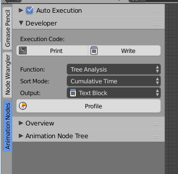

Release Notes for Version 1.6
=============================

Convert to Integer List Node
****************************

.. image:: images_v1_6/convert_to_integer_node.png

Slice List Node
***************

The *Slice List* node has two options now. You can either input an start and end
index or the start index and the length the output list. You can choose between
both options in the advanced node settings.

.. image:: images_v1_6/slice_list_node.png

Popup to Rename Objects
***********************

The button to assign the active object to an object or spline socket got a
new functionality. When you hold down Ctrl and click it you get a little popup
that allows you to rename the object in place. This is very handy when you
want to clean up your scene but don't want to seach all the objects in the
outliner or the 3d viewport.

.. image:: images_v1_6/object_renaming.gif

Profiling
*********

This feature is more important to people who develop AN, but it can also be
useful for others to find out which functions make your node tree slow.
Unfortunally it isn't very easy to understand the profiling output if you
don't know anything about programming.

Minor Changes
*************

The *Compose Matrix* node is roughly 40% faster now.

The *Splines from Object* node is 30% faster for bezier splines.

This *Floating Advanced Panel* that you can open with the U key is fixed now.

The width and location of the selected node in the Node Panel aren't visible
anymore when *Debug* is disabled in the user preferences of AN.

Help the user to remember to enable the socket when it is linked:

    .. image:: images_v1_6/is_used_helper.png
