*****************************
Release Notes for Version 2.0
*****************************

Key Features:
#############

Cython
******

Many parts of Animation Nodes has been rewritten using the Cython programming language. It's a language that mixes Python and C and is perfectly suited to develop addons with high performance for Blender. There is one disadvantage though, we now have different versions of Animation Nodes for different platforms. So you have to download the correct version for your platform.

.. image:: images_v2_0/cython_performance_example.gif

Subsequently, generating vectors is now 400x faster compared to non cythonized versions. Maths is also 200x faster.

Vectorization
*************

Lists are an essential part of Animation Nodes. In previous versions the only way to use lists effectively was to use loops. These have an advantages as they give you a lot of flexibility. However, in many cases the flexibility of loops are not needed. This release includes an alternative approach to edit lists: Vectorized Nodes. A vectorized node is a node that can work on individual values as well as on lists. Together with Cython, this leads to big speedup for some operations.

.. image:: images_v2_0/vectorization_example.gif

Not all nodes which could have this functionality have it yet. Fortunately, vectorizing a node does not break it, so some nodes can be vectorized after the first release of AN 2.0.

Falloffs
********

While the first two key features were mainly targeted at all users of Animation Nodes, falloffs have been designed specifically for motion graphics designers. In general, a falloff is a function that tells an effect how much it should influence a specific object. You can think of it like a mask for an effect (similar on how we can use weight painting to control the influence of some modifiers).

.. image:: images_v2_0/falloff_example.gif

Compatibility
#############

Similar to the last releases, this release will break most existing files in a way so that they don't work anymore in this release. This is necessary to not slow down future development (keeping old stuff working always means that some new features would not be possible). There might be some files that still work in this release but you should not expect that.

Updating files to work in this version is easy in some cases but very difficult in others. In general I suggest to either use the old version for old files or rebuild the node trees from scratch.

It is also possible to change existing files in a way that they automatically load the correct version of AN when loaded. This might also be useful when you want to render animations that use AN on a renderfarm, basically you can put the .blend file and the addon into a .zip file and upload it to the renderfarm (Note: this is only possible when the renderfarm allows you to execute python scripts, sometimes you first have to ask for permission). For more information contact me (mail@jlucke.com).

Nodes
#####

Numbers
*******

All number nodes that can be vectorized are now vectorized.

Float Range
===========

Float Range node can now generate floats inside the closed interval ``[start, stop]``. This can be done by choosing the **Start/Stop** option. The node now is 400x faster than before.

.. image:: images_v2_0/float_range.png

Random Number
=============

Random Number node can now generate a list of random floats. This can be done by checking the **Create List** button beside the node seed. The node is now 400x faster than before.

.. image:: images_v2_0/random_numbers.png

Map Range
=========

Map Range node has a new UI for easier and faster workflow. And it is vectorized, so it can now remap a list of floats.

.. image:: images_v2_0/map_range.png

Float Math
==========

Math node is now 200x faster. It is vectorized such that you can operate on two lists element wise, operate on a single list for single input operations and operate on a list and a value where the value is added, multiplied, etc to all the value of the list.

.. image:: images_v2_0/vectorization_example.gif

The math node also have a new UI where a small menu called **Quick Settings** will appear whenever the node is duplicated. This menu includes four buttons which convert the type of the math node to addition, multiplication, subtraction or division. This allow faster conversion if needed. If you don't want to convert, then pressing the check mark will hide the menu telling AN that this is the type you want. Moreover, a button is present in the advanced node settings that hide the menu for all nodes in the current node tree.

.. image:: images_v2_0/float_math.gif

Vectors
*******

Random Vector
=============

Random Vector node can now generate a list of random vectors. This can be done by checking the **Create List** button beside the node seed. The node is now 400x faster than before.

.. image:: images_v2_0/random_vector.png

Vector Wiggle
=============

Vector Wiggle node can now generate a list of vectors. Notice that the random vectors are different in seed and not in the evolution variable which means the vectors when plotted doesn't represent a perlin noise.

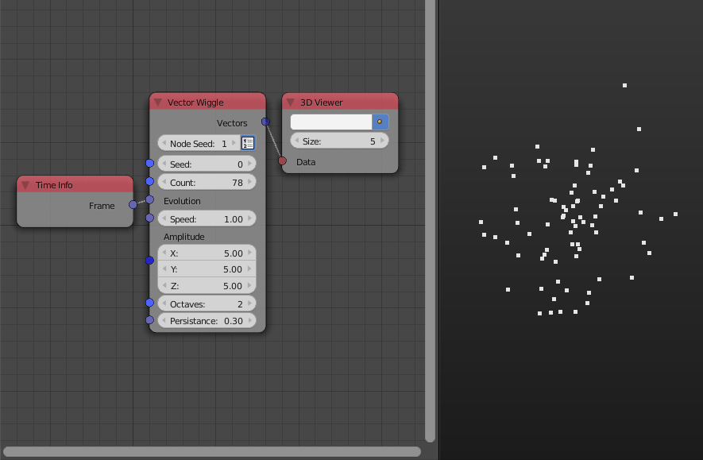

Transform Vector List
=====================

Transform Vector List node was removed because now the **Transform Vector** node is vectorized and can operate on lists of vectors.

Offset Vector
=============

This new node was added to make use of falloffs with vectors. The node simply translate the vector based on a translation vector, the factor of translation is controlled by a falloff.

.. image:: images_v2_0/offset_vector.gif

Rotations
*********

Random Euler
============

Random Euler node can now generate a list of random eulers. This can be done by checking the **Create List** button beside the node seed. The node is now 400x faster than before.

.. image:: images_v2_0/random_euler.png

Matrices
********

Distribute Matrices
===================

This node was newly added and it generate a list of transformation matrices distributed on a line, grid, circle or mesh vertices. The resulted transformation matrices include locations information only in the line and grid options while it include both location and rotation data in the circle and mesh vertices options assuming vertices normal were given.

.. image:: images_v2_0/distribute_matrices.gif

Replicate Matrix
================

This node was newly added and it instance and transforms input transfromation matrices based on some other input transfromation matrices. Below is an example if use, the first distribute matrices generate a circle of matrices, the replicate matrix node was used to instance those circles in some other bigger circle generated from the second distribute matrix.

.. image:: images_v2_0/replicate_matrix.gif

Offset Matrices
===============

This newly added node make use of falloffs with matrices. The node simply transforms the input transformation matrices based on a transformation matrix generated from the input translation, rotation and scale vectors and eulers, the factor of transformation is controlled by a falloff.

.. image:: images_v2_0/falloff_example.gif

Change Matrix Pivot
===================

Change Matrix Pivot node was removed because it can be recreated easily with ordered matrix multiplication.

Texts
*****

Fill Text >> Repeat Text
========================

Fill Text node was renamed repeat text for convention.

.. image:: images_v2_0/repeat_text.gif

Replicate Text
==============

Replicate Text node was removed because the same function can be done using the repeat text node by leaving the text input empty. See example above.

Reverse Text
============

Reverse Text node was added that reverse the input text's character's order.

.. image:: images_v2_0/reverse_text.gif

Booleans
********

Compare Node
============

A new condition ``Is None`` which check if the input is a non data type. Can be used to avoid possible non data types errors. Most of the fundemntal data types will always return False because the input is always initiallized, however, a data type like generic can be empty so it may return True.

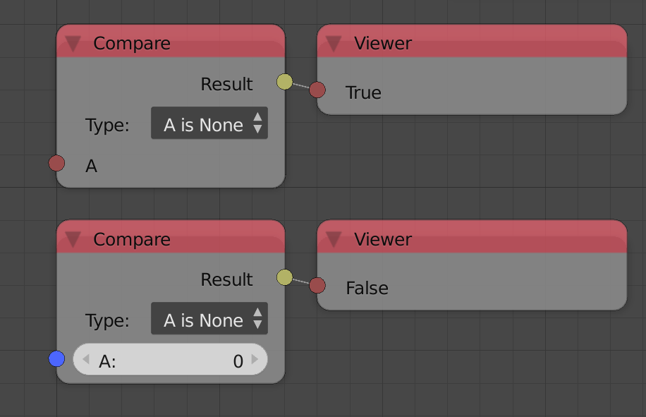

Logic Operators
===============

Two new operators were added : ``Not (A and B)`` which returns True if one of them is False and ``Not (A or B)`` which returns True if both of them is False.

Boolean List Logic
==================

Two new options were added to the boolean list logic node, including : ``Not All True`` which returns True if at least one boolean is False and ``Not All False`` which returns True if at least one boolean is True.

.. image:: images_v2_0/boolean_list_logic.png

Number To Boolean
=================

This node was newly added to convert an number into a boolean, if number is zero, it will return False and otherwise True.

.. image:: images_v2_0/number_to_boolean.png

Colors
******

Colors were left intact.

Lists
*****

Create Lists
============

**Remove Inputs** in advanced node settings became **Remove Unlinked Inputs** which removed inputs if they weren't connected to any other node.

Get List Element
================

Advanced Node Settings was moved to the node itself for easier and faster control. The node can now get multiple elements if given a list of integers that represent their indices (Possibly polygon and edge indices because under the hood, they are integer lists as well.). To do this, check Use Index List button.

.. image:: images_v2_0/get_list_element.gif

Mask List
=========

This node was newly added and it selectively remove list elements based on a boolean list where if the boolean at the same index was False, the element is removed.

.. image:: images_v2_0/mask_list.gif

Sort List
=========

Name, Post Distance and Direction options were removed because they can be achieve using other options.

Random List
===========

This node was newly added, it simply returns a list that contain some random elements from the input list. Unlike the multiple option in the Get Random Element node, elements can be repeated and thus the length of the output node can be larger than the input list.

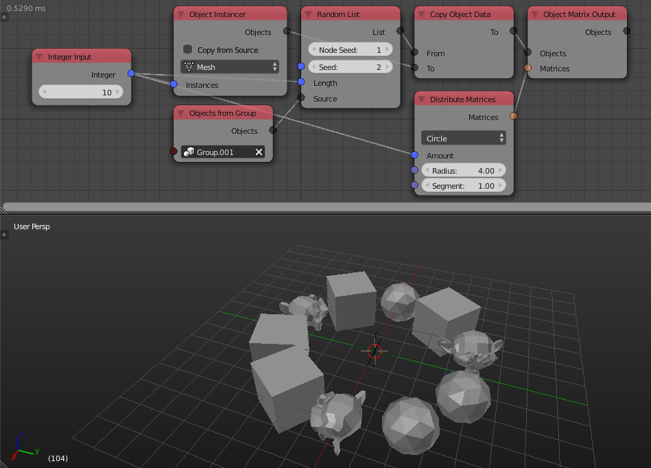

Objects
*******

Object Transforms Output
========================

Object Transforms Output has a new UI for enabling transformation channels. The node now support editing the delta transforms of object, delta transforms are transforms that are added on top of the current transforms, so, now you can define objects relative transforms without any ID keys. Enabled delta transforms from the advanced node settings.
The node is also vectroized, so you may edit delta transforms for multiple objects.

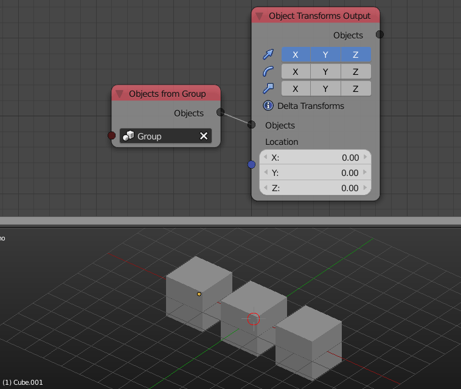

Object Attribute Input
======================

The node now has an operator to create an execution trigger for the property at the input path ID.

.. image:: images_v2_0/attribute_input.gif

Object Attribute Output
=======================

The node is now vectorized and can take a list of object. When an object list is input, **Multiple Values** option appear, in essence, you have two options, to set the input value to all object or to provide a list of values to be set to objects element wise. The **Multiple Values** option if true will tell the node to expect a list of values to set to objects element wise.

.. image:: images_v2_0/attribute_output.gif

Object Data Path Output
=======================

The now cache data paths for faster future execution. The cache can be cleared using an operator in the advanced node settings.

Armature Info
=============

This node was newly added and it gives access to some information about bones of the input armature like their centers, transformation matrix, directions, lengths, tails, heads and more.

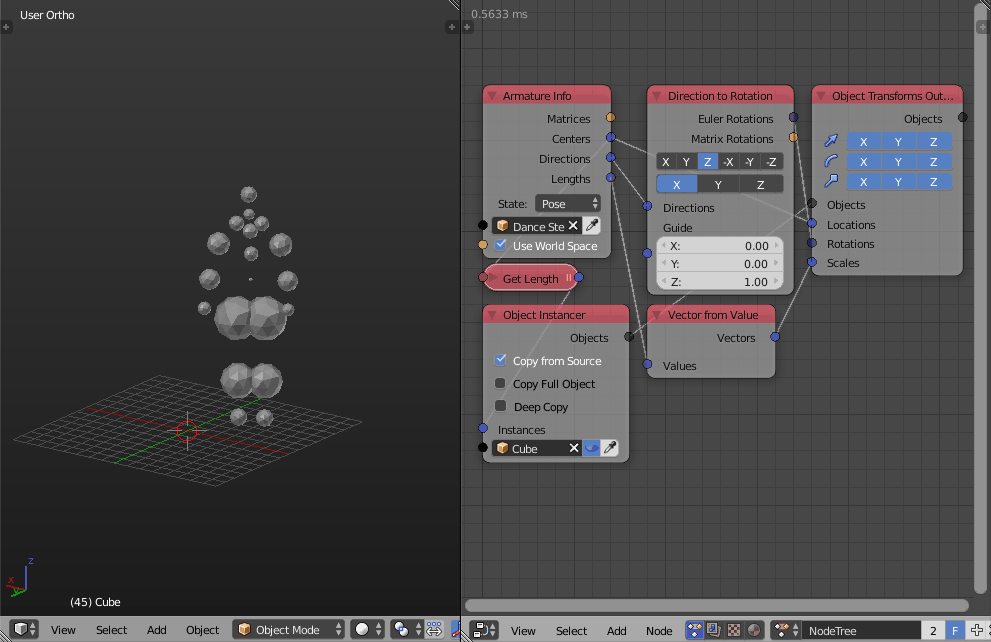

Object Instancer
================

The object instancer node now have an option to hide the source object.

.. image:: images_v2_0/object_instancer.gif

Object ID Key
=============

Object ID node didn't change, however, new ID keys were introduced.

Text, Float and Integer IDs
---------------------------

An ID key can be created to hold a text, float or integer per object, think of it as a custom property of the object.

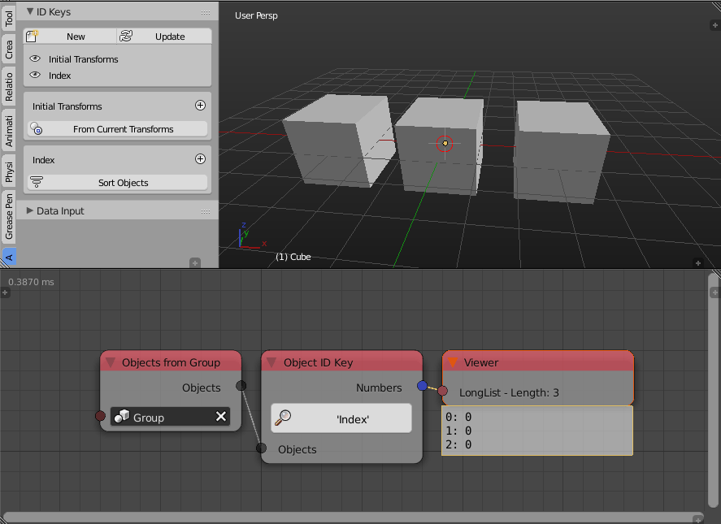

Index IDs
---------

The index ID associate an integer to every object, that integer is usually its index in some list of objects. That list of objects can be sorted using different methods.

Below is an example of animating some objects based on their indices list which we will generate using the Index ID keys, methods:

Selection Order Method
^^^^^^^^^^^^^^^^^^^^^^

.. image:: images_v2_0/selection_order_id.gif

Random Method
^^^^^^^^^^^^^

.. image:: images_v2_0/random_sort_id.gif

Distance Method
^^^^^^^^^^^^^^^

.. image:: images_v2_0/point_distance_id.gif

Axis Method
^^^^^^^^^^^

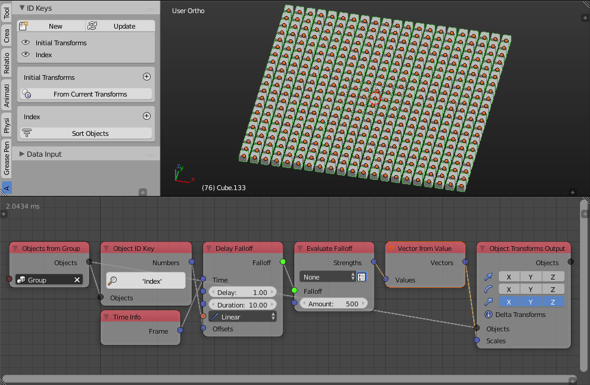

Other options includes alphabetical sorting of object.

Mesh
****

This category is one of the heavily updated one, a lot of nodes were removed and a lot were added.

Object Mesh Data
================

Vertex and Polygon data outputs were removed as well as their data types, they are no longer available in AN 2.0. As an alternative, some new outputs were given including: Vertices Normals, Polygons Centers, Polygons Normals, Local Polygon Areas and Material Indices. The new outputs are pretty much what the polygon and vertex data included, so there no loss of flexibility here, in fact it is much more efficient.

.. image:: images_v2_0/mesh_data.gif

Get Bounding Box
================

Get bounding box node now returns the mesh data of the bounding box as well as its center.

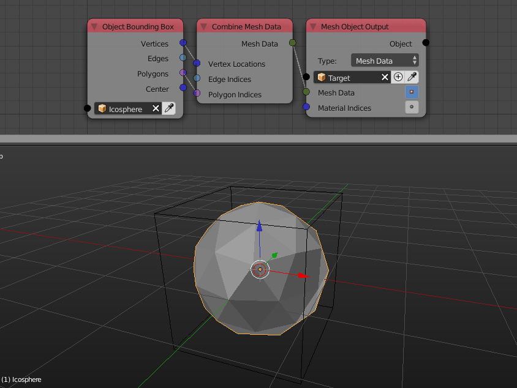

Vertex Group Input
==================

This newly added node return the weights of the selected vertex group.

.. image:: images_v2_0/vertex_group_input.gif

Cylinder Mesh
=============

This newly added node creates the mesh data of a cylinder.

.. image:: images_v2_0/cylinder_mesh.gif

Grid Mesh
=========

Grid Mesh generator was redesigned and can now be defined either using grid dimensions or step sizes for cells.

.. image:: images_v2_0/grid_mesh.gif

Find Close Points
=================

Find Close Points (previously named Find Close Vertices) node has been redesigned. There are now two modes, one that create n number of connections to n closest points where n is an input integer; and another mode that create connections to any points in some input radius. The node also returns distances to points as an output.

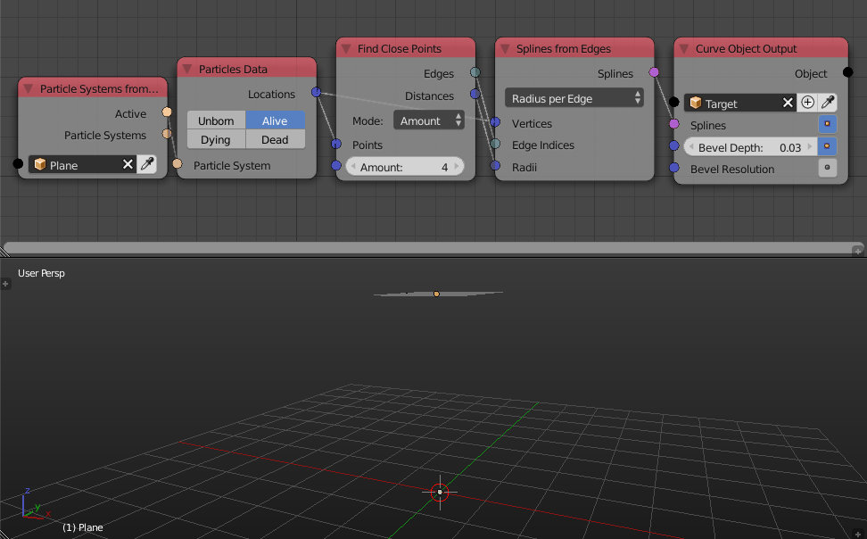

Edges To Planes
===============

Edges To Planes node was removed and replaced by Edges To Tubes node.

Edges To Tube
=============

This node was newly created as a replacement to the Edges To Planes node and it simply create tubes in places of edges.

.. image:: images_v2_0/grid_mesh.gif

Create Edges
============

This node was newly created and it returns edges info for edges that connects each two vectors in the two input vector lists. The first vectors in both lists are connected together, the second vectors in both list are connected together and so on.

.. image:: images_v2_0/create_edges.gif

Create Polygon Indices
======================

A new option was added to create indices of the pattern ``0,1,2,3, ... ,n`` where n+1 is an input integer. This is helpful if vertices are in the right order. The node also support the creation of multiple indices list with different number of indices by checking the **Use List** button next to the type menu.

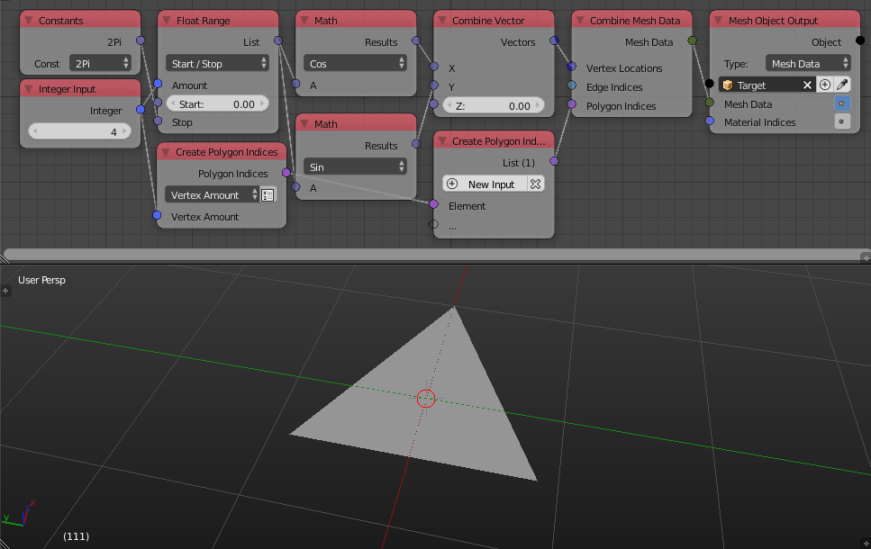

Edge Info
=========

This node was newly added and it return some information about the input edge data like their centers, length, starting and ending points.

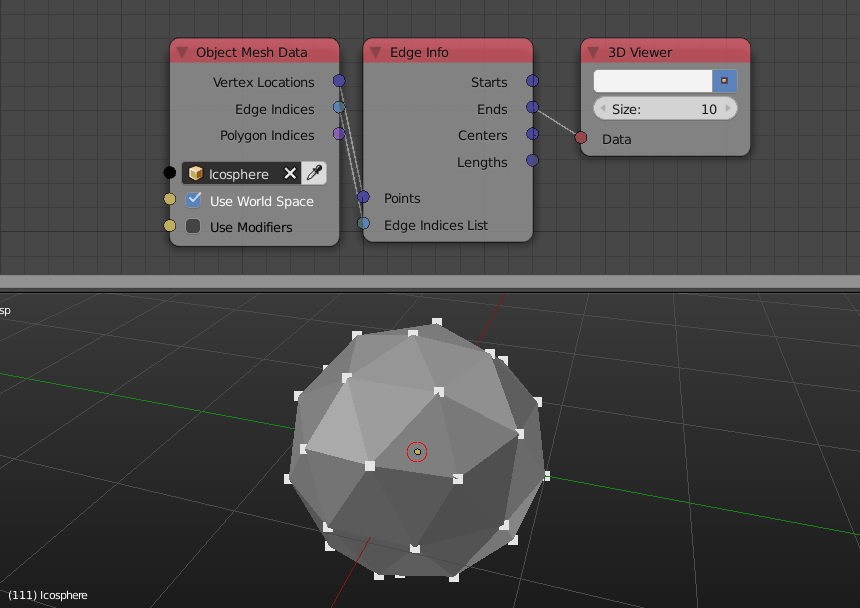

Create Bmesh
============

This node was newly added and it create a bmesh data type from a mesh data type.

.. image:: images_v2_0/create_bmesh.gif

Mesh Data From Object
=====================

This node was newly added and it returns the mesh data of the input object. See example above.

Replicate Mesh Data
===================

This node was newly added and it instance the mesh data and transforms it based on the input transformation matrices, then it combines all mesh data into a single mesh data.

.. image:: images_v2_0/replicate_mesh_data.gif

Extract Polygon Transforms
==========================

This node was newly added and it returns transformation matrices that describe the location and orientation of the input polygons. The local x axis is aligned with the direction of the first edge of each polygon.

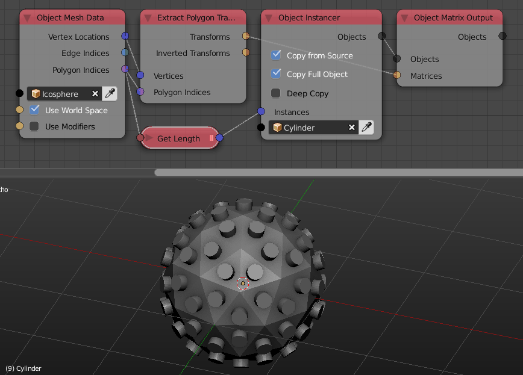

Prepare Polygon Transformation
==============================

This node was newly added. It separates the input polygons and return them in their unity position, that is, they are located at the center of the world and lie on the xy plane. It also return a list of transformation matrices that if used to transformed the output polygons, the result will be the polygons in their initial position and orientation. This node is useful when used with transform polygons.

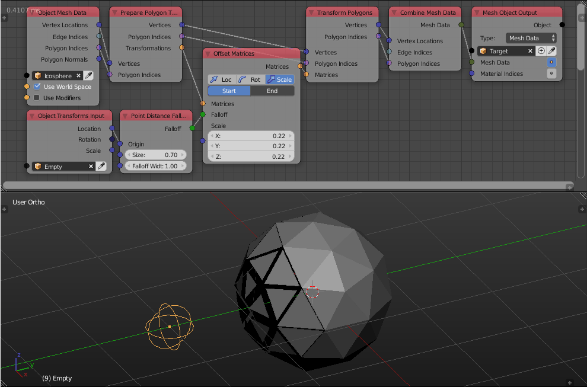

Transform Polygons
==================

This node was newly added and it transforms input polygons based on an input transformation matrix.

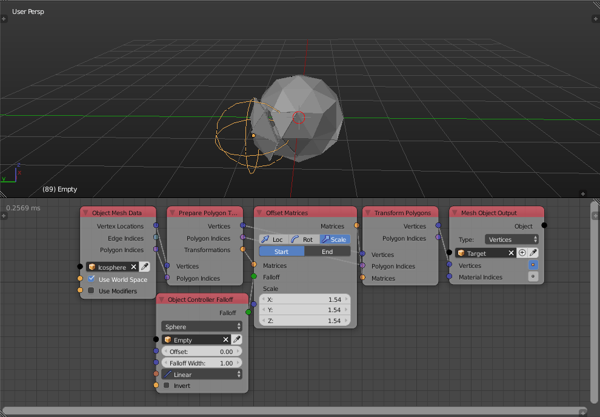

Separate Polygons
=================

This node was newly added and it simply separate the input polygons, the result is exactly the same if you used the Prepare Polygon Transformation node and transformed the polygons based on the transformation matrices given.

.. image:: images_v2_0/separate_polygons.gif

Mesh Object Output
==================

Advanced settings have been changed and extended. Now, with the new **Ensure Animation Data** feature (enabled by default), it allows exporters (mainly Alembic) to export the mesh correctly.

.. image:: images_v2_0/mesh_object_output_advanced_settings_comp.png

Polygon Info
============

Polygon Info node was removed.

Vertex Info
===========

Vertex Info node was removed.

Splines
*******

Append Point To Spline
======================

A radius input was added to the node to set the radius of the newly created point.

.. image:: images_v2_0/append_point_to_spline.gif

Spline From Points
==================

You can now set the left and right handles of the spline points manually as well as setting their radius.

.. image:: images_v2_0/spline_from_points.gif

Replicate Spline
================

This newly added node instance splines and transforms them based on the input transformation matrices.

.. image:: images_v2_0/replicate_spline.gif

Spline Info
===========

Spline Info node now returns the locations of the handles of the points as well as the radii and amount of points.

.. image:: images_v2_0/spline_info.gif

Splines From Object
===================

There is now an option to return the splines in World Space.

Change Spline Type
==================

This newly added node convert spline to a poly or a bezier spline.

.. image:: images_v2_0/change_spline_type.gif

Set Spline Radius
=================

This newly added node set the radius of the points of the input spline.

.. image:: images_v2_0/set_spline_radius.gif

Splines From Edges
==================

Two options to define the radius of spline points were added. The first options sets the radius per point, so it expects a float list of the same size as the vertices of the edges, the second option sets the radius per edge so it expects a float list with the same length as the edges indices list. It should be noted that the node is vectorized, so you might just enter a single float and it will be set as the radius of all points and edges and the option won't matter.

.. image:: images_v2_0/splines_from_edges.gif

Project On Spline
=================

A new output **Distance** was added and it is equal to the distance between the input point and the projected point. In other words, it is the shortest distanced between the input point and the closest point on the spline. Or in other words, it is the length of the line that is perpendicular to the tangent at the surface and starts at the input point and ends at the point of tangency.

Particle System
***************

The particle system category was redesigned to be more compact and useful.

Particle Data
=============

This newly added node combines the filter particles and particle list info node. It filter particles based on the selected options, then it return particle info like their locations, velocities, sizes and so on.

Hair Data
=========

This newly added node returns the particle system hair as splines.

.. image:: images_v2_0/hair_data.gif

Get Particles
=============

Get Particles node was removed.

Particle System Input
=====================

Particle System Input node was removed.

Filter Particles
================

Filter Particles node was removed.

Particle List Info
==================

Particle List Info node was removed.

Particle Info
=============

Particle Info node was removed.

Animation
*********

No changes to the animation category.

Interpolations From Curve Mapping >> Curve Interpolation
========================================================

The Interpolation From Curve Mapping node was renamed to Curve Interpolation. The node now support caching of interpolation for tremendously faster future large evaluation. Below is a curve interpolation with and without cache option.

.. image:: images_v2_0/curve_interpolation.png

Mix Interpolation
=================

This newly added node mixes between two interpolation using one of two algorithms. **Overlay** which simply overlay both interpolation where zero means the first interpolation and 1 means the second. **Chain** which stack input interpolations beside each others, below is a visualization for what chain option does, the first interpolation is a linear one while the second interpolation is an exponential one, both interpolations are remapped based on End 1 and Start 2 inputs then they are stacked beside each other with some fading.

.. image:: images_v2_0/mix_interpolation.png

Mirror Interpolation
====================

This newly added node invert the interpolation and possibly combine it with the original if chain was checked (Resulting in a mirror).

.. image:: images_v2_0/mirror_interpolation.gif

Falloff
*******

This whole category was newly added and it provide a high level approach to controlling effects and animating them. Below is some of the nodes that is includes with it.

Fade Falloff
============

This falloff can be used to fade between two values, in the example below, we fade between 0 and 1 scale of some object where the starting point is the inverse of the current frame.

.. image:: images_v2_0/fade_falloff.gif

Delay Falloff
=============

This falloff can be used to delay the effect of some objects than other based on time, in the below example, we make some objects appear earlier than others.

.. image:: images_v2_0/point_distance_id.gif

Wiggle Falloff
==============

This falloff can be used to control an effect based a noise function, in the example below, we move the vertices up with some factor we got from the noise function.

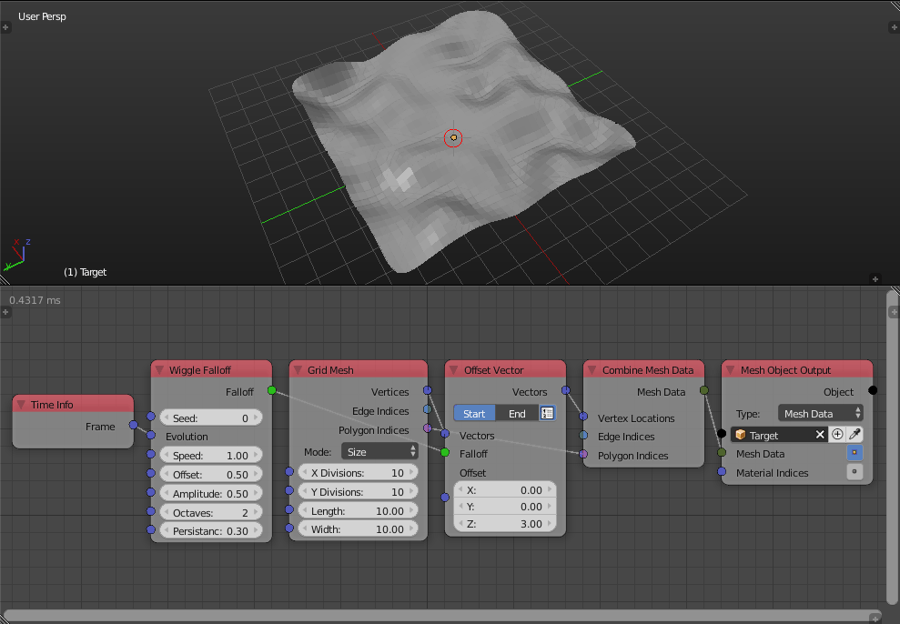

Random Falloff
==============

Much like the wiggle falloff, this can be used to control and effect based on a random factor except this factor is completely random and can't be animated, it is much faster than wiggle falloff so use this node if you are not going to animate.

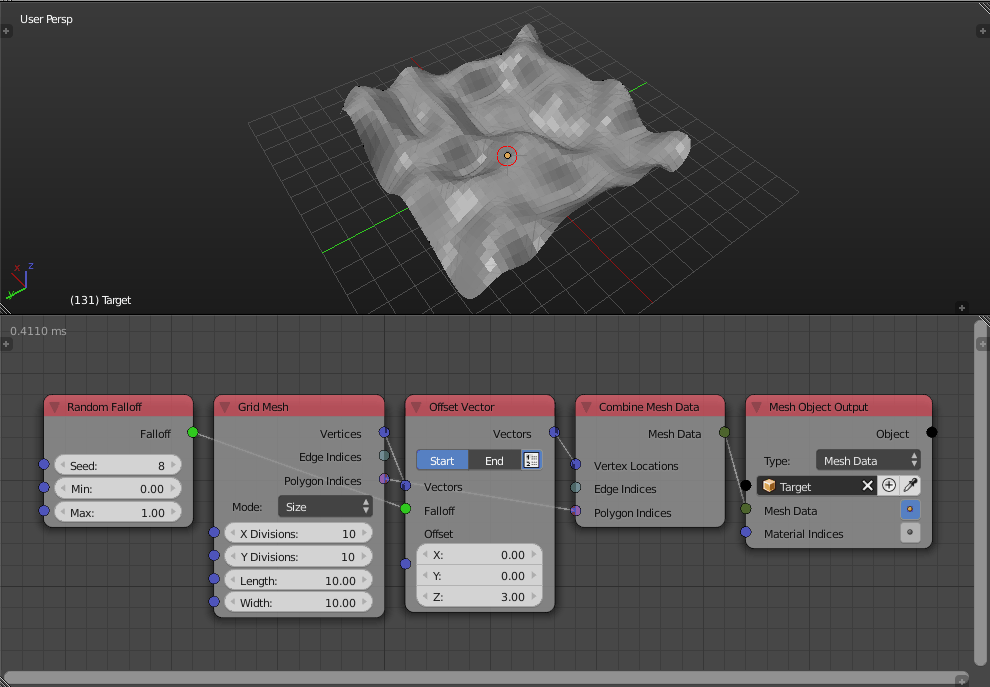

Index Mask Falloff
==================

This falloff choose between two factors based on some pattern, a possible pattern is the nth pattern like ABABAB or ABBABBABB or ABBBABBBABBB ... . A possible pattern is also a random pattern like ABAABAbABAbAA.

.. image:: images_v2_0/index_mask_falloff.gif

Object Controller Falloff
=========================

This falloff can be used to control an effect based on the distance some object (usually an empty) where the size of the object control the offset of that falloff. The distance can be a normal euclidean distance as the following example:

.. image:: images_v2_0/object_controller_falloff1.gif

Or a distance along the local axis of the object, like this example:

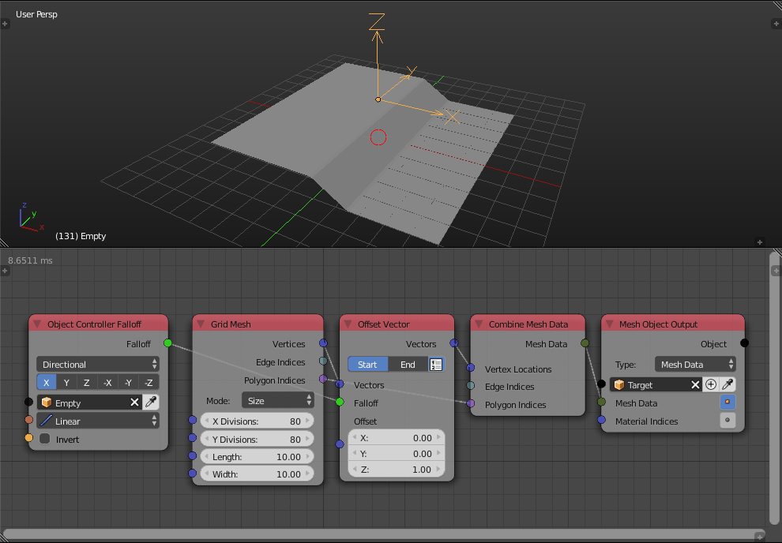

Sound Falloff
=============

Sound falloff provide a much more efficient way to evaluate baked sound data. You can evaluate the sound data based on the object indices or based on another falloff ! So I may use a point distance falloff no evaluate the sound data resulting in this radial sound visualization:

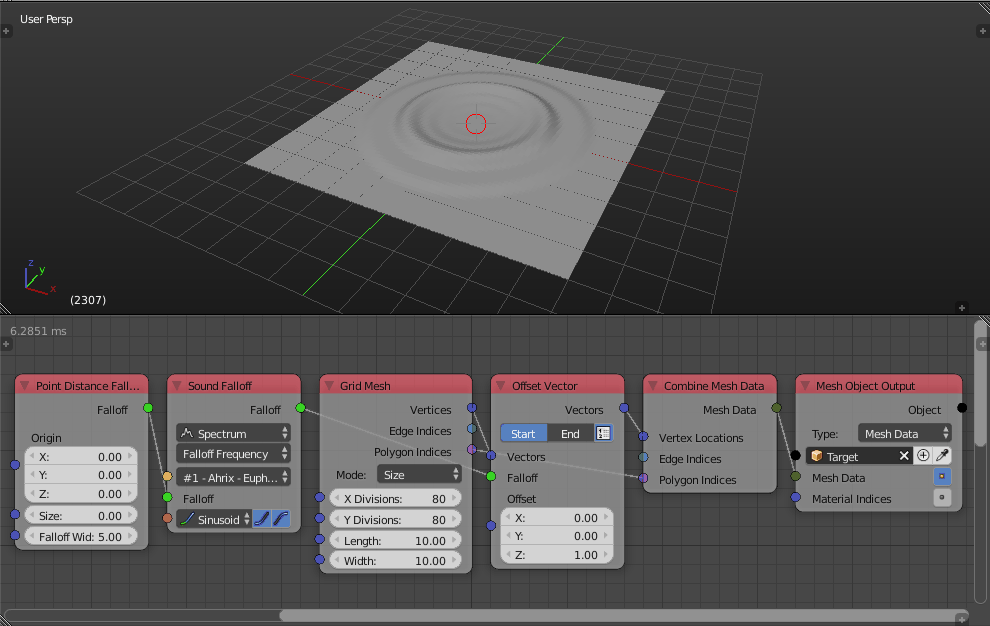

Spline Falloff
=============

Spline falloff enables you to control and effect based on the shortest distance to some spline object.

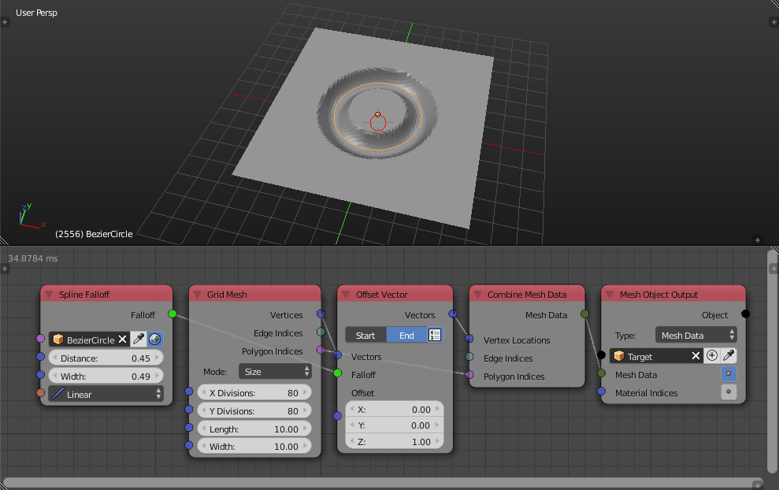

Constant Falloff
================

Constant Falloff is the default falloff where it just set a constant factor for all effects' objects.

Custom Falloff
==============

Custom falloff lets you create a falloff from a list of factors for total control.

Directional Falloff
===================

Directional falloff lets you control an effect based on the distance along some vector from some point. It is the same as the direction option in the object controller falloff but inputs are exposed and not controlled by an object.

.. image:: images_v2_0/directional_falloff.gif

Point Distance Falloff
======================
Point distance falloff lets you control an effect based on the distance to some point. It is the same as the sphere option in the object controller falloff but inputs are exposed and not controlled by an object.

.. image:: images_v2_0/point_distance_falloff.gif

Interpolate Falloff
===================

This node lets you edit falloffs based on an interpolation.

.. image:: images_v2_0/interpolate_falloff.gif

Invert Falloff
==============

This node invert the factors of the input falloff.

.. image:: images_v2_0/invert_falloff.gif

Mix Falloff
===========

This node mixes between two falloffs, mixing can be done by taking the maximum or the minimum of the falloffs, it can also be the sume or multiple of both falloffs.

.. image:: images_v2_0/mix_falloff.gif

Evaluate Falloff
================

This node returns the factors of the input falloff evaluated at the inputs, in essence, a falloff just associates a float (factor) to every object either based on its transforms or index, this factor or float is then used to mix between effects. Here is an example of a falloff evaluate at the locations of the cubes:

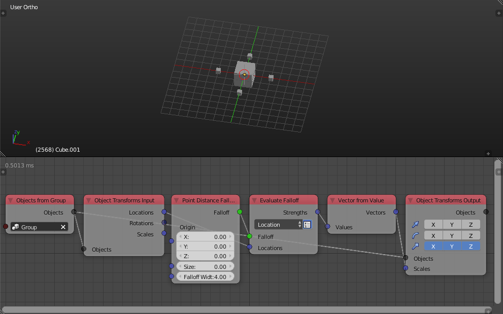

Fcurves
*******

Fcurves have been left intact.

Materials
*********

Materials have been left intact.

Sounds
******

Sound nodes have been redesigned visually and had some inputs renamed but functionally it is still the same.

The *Single* and *Equalizer* sound types are called *Average* and *Spectrum* now. These names are used more often in other software as well.

Also the output of the *Evaluate Sound* node is called *Volume/Volumes* now depending on which sound type is selected.

.. image:: images_v2_0/sound_bake.png

Sequences
*********

Sequences has been left intact.

Geometry
********

Triangulate Polygons
====================

Triangulate Polygons has been removed because it is nearly never used however it may be rewritten in a better form in the future.

Intersect Polyline Plane
========================

Intersect Polyline Plane was removed because it is nearly never used.

KD & BVH Trees
**************

Ray Cast BVH Tree
=================

There is now an option to start the ray at infinity.

.. image:: images_v2_0/ray_cast.gif

Viewer
******

Debug nodes are now called viewers.

Viewer
======

Debug, Debug List and Debug Drawer nodes were combined into a single node called Viewer. It automatically determines whether data should be drawn inline (single element) or in a box (list), and returns information such as datatype and list length (depending on input datatypes). The result can also be output to text block or console.

.. image:: images_v2_0/viewer_node.png
.. image:: images_v2_0/viewer_output_settings.png

3D Viewer
=========

This newly added node draw point an empty like objects in the 3D viewport. If vector(s) were given, then points are drawn in their locations, if matrices were given, then empty like objects are drawn to show their orientation as well as their location.

.. image:: images_v2_0/3d_viewer.png

Generic
*******

Converter
=========

Converter node now has a lock button to lock the data type and stop it from  converting data type automatically.

.. image:: images_v2_0/converter.png

SubProgrames
############

Loops
*****

Generators are now vectorized which means they can append multiple values if given a list.

.. image:: images_v2_0/loops.png

Data Types
##########

Bmesh
*****

Bmesh socket color has changed to green not to be confused with falloffs.

Vertex
******

Vertex Data type was removed.

Polygon
*******

Polygon Data type was removed.

Falloff
*******

Falloff data type was added.

Data Inputs
***********

Input of data input nodes like input integer, float are now hidden because it confuses people. It can be unhidden just like any node if needed.

Keyboard Shortcuts
##################

Animation Nodes currently uses the *W*, *E* and *U* key in the node editor. The *W* and *E* key have not changed since the last release but the *U* key now opens a popup that not only shows the advanced settings of a node but also it's sockets. This is useful as some nodes have hidden sockets or allow reordering/deletion of sockets.

.. image:: images_v2_0/socket_settings.gif

3D ViewPort
###########

An option to show vertices', edges' and polygons' indices is now available under the display panel in properties menu.

.. image:: images_v2_0/viewport_indices.png

Header Bar
##########

Templates
*********

Templates were removed.

Remove Node Tree
****************

There is now a button to remove the current node tree.

Developer Tools
###############

Measure Execution Time
**********************

Measure Execution Time tool now displays the minimum execution time instead of average.

Performance Mode
****************

Performance Mode was removed.

Documentation
#############

Documentation is now fully written, all nodes and guides are now available.
