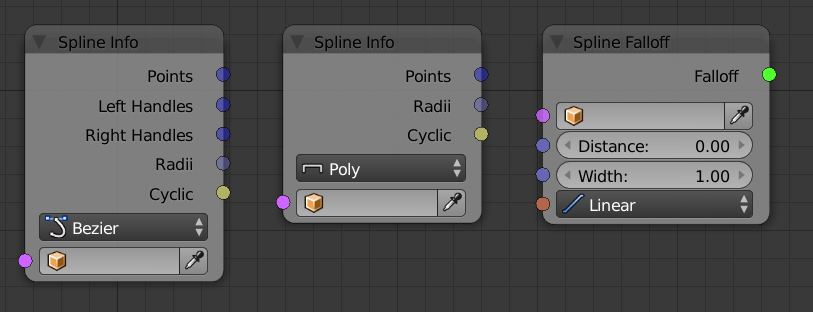
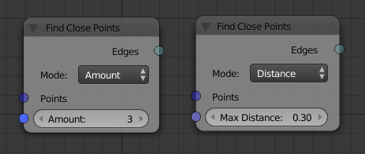
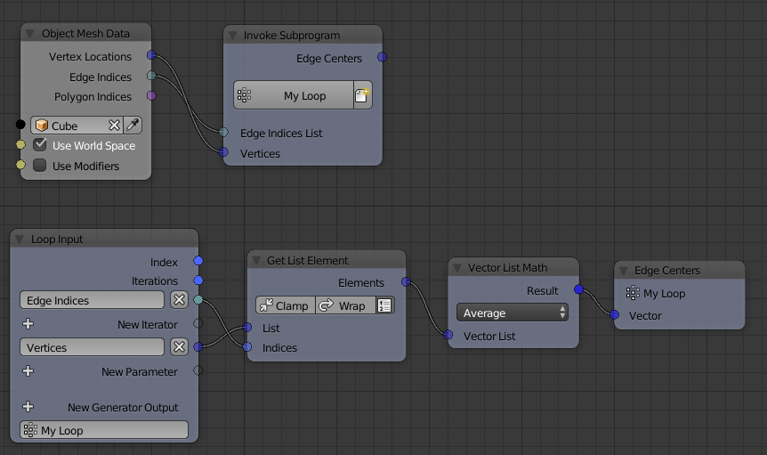

=============================
Release Notes for Version 2.0
=============================

Key Featuers:
=============

- **Cython**:
  Many parts of Animation Nodes has been rewritten using the Cython programming. It's a language that mixes Python and C and is perfectly suited to develop addons with higher performance for Blender. There is one disadvantage though, we now have different versions of Animation Nodes for different platforms. So you have to download the correct version for your platform.

  .. image:: images_v2_0/cython_performance_example.gif

  Generating vectors is now 400x faster compared to non cythonized versions. Maths is also 400x faster.

- **Vectorization**:
  Lists are an essential part of Animation Nodes. In previous versions the only way to use lists effectively was to use loops. These have an advantages as they give you a lot of flexibility. However, in many cases the flexibility of loops are not needed. This release includes an alternative approach to edit lists: Vectorized Nodes. A vectorized node is a node that can work on individual values as well as on lists. Together with the  Cython, this leads to big speedup for some operations.

  .. image:: images_v2_0/vectorization_example.gif

  Not all nodes which could have this functionality have it yet. Fortunately, vectorizing a node does not break it, so some nodes can be vectorized after the first release of AN 2.0.
- **Falloffs**:
  While the first two keay features were mainly targeted at all users of Animation Nodes, falloffs have been designed specifically for motion graphics designers. In general, a falloff is a function that tells an effect how much it should influence a specific object. You can think of it like a mask for an effect (similar on how we can use weight painting to control the influence of some modifiers).

  .. image:: images_v2_0/falloff_example.gif

Compatibility
=============

Similar to the last releases, this release will break most existing files in a way so that they don't work anymore in this release. This is necessary to not slow down future development (keeping old stuff working always means that some new features would not be possible). There might be some files that still work in this release but you should not expect that.

Updating files to work in this version is easy in some cases but very difficult in others. In general I suggest to either use the old version for old files or rebuild the node trees from scratch.

It is also possible to change existing files in a way that they automatically load the correct version of AN when loaded. This might also be useful when you want to render animations that use AN on a renderfarm, basically you can put the .blend file and the addon into a .zip file and upload it to the renderfarm (Note: this is only possible when the renderfarm allows you to execute python scripts, sometimes you first have to ask for permission). For more information contact me (mail@jlucke.com).

New Nodes
=========

Numbers
-------

All number nodes that can be vectorized are now vectorized.

Float Range
^^^^^^^^^^^

Float Range node can now generate floats inside the closed interval ``[start, stop]``. This can be done by choosing the **Start/Stop** option. The node now is 400x faster than before.

.. image:: images_v2_0/float_range.png

Random Number
^^^^^^^^^^^^^

Random Number node can now generate a list of random floats. This can be done by checking the **Create List** button beside the node seed. The node is now 400x faster than before.

.. image:: images_v2_0/random_numbers.png

Map Range
^^^^^^^^^

Map Range node has a new UI for easier and faster workflow. And it is vectorized, so it can now remap a list of floats.

.. image:: images_v2_0/map_range.png

Float Math
^^^^^^^^^^

Math node is now 200x faster. It is vectorized such that you can operate on two lists element wise, operate on a single list for single input operations and operate on a list and a value where the value is added, multiplied, etc to all the value of the list.

.. image:: images_v2_0/vectorization_example.gif

The math node also have a new UI where a small menu called **Quick Settings** will appear whenever the node is duplicated. This menu includes four buttons which convert the type of the math node to addition, multiplication, subtraction or division. This allow faster conversion if needed. If you don't want to convert, then pressing the check mark will hide the menu telling AN that this is the type you want. Moreover, a button is present in the advanced node settings that hide the menu for all nodes in the current node tree.

.. image:: images_v2_0/float_math.gif

Vectors
-------

Random Vector
^^^^^^^^^^^^^

Random Vector node can now generate a list of random vectors. This can be done by checking the **Create List** button beside the node seed. The node is now 400x faster than before.

.. image:: images_v2_0/random_vector.png

Vector Wiggle
^^^^^^^^^^^^^

Vector Wiggle node can now generate a list of vectors. Notice that the random vectors are different in seed and not in the evolution variable which means the vectors when plotted doesn't represent a perlin noise.

.. image:: images_v2_0/vector_wiggle.gif

Transform Vector List
^^^^^^^^^^^^^^^^^^^^^

Transform Vector List node was removed because now the **Transform Vector** node is vectorized and can operate on lists of vectors.

Offset Vector
^^^^^^^^^^^^^

This new node was added to make use of falloffs with vectors. The node simply translate the vector based on a translation vector, the factor of translation is controlled by a falloff.

.. image:: images_v2_0/offset_vector.gif

Rotations
---------

Random Euler
^^^^^^^^^^^^

Random Euler node can now generate a list of random eulers. This can be done by checking the **Create List** button beside the node seed. The node is now 400x faster than before.

.. image:: images_v2_0/random_euler.png

Matrices
--------

Distribute Matrices
^^^^^^^^^^^^^^^^^^^

This node was newly added and it generate a list of transformation matrices distributed on a line, grid, circle or mesh vertices. The resulted transformation matrices include locations information only in the line and grid options while it include both location and rotation data in the circle and mesh vertices options assuming vertices normal were given.

.. image:: images_v2_0/distribute_matrices.gif

Replicate Matrix
^^^^^^^^^^^^^^^^

This node was newly added and it instance and transforms input transfromation matrices based on some other input transfromation matrices. Below is an example if use, the first distribute matrices generate a circle of matrices, the replicate matrix node was used to instance those circles in some other bigger circle generated from the second distribute matrix.

.. image:: images_v2_0/replicate_matrix.gif

Offset Matrices
^^^^^^^^^^^^^^^

This newly added node make use of falloffs with matrices. The node simply transforms the input transformation matrices based on a transformation matrix generated from the input translation, rotation and scale vectors and eulers, the factor of transformation is controlled by a falloff.

.. image:: images_v2_0/falloff_example.gif

Change Matrix Pivot
^^^^^^^^^^^^^^^^^^^

Change Matrix Pivot node was removed because it can be recreated easily with ordered matrix multiplication.

Texts
-----

Fill Text >> Repeat Text
^^^^^^^^^^^^^^^^^^^^^^^^

Fill Text node was renamed repeat text for convention.

.. image:: images_v2_0/repeat_text.gif

Replicate Text
^^^^^^^^^^^^^^

Replicate Text node was removed because the same function can be done using the repeat text node by leaving the text input empty. See example above.

Reverse Text
^^^^^^^^^^^^

Reverse Text node was added that reverse the input text's character's order.

.. image:: images_v2_0/reverse_text.gif

Booleans
--------

Compare Node
^^^^^^^^^^^^

A new condition ``Is None`` which check if the input is a non data type. Can be used to avoid possible non data types errors. Most of the fundemntal data types will always return False because the input is always initiallized, however, a data type like generic can be empty so it may return True.

.. image:: images_v2_0/compare_node.png

Logic Operators
^^^^^^^^^^^^^^^

Two new operators were added : ``Not (A and B)`` which returns True if one of them is False and ``Not (A or B)`` which returns True if both of them is False.

Boolean List Logic
^^^^^^^^^^^^^^^^^^

Two new options were added to the boolean list logic node, including : ``Not All True`` which returns True if at least one boolean is False and ``Not All False`` which returns True if at least one boolean is True.

.. image:: images_v2_0/boolean_list_logic.png

Number To Boolean
^^^^^^^^^^^^^^^^^

This node was newly added to convert an number into a boolean, if number is zero, it will return False and otherwise True.

.. image:: images_v2_0/number_to_boolean.png

Colors
------

Colors were left intact.

Lists
-----

Create Lists
^^^^^^^^^^^^

**Remove Inputs** in advanced node settings became **Remove Unlinked Inputs** which removed inputs if they weren't connected to any other node.

Get List Element
^^^^^^^^^^^^^^^^

Advanced Node Settings was moved to the node itself for easier and faster control. The node can now get multiple elements if given a list of integers that represent their indices. To do this, check Use Index List button.

.. image:: images_v2_0/get_list_element.gif

Mask List
^^^^^^^^^

This node was newly added and it selectively remove list elements based on a boolea list where if the boolean at the same index was False, the element is removed.

.. image:: images_v2_0/mask_list.gif

Sort List
^^^^^^^^^

Name, Post Distance and Direction options were removed because they can be achieve using other options.

Random List
^^^^^^^^^^^

This node was newly added, it simply returns a list that contain some random elements from the input list. Unlike the multiple option in the Get Random Element node, elements can be repeated and thus the length of the output node can be larger than the input list.

.. image:: images_v2_0/random_list.png

Interpolations
**************

The interpolation system has been upgraded to cython to allow much faster evaluation of interpolations. Beside these under-the-hood changes, some new node functionalities have been added as well.

TODO: IMAGES

    - New *Mirror Interpolation* node
    - New *Chain* option in *Mix Interpolations* node
    - New *Cache Interpolation* option in *Interpolation from Curve Mapping* node (should be used when the falloff is evaluated very often)
    - The *Evaluate Interpolation* node has been vectorized.

Sounds
******

The *Single* and *Equalizer* sound types are called *Average* and *Spectrum* now. These names are used more often in other software as well.

Also the output of the *Evaluate Sound* node is called *Volume/Volumes* now depending on which sound type is selected.

There is a new *Sound Falloff* node that makes some sound effects much easier. It is still possible to use the old approach to do sound animations though.

TODO: LINK

Splines
*******

The most notable change is that each spline point (poly and bezier) has a radius now. This allows for some very interesting effects.

TODO: Join Evaluate and Sample Spline nodes

The *Spline Info* node has been upgraded to output more information depending on which spline type is selected. These options include the left/right handles for every bezier spline point and the radius of every point.

The *Trim Spline* falloff produces a much cleaner result for bezier splines now.

TODO: IMAGE

The spline input of the *Curve Object Output* node has been vectorized. This means that no *Create List* node is needed anymore if you only want to set one spline on the curve object.

There is a new *Spline Falloff* node.

TODO: LINK

Find Close Points
*****************

The *Find Close Vertices* has been renamed to *Find Close Points*. Also the functionality of the node has been upgraded to make it easier to use.

TODO: LINK

Data Input
**********

The *Data Input* nodes are all the nodes with names like *Integer Input*, *Float Input*, *Object Input*, ... (They all share the same base). Originally these nodes also had an input socket which confused many people. Therefor this socket is hidden now but it is possible to unhide it.

TODO: IMAGE

BVH/KD Tree
***********

Get List Element
****************

The *Get List Element* node can output a list now if multiple indices are provided as input. Together with the new implicit conversion from Edge/Polygon Indices to Integer List this node is ideal to get e.g. all the vertices of a specific polygon.

Also the UI of the node has changed. Two options that were only visible in the advanced settings before are visible all the time now.

ID Keys
*******

The ID Key system allows you to store data per object (or more general, per ID object). There are two default ID Keys, one that can store the initial transformation of an object and one that can store an integer index. The index can be used for sorting the objects but other uses are possible as well.

ID Keys already exist for a long time but more of the functionality is available to the user now. E.g. it is possible to create and remove your own ID Keys.

To access this data in the node tree you need to use the *Object ID Key* node. This node is vectorized now, so you can get the values for many objects at the same time.

TODO: IMAGE

Polygons
********

Matrices
********

Offset Vectors
**************

Offset Matrices
***************

Text
****

Math
****

Viewer
******

Keyboard Shortcuts
******************

Animation Nodes currently uses the *W*, *E* and *U* key in the node editor. The *W* and *E* key have not changed since the last release but the *U* key now opens a popup that not only shows the advanced settings of a node but also it's sockets. This is useful as some nodes have hidden sockets or allow reordering/deletion of sockets.
