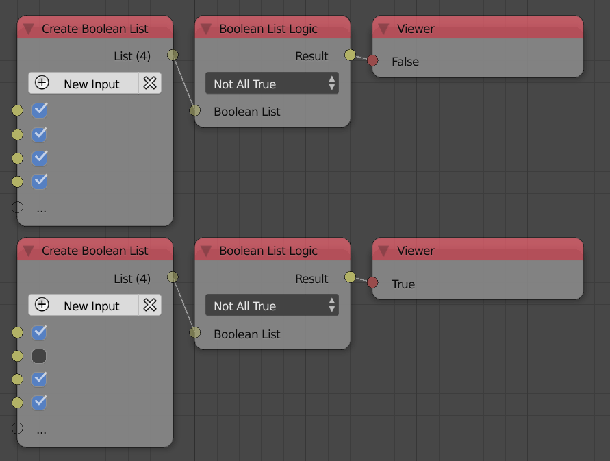
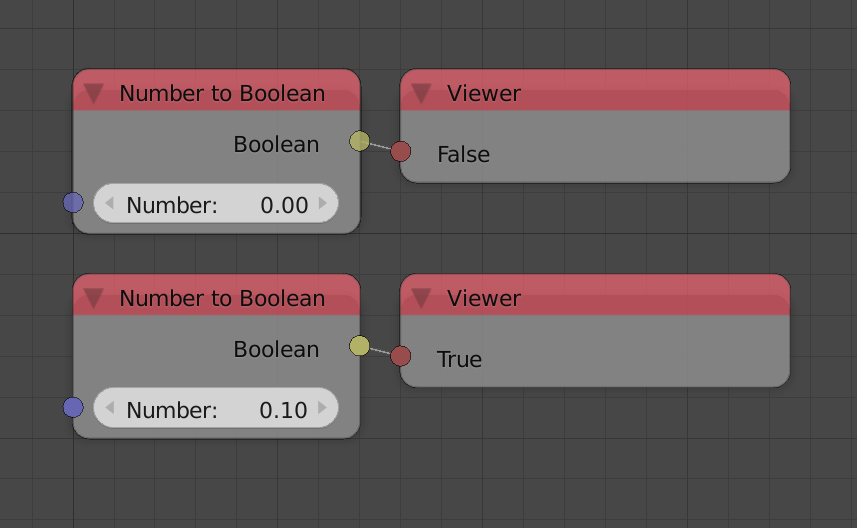

Booleans
********

Compare Node
============

A new condition ``Is None`` which check if the input is a non data type. Can be used to avoid possible non data types errors. Most of the fundemntal data types will always return False because the input is always initiallized, however, a data type like generic can be empty so it may return True.

.. image:: images/compare_node.png

Logic Operators
===============

Two new operators were added : ``Not (A and B)`` which returns True if one of them is False and ``Not (A or B)`` which returns True if both of them is False.

Boolean List Logic
==================

Two new options were added to the boolean list logic node, including : ``Not All True`` which returns True if at least one boolean is False and ``Not All False`` which returns True if at least one boolean is True.

Number To Boolean
=================

This node was newly added to convert an number into a boolean, if number is zero, it will return False and otherwise True.

