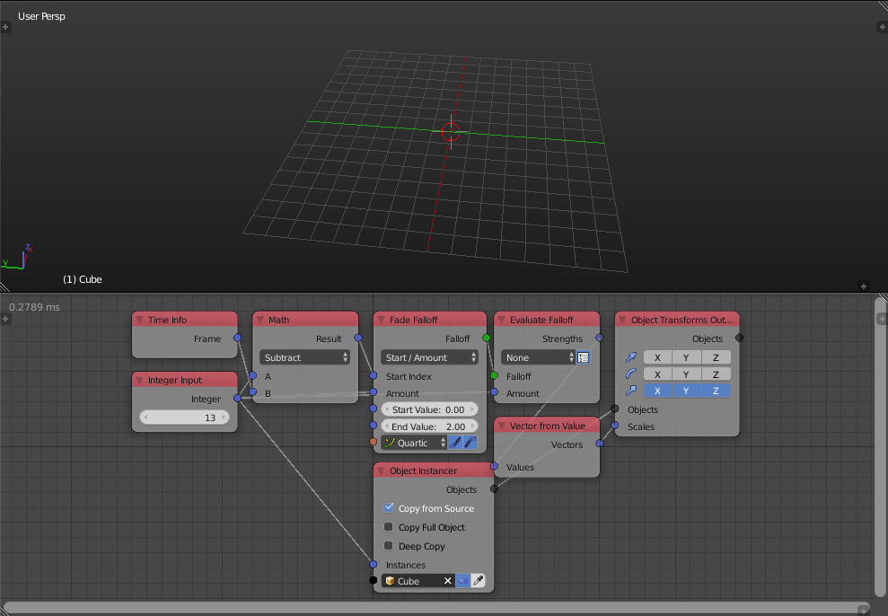
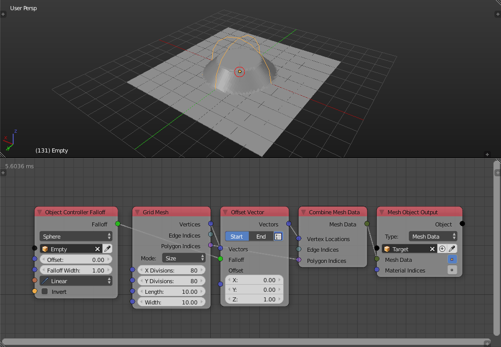
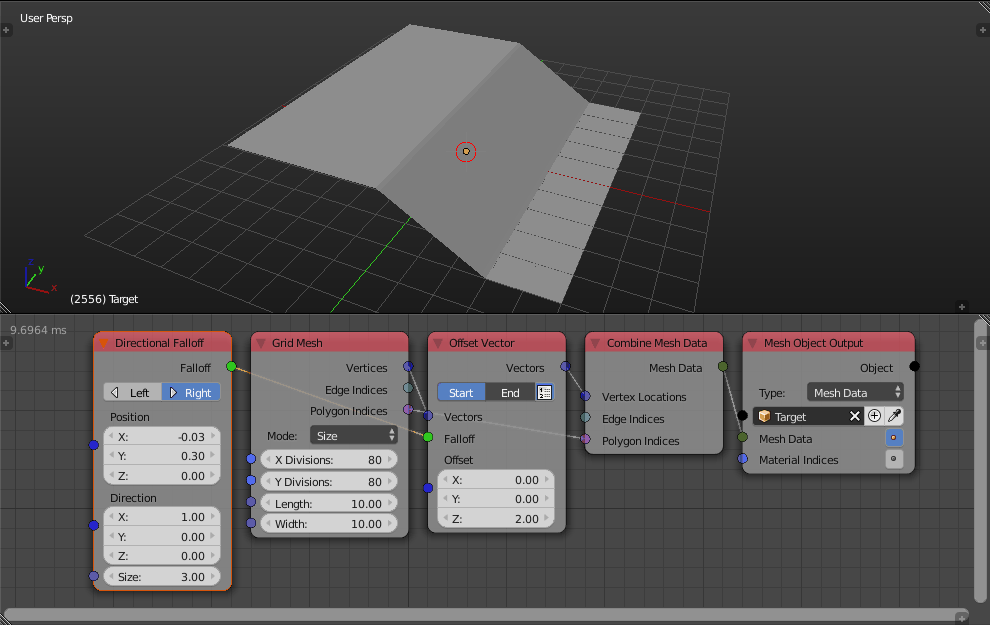
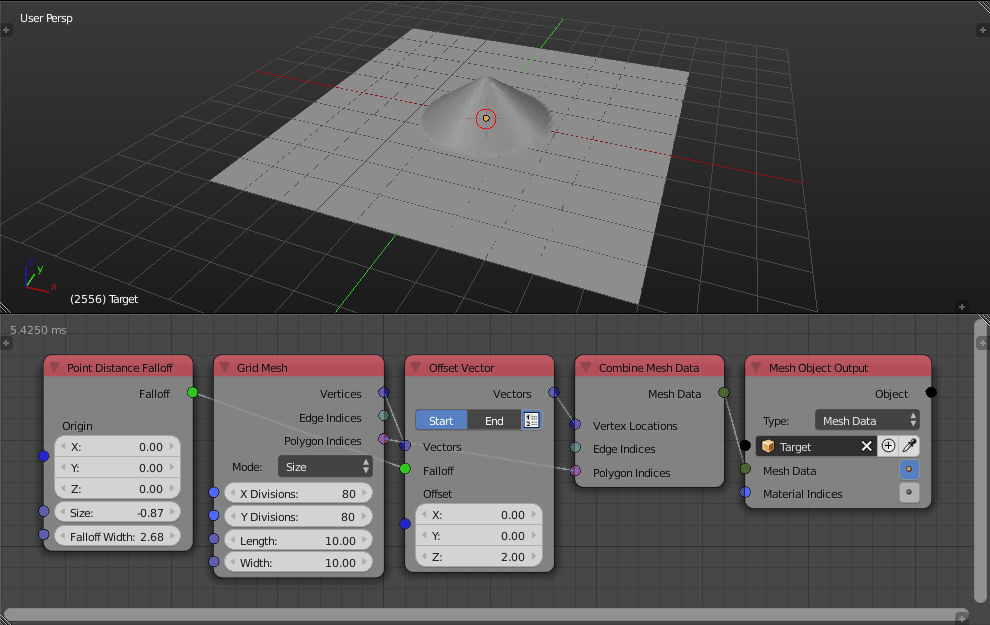
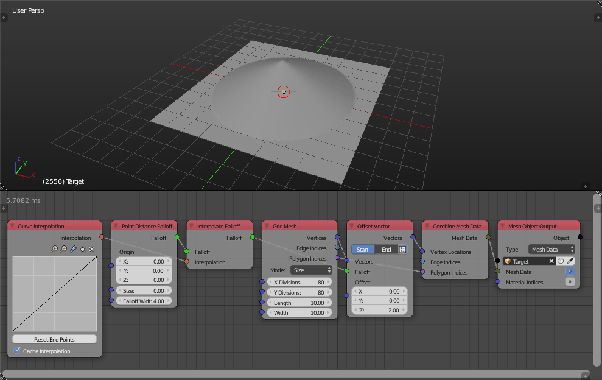
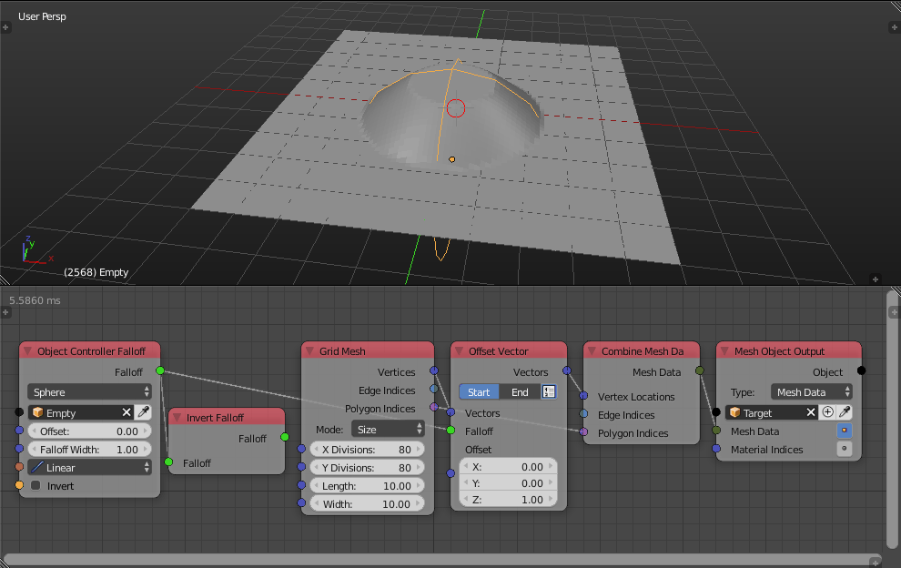
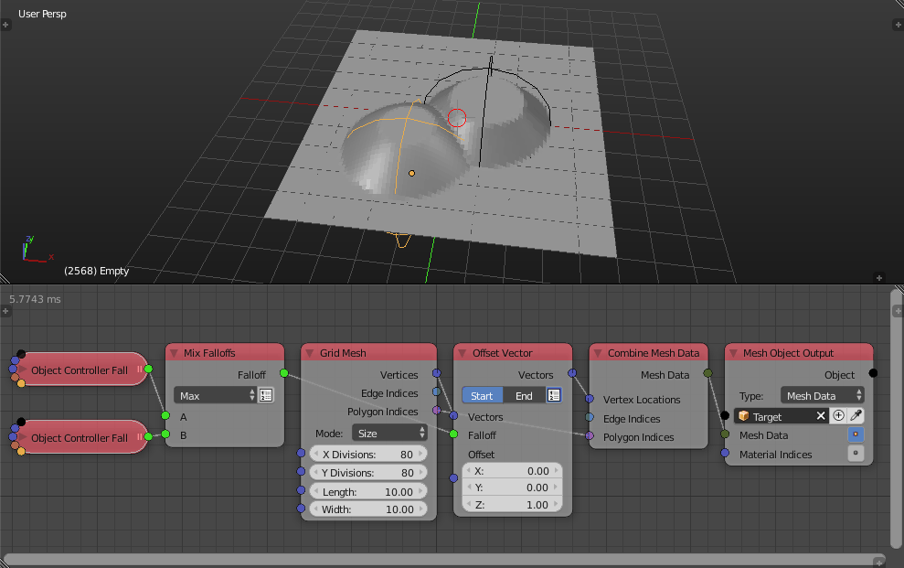
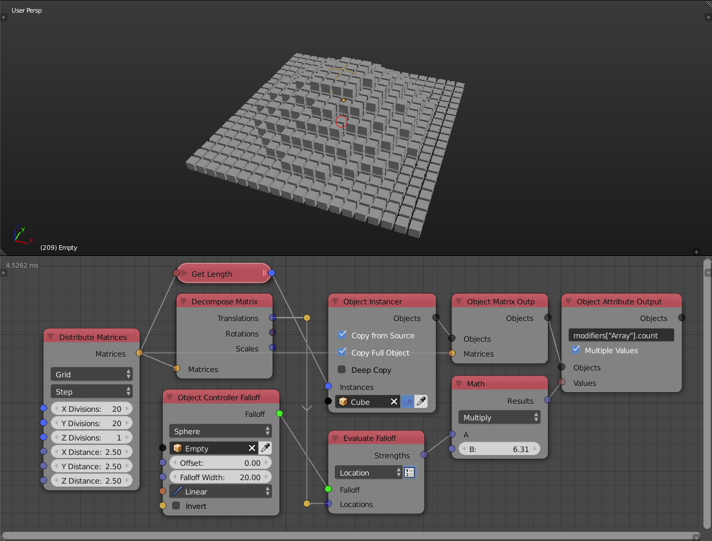

Falloff
*******

This whole category was added and it provides a high level approach to controlling effects and animating them. Below are some of the nodes it includes.

Fade Falloff
============

This falloff can be used to fade between two values.

Delay Falloff
=============

This falloff can be used to delay the effect of some objects based on time. In the example below we make some objects appear earlier than others. It works good in conjunction with the Object ID Key node.

.. image:: images/point_distance_id.gif

Wiggle Falloff
==============

This falloff can be used to control an effect based on a noise function. So far there is only 1D noise meaning that the effect strength only depends on the time and not on the location of a vertex.

.. image:: images/wiggle_falloff.gif

Random Falloff
==============

Much like the wiggle falloff, this can be used to control and effect based on a random factor except this factor is completely random and can't be animated, it is much faster than wiggle falloff so use this node if you are not going to animate.

.. image:: images/random_falloff.gif

Index Mask Falloff
==================

This falloff chooses between two values based on a pattern. Currently two patterns are supported: ``Every Nth`` and ``Random``.

.. image:: images/index_mask_falloff.gif

Object Controller Falloff
=========================

This falloff is a wrapper for multiple other falloffs to make them easier and faster to use in practice. So far it supports spherical and direction falloffs.

.. image:: images/object_controller_falloff2.gif

Sound Falloff
=============

Sound falloff provide a much more efficient way to evaluate baked sound data. You can evaluate the sound data based on the object indices or based on another falloff. So you may use a point distance falloff to evaluate the sound data resulting in this radial sound visualization:

.. image:: images/sound_falloff.gif

To create a normal equalizer animation, start with something like that:

.. image:: images/equalizer.gif

Spline Falloff
==============

The spline falloff enables you to control an effect based on the shortest distance to a spline.

.. image:: images/curve_falloff.gif

Constant Falloff
================

This is the default falloff. With this every effected element is effected with the same strength.

Custom Falloff
==============

A custom falloff lets you create a falloff from a list of factors for total control.

Directional Falloff
===================

A directional falloff lets you control an effect based on the distance along some vector from some point. It is the same as the direction option in the object controller falloff but inputs are exposed and not controlled by an object.

Point Distance Falloff
======================
A point distance falloff lets you control an effect based on the distance to some point. It is the same as the sphere option in the object controller falloff but inputs are exposed and not controlled by an object.

Interpolate Falloff
===================

With this you can edit a falloff. For this node to make sense the input falloff should only produce factors between 0 and 1. Most of the common falloffs do this anyway.

Remap Falloff
=============

This node remaps the floats of the input falloff to a new range. The node assumes that the original range was ``[0,1]``, which is usually the case.

.. image:: images/remap_falloff_node_example.gif

Invert Falloff
==============

This node invert the factors of the input falloff.

Mix Falloff
===========

This node mixes between two or more falloffs. It supports multiple modes: Max, Min, Add, Multiply.

Evaluate Falloff
================

This node evaluates the falloff for the given inputs. So it returns a list of strenghts (a number one for every element). This can be used to control custom effects.

